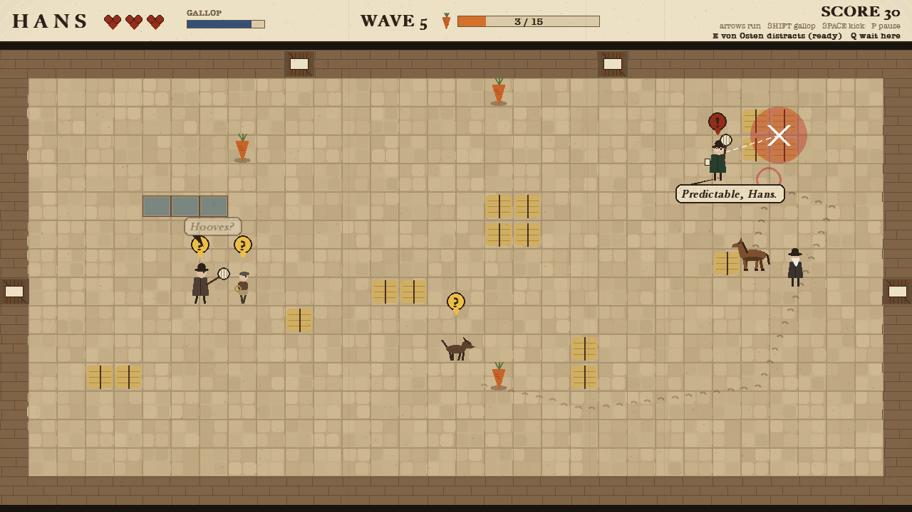
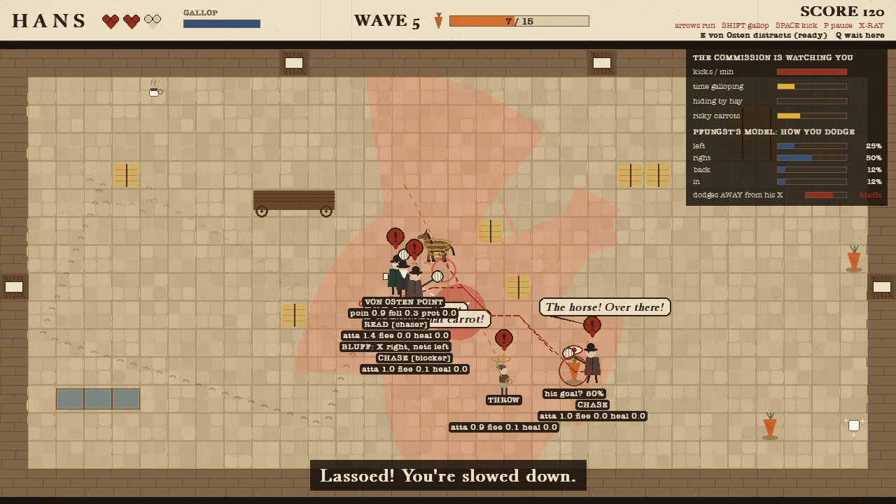
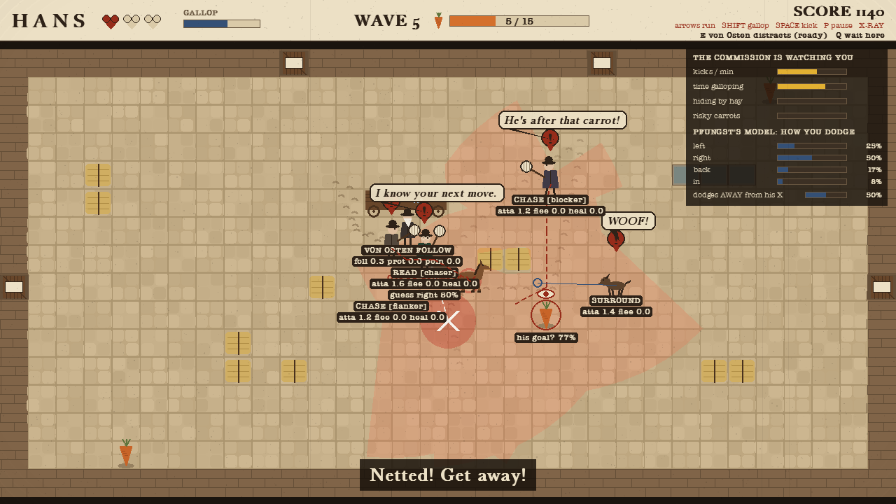
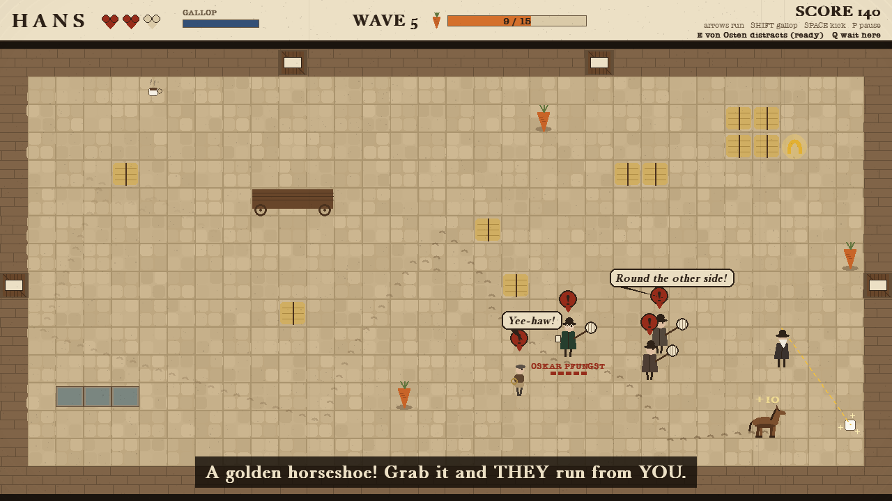
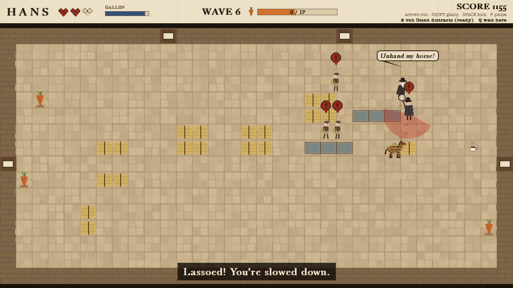

# Hans

*Catch me if you can.* Berlin, 1904.

Clever Hans could count, spell and tell the time. Or so they said. His real gift was **reading
people**: the tiny lean or held breath that told him when to stop tapping. In 1907 the
psychologist **Oskar Pfungst** worked out the trick by reading Hans right back.

In this game you are Hans, and the story is the mechanic:

- **You read them.** Every red warning is Hans reading a tell: a net winding up, a dog crouching, a rope spinning. See red, move.
- **They read you.** The Commission watches how you play and adapts. Every 5th wave **Pfungst** arrives. He has studied every dodge you've made, marks where he predicts you'll go with a chalk X, and *bluffs* if he learns you're reading his X.
- **Von Osten stands by you.** Hans's owner is an AI companion: he grabs nets mid-swing, shouts down dogs, nods toward sugar cubes (the real "Clever Hans" cue!), and argues with a scientist when you press **E**.

Run around the courtyard eating carrots, kick the scientists, dodge the lassos, and don't let the
dogs corner you. Each wave brings more of them, and they get quicker and smarter.



## Play

```bash
python3 -m venv .venv
source .venv/bin/activate
pip install -r requirements.txt
python main.py
```

| Key | |
|---|---|
| Arrows / WASD | run |
| hold Shift | gallop: fast, but it tires you and they hear it |
| Space | kick: knocks down anyone close |
| E | von Osten goes and argues with the nearest scientist (12 s cooldown) |
| Q | von Osten waits here / follows you again |
| P / Esc | pause |
| X | AI X-Ray: see what every enemy is thinking |
| F1 / M / F11 | help / mute / full screen |

**Goal:** eat the carrots to clear each wave. You have 3 hearts. A **red warning** means an attack
is coming: a net swing, a dog's pounce, or a lasso. Get out of the way, or step in and kick first.
A **sugar cube** gives a heart back; a **golden horseshoe** makes everyone run from *you*.

Options: `--wave 4` (start later), `--xray`, `--seed 42`, `--no-sound`.

## The AI

Every enemy is a finite state machine with senses and motivations, and the game works hard to
make their thinking **visible**. That's the "illusion of intelligence" from the first lecture.

### Reading and being read (v0.4.2)

| | What you see | What's really happening |
|---|---|---|
| **Pfungst's player model** ([`playermodel.py`](game/ai/playermodel.py)) | "Predictable, Hans." A chalk X where he thinks you'll dodge | Every time any enemy winds up an attack, it records which way you escaped (left / right / back / in, relative to the attacker). Pfungst aims at your most frequent side. |
| **Second-order bluffing** ([`pfungst.py`](game/ai/pfungst.py)) | "You read my chalk, Hans?", and the net lands on the *other* side | The model also records whether you dodge *away from his X*. The more you do, the more often he draws the X on one side and nets the other: "he knows that I know". |
| **Tactics blackboard** ([`tactics.py`](game/ai/tactics.py)) | "He's after that carrot!" One enemy guards the carrot you're heading for; another cuts off your escape | **Goal recognition** from your heading, **roles** (chaser / blocker / flanker / cutoff) re-assigned twice a second (4× with Pfungst in command), and pressing the attack when you're tired or on your last heart |
| **Von Osten, companion AI** ([`vonosten.py`](game/ai/vonosten.py)) | "Unhand my horse!", "Down, boy!", "Behind you, Hans!", a nod toward the sugar | A utility-scoring FSM (FOLLOW / STAY / PROTECT / POINT / DISTRACT) re-scored 4× a second, plus two commands |

**Does it work?** `python -m tools.pfungst_lab` puts Pfungst in a duel against bot players with
known habits:

| player | full Pfungst | guessing (no player model) | no bluffing |
|---|---|---|---|
| always dodges left | **95%** caught | 34% | 95% |
| reads the X and dodges away | **70%** | 39% | 0% |
| dodges at random | 36% | 25% | 34% |

The player model beats a habit; bluffing beats a reader; nothing beats true randomness. That's
the lesson Pfungst taught about Hans.

### Everything else

- **They talk.** Every state change is said out loud in a speech bubble: "There he is!", "Where did he go?", "I need a coffee...", "I'll go round!", "Behind the hay!", "sniff sniff".
- **The Commission learns how you play.** Between waves it looks at your habits and adopts a counter-tactic, and tells you: kick a lot and they **jump back from your kicks**; gallop a lot and they **cut you off**; hide by the hay and they **check behind it**; snatch carrots under their noses and one **guards the carrots**.
- **Teamwork.** A second scientist runs round to the far side of you (a pincer); a shout or a bark alerts the others; dogs share out a ring around you.
- **Tracking.** You leave hoofprints; dogs follow the trail, nose down, from print to fresher print.
- **Morale.** Knock enough of them out and the rest lose their nerve ("He's too strong!").

| | States | What makes it smart |
|---|---|---|
| **Scientist** (net) | WANDER, INVESTIGATE, SEARCH, CHASE, SWING, STUNNED, FLEE, HEAL, KO | A* chase re-planned 4x a second; a visible wind-up; when kicked he weighs attacking vs fleeing vs **going for a coffee he's seen** |
| **Stable boy** (lasso) | ... POSITION, THROW, COVER | Scores nearby tiles to find a good throwing spot; **leads his throw** to where Hans is going; **hides behind hay** when charged |
| **Guard dog** | ... SURROUND, POUNCE, RETREAT | **Pack tactics**: the pack shares out a ring around Hans and attacks from several sides; finds Hans by **smell** through hay |

- **Perception:** a 120° sight cone with line of sight (hay and carts block it), a double take on a glimpse, hearing (gallops, kicks, crunching carrots), smell (dogs), and memory of where Hans was last seen.
- **Decision making:** desirability scores for attack / flee / heal / cover ([`desire.py`](game/ai/desire.py)), re-evaluated twice a second, with a little stickiness so they don't dither.
- **Pathfinding:** A* on the courtyard grid for chasing, investigating, searching, fleeing, fetching coffee and finding cover.
- **Procedural generation:** every wave gets a new courtyard layout (checked for fairness and connectivity), and waves beyond 5 are generated from a growing budget.
- **Evade:** the golden horseshoe flips everyone into FLEE, like the Pac-Man ghosts in the FSM lecture.
- **Adaptation:** [`commission.py`](game/ai/commission.py) watches your habits; [`barks.py`](game/ai/barks.py) makes decisions audible.

Full design, balancing data, video script and report plan: **[docs/GAME_DESIGN.md](docs/GAME_DESIGN.md)**.

## Tests and tools

```bash
pip install -r requirements-dev.txt
python -m pytest             # 54 tests
python -m tools.autoplay     # bots play many games: how far does a sensible player get?
python -m tools.pfungst_lab  # duels: does Pfungst's player model really read you?
```

## Screens

| | |
|---|---|
|  |  |
|  |  |
|  |  |
|  |  |
|  |  |
|  |  |
|  |  |

*Earlier versions of this project are kept as git tags: `v0.2-detective` and `v0.3-stealth`.*
