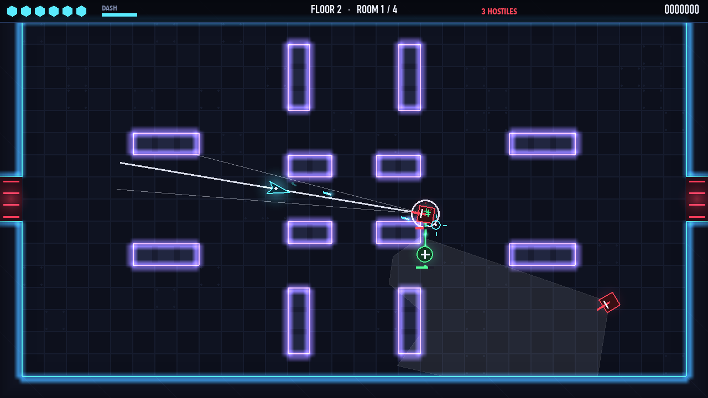
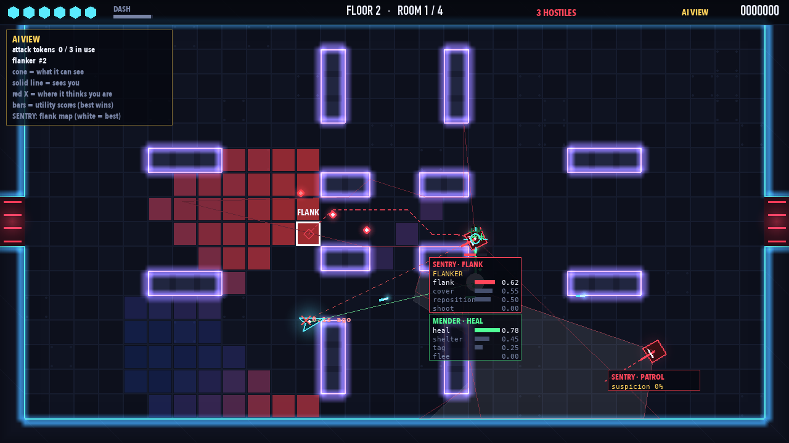
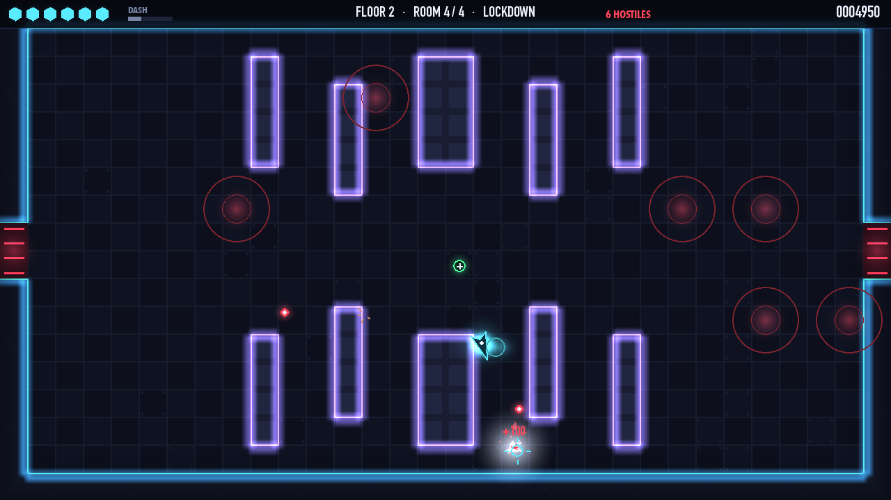
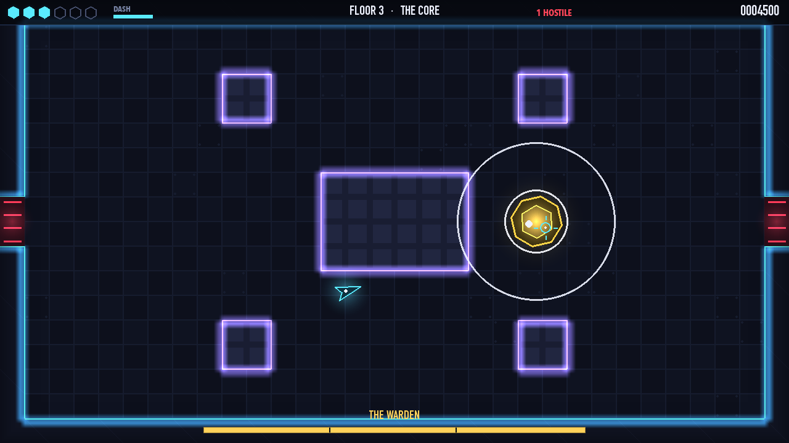
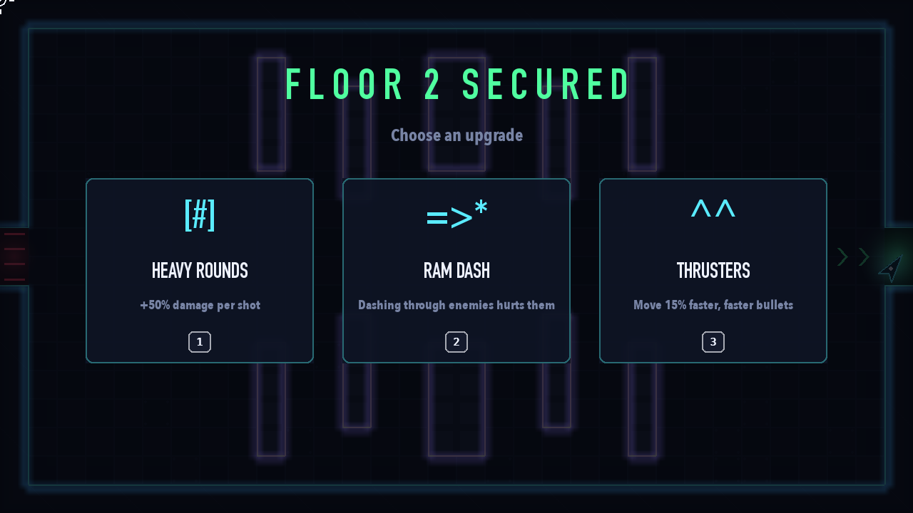
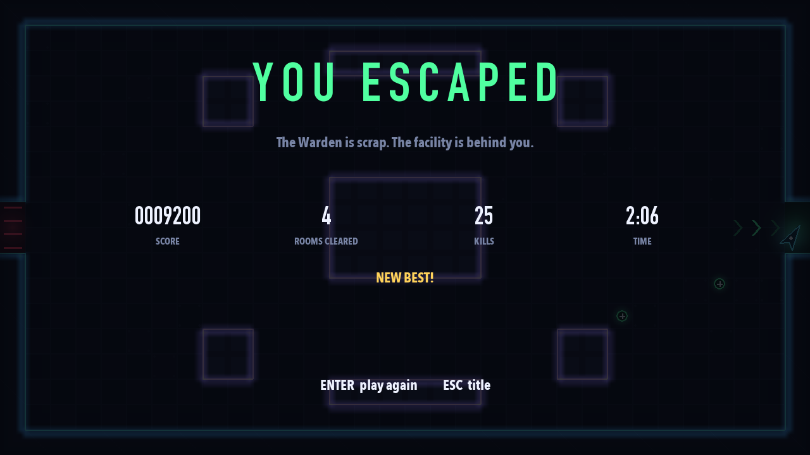
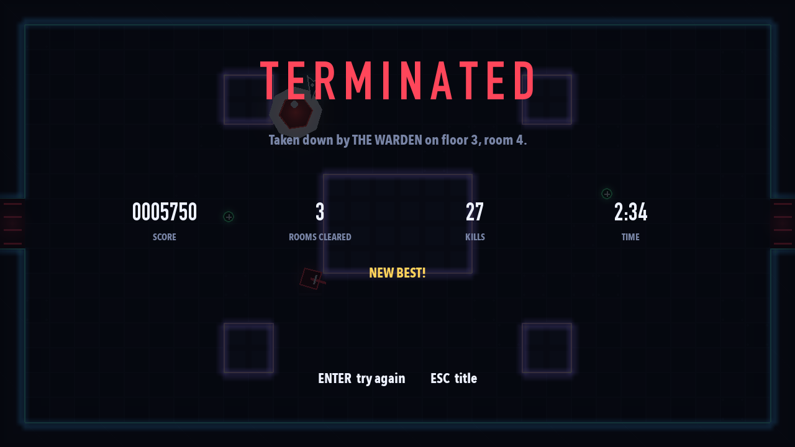

# LOCKDOWN

*Break out of the facility, room by room. The security AI is watching.*

A top-down neon shooter where every enemy thinks. They see, hear, remember, take cover, flank,
heal each other and take turns to attack. Every attack is telegraphed the same way, so you can
always read what's coming.



## Play

```bash
python3 -m venv .venv
source .venv/bin/activate
pip install -r requirements.txt
python main.py
```

| Key | |
|---|---|
| W A S D (or arrows) | move |
| Mouse | aim |
| Left click (hold) | shoot |
| Space / right click / Shift | dash: a quick burst you can't be hit during |
| Tab (or X) | **AI View**: see what every enemy knows, wants and plans |
| Esc / P | pause |
| M · F11 | mute · full screen |

Options: `--floor 3` (start on the Warden's floor), `--xray` (AI View on), `--seed 42`, `--no-sound`.

**How it plays.** Clear a room and the exit opens. Four rooms make a floor; the last is a
LOCKDOWN (two waves). After each floor you pick one of three upgrades. At the end of floor 3 the
Warden waits. You have 6 health; enemies sometimes drop repairs.

**Reading the enemies.** Calm enemies show their sight cone, which turns yellow, then red, as they
notice you (a `?` means "did I see something?", a `!` means "there you are"). Shoot one before it
notices you for double damage. Every attack shows a line in the enemy's colour that follows you,
then **flashes white and locks**. That's your cue to move.

## The enemies

| | | What makes it smart |
|---|---|---|
| ◆ **SENTRY** | soldier | Picks between shooting, strafing, repositioning, taking cover and flanking with utility scores. Hurt or under fire, it scores nearby tiles and hides where you can't see it, then peeks out. If someone else has you pinned, it goes round the side (A* that avoids your line of fire). |
| ▲ **HOUND** | rammer | Stalks you, circles while it waits its turn, then charges down a locked line. If the line ends at a wall, it slams in and is **dazed**: double damage. Bait it. |
| ◇ **LENS** | sniper | Finds a long sight line 7-12 tiles away, aims a laser that stops at walls, then relocates after every shot. Runs if you get close. |
| ✚ **MENDER** | medic | Heals the most hurt ally it knows about, hides behind its squad, and flees if you rush it. Kill it first. |
| ⬢ **THE WARDEN** | boss | Three phases. Volleys, rings, a sweeping laser (walls stop it), charges, reinforcements; chosen by utility with per-attack cooldowns. |

## The AI

- **Finite state machines.** Every enemy runs one, with a shared calm half (PATROL → INVESTIGATE → SEARCH) and its own combat states. The screens use the same state machine class.
- **Perception with imperfect information.** Sight cones with exact grid line of sight, a suspicion meter (a double take before "!"), hearing gunshots, and a memory of where you *were*. Lose them for 5 seconds and they search.
- **Utility decision making.** Each option gets a 0-1 score from what the enemy knows. The best *feasible* option wins, with a bonus for the current one so they don't dither.
- **Tactical positioning.** Tiles are scored for cover, firing, flanking and escape spots, and enemies claim spots so the squad spreads out.
- **Pathfinding.** A* with an octile heuristic and path smoothing. Flankers add a cost to every tile you can see, so their path goes behind cover.
- **Squad coordination.** Attack tokens: only 2-3 enemies attack at once, and one flanker at a time.
- **Procedural generation.** Symmetric room layouts, validated by flood fill; enemy groups bought from a difficulty budget; upgrades.

Press **Tab** in game to see all of it live: cones, what each enemy knows, its path, its utility
scores, who holds attack tokens. Hover an enemy to see the heat map of spots it last scored.



## Does the AI work?

Bots play whole runs (`python -m tools.autoplay`). A **skilled** bot reacts 0.3 s into a
telegraph; an **average** one reacts late and aims loosely.

| bot | rooms cleared (median, of 12) | escaped |
|---|---|---|
| skilled | 12 | 16 / 20 |
| average | 11 | 2 / 20 |

Switching AI features off one at a time (`python -m tools.ablation`, average bot, floors 1-2):

| condition | hits on the player per room | seconds per room |
|---|---|---|
| full AI | 0.70 | 33.8 |
| random decisions instead of utility scores | 0.57 | 34.1 |
| no cover | 0.90 | 29.8 |
| no attack tokens | 0.89 | 33.6 |

Utility scoring makes enemies more dangerous than random choices. Cover makes them survive longer
(rooms last longer) at the cost of some damage. Attack tokens make fights fairer. Full
design and numbers: **[docs/GAME_DESIGN.md](docs/GAME_DESIGN.md)**.

## Tests and tools

```bash
pip install -r requirements-dev.txt
python -m pytest              # 33 tests: geometry, rooms, senses, every enemy, the boss, the game loop
python -m tools.autoplay      # skilled and average bots play 20 runs each
python -m tools.ablation      # switch AI features off one at a time
```

## Screens

| | |
|---|---|
|  |  |
|  |  |
|  |  |

*Earlier versions of this project (the Clever Hans games) are kept as git tags: `v0.2-detective`,
`v0.3-stealth` and `v0.4.2-hans`.*
