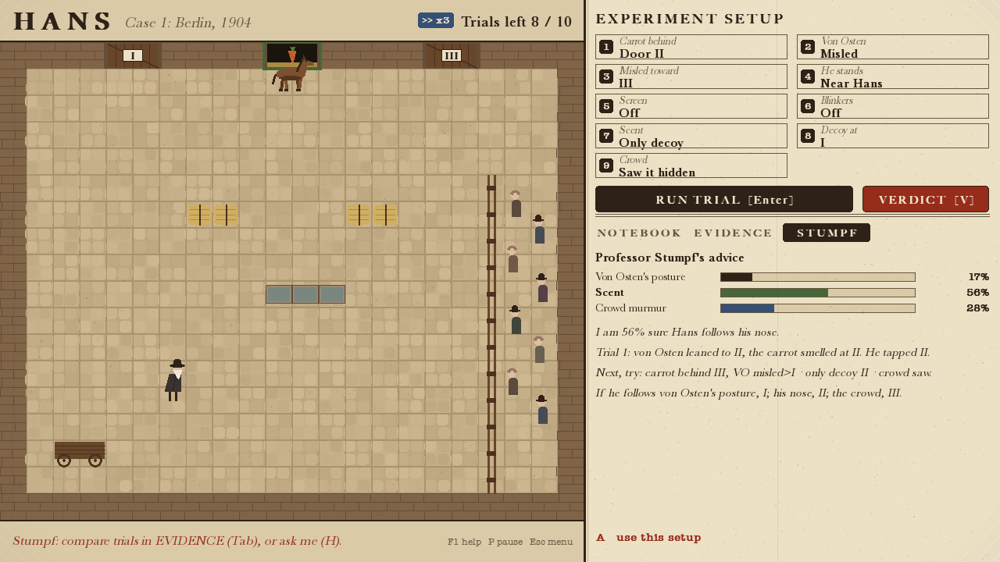
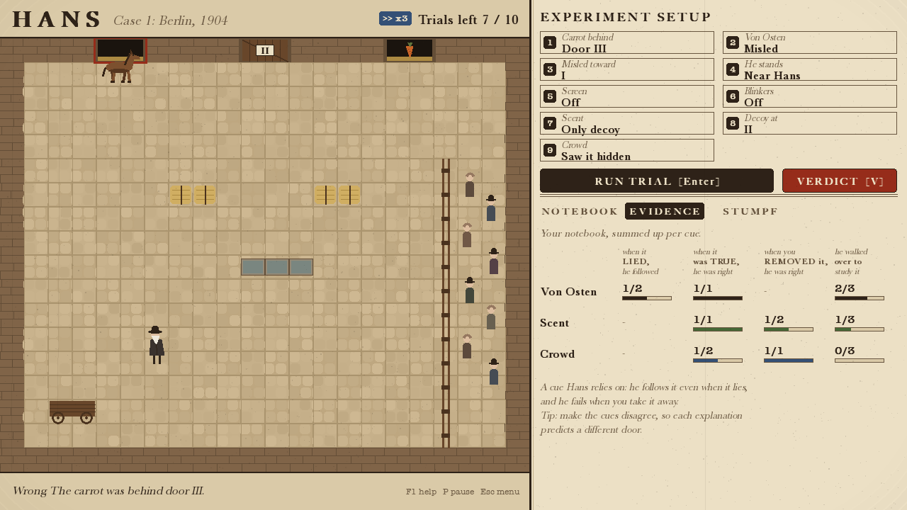
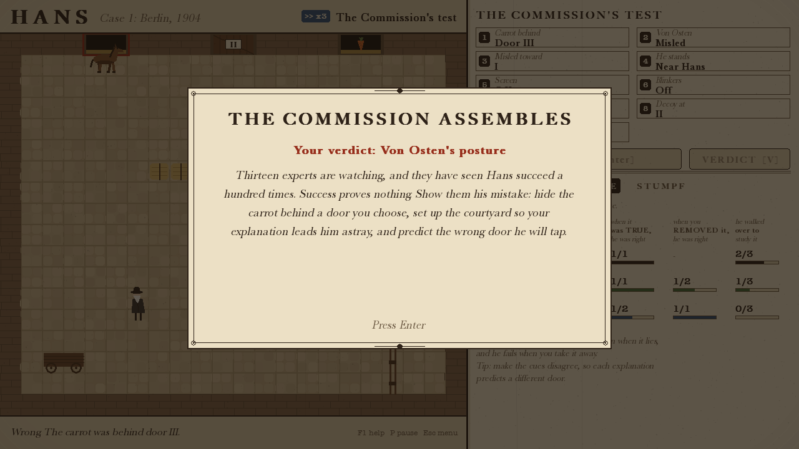

# Hans

*A game about learning the wrong clues.* Berlin, 1904.

Everyone believes Clever Hans the horse can think. You are **Oskar Pfungst**, the young
psychologist sent to find out how he really does it. Design experiments, watch what Hans
looks at, name what he really relies on, then prove it: make him tap the wrong door in front
of the Commission, and predict which one. Just don't forget that every experiment teaches Hans
something too.


Two AIs, both written from scratch in Python + pygame-ce for an AI for Games module:

- **Hans**, an autonomous agent: a **finite state machine**; **perception** by sight, smell and sound with line of sight and misreads; **Bayesian cue integration**; **value-of-information** decisions about what to study; **A\* pathfinding**; **online trust learning**; a **temperament**; and a **procedurally generated** training history.
- **Professor Stumpf**, a rule-based scientist: tracks hypotheses from the notebook alone and designs the most informative experiment out of 84. He gives hints, or solves the case himself. Over 200 generated cases: **96%** right verdicts, **94%** right Commission predictions, **3.4** trials on average.

## Run it

```bash
python3 -m venv .venv
source .venv/bin/activate
pip install -r requirements.txt
python main.py
```

Options: `--xray` (start with the X-Ray on), `--seed 42` (reproducible run), `--case 3` (start
from a later case), `--no-sound`, `--no-log`.

## How to play

1. **Set up an experiment** in the panel (click or keys 1–9; hover to see what an option does).
2. **Run the trial** (Enter). Hans takes in the courtyard, walks over to study whatever could change his mind, and taps the door he believes in.
3. **Read the evidence.** The notebook records what he studied and tapped; the EVIDENCE tab sums it up per cue.
4. **Verdict** (V): von Osten's posture, the scent, or the crowd?
5. **The Commission's test**: hide the carrot behind a chosen door and predict Hans's *mistake*.

Stuck? **H** asks Professor Stumpf (−5 points), **A** applies his suggestion, **S** lets him run the case.

| Input | Action |
|---|---|
| Click / `1`–`9`, `0` | Cycle a setup option (right-click or Shift = back) |
| `Enter` / `Space` | Run trial · continue |
| `V` | Verdict |
| `Tab` | Notebook / Evidence / Stumpf |
| `H` / `A` / `S` | Ask Stumpf / apply his setup / autopilot |
| `X` | AI X-Ray (shows Hans's mind; makes the case unofficial) |
| `F` / `P` / `M` | Fast-forward / pause / mute |
| `F1` / `F11` / `Esc` | Help / full screen / title |

## The AI

| Technique | Where | What it does |
|---|---|---|
| Finite state machines | [`hans_states.py`](game/ai/hans_states.py), [`state_machine.py`](game/ai/state_machine.py) | Hans: WAITING → OBSERVING ⇄ INVESTIGATING → DECIDING → ANSWERING → LEARNING. The same class runs Stumpf's autopilot and the screens |
| Perception | [`perception.py`](game/ai/perception.py) | Clarity by sense, distance, line of sight, blinkers; misreads. Hans never sees the answer |
| Decision making | [`utility.py`](game/ai/utility.py) | P(carrot behind each door) by Bayes' rule; study the source with the best value of information minus walking cost |
| Learning | [`beliefs.py`](game/ai/beliefs.py) | Beta(α, β) trust per cue with decay, which is why your experiments change him |
| Pathfinding | [`pathfinding.py`](game/ai/pathfinding.py) | 8-way A*, octile heuristic; travel time feeds the attention decision |
| Motivation | [`temperament.py`](game/ai/temperament.py) | Patience, speed, curiosity, confidence: steady, restless, thorough, bold |
| Procedural generation | [`case.py`](game/case.py) | Each Hans is trained by 60 simulated trials; what he relies on *emerges* |
| Scientist AI | [`scientist.py`](game/ai/scientist.py) | Rule-based hypothesis tracking + expected-information-gain experiment design + autopilot FSM |

Full design, maths, evaluation, video script and report plan: **[docs/GAME_DESIGN.md](docs/GAME_DESIGN.md)**.

## Tests and numbers

```bash
pip install -r requirements-dev.txt
python -m pytest                        # 56 tests
python -m tools.evaluate stumpf 200     # Stumpf's autopilot on 200 generated cases
python -m tools.evaluate regimes        # what each training regime x temperament produces
python -m tools.evaluate logs           # your own play, accuracy by condition
```

## Screens

| | |
|---|---|
|  |  |
|  |  |
|  |  |

*Historical note:* Clever Hans, Wilhelm von Osten, the 1904 Commission, Carl Stumpf and Oskar
Pfungst's experiments are real. The carrot-behind-doors task, the scent and crowd cues and the
later cases are inventions for the game.
