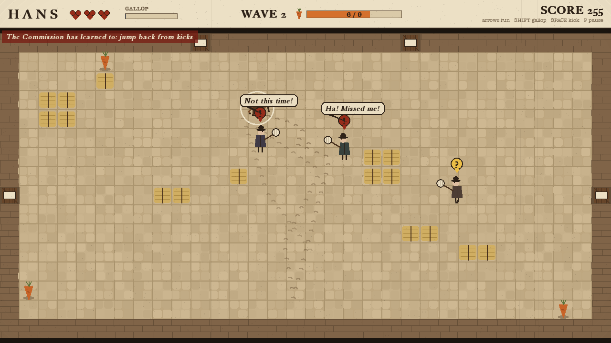
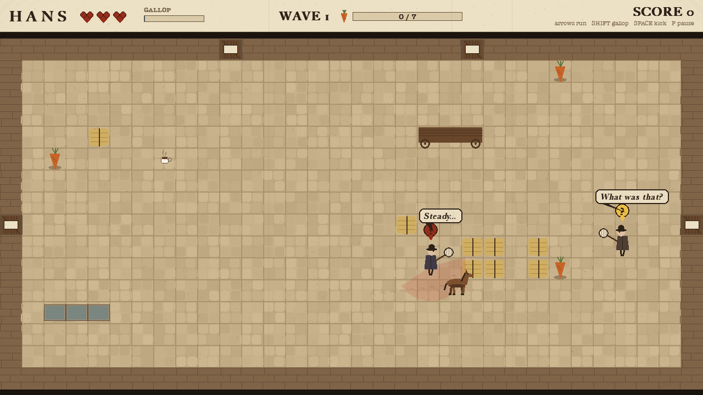
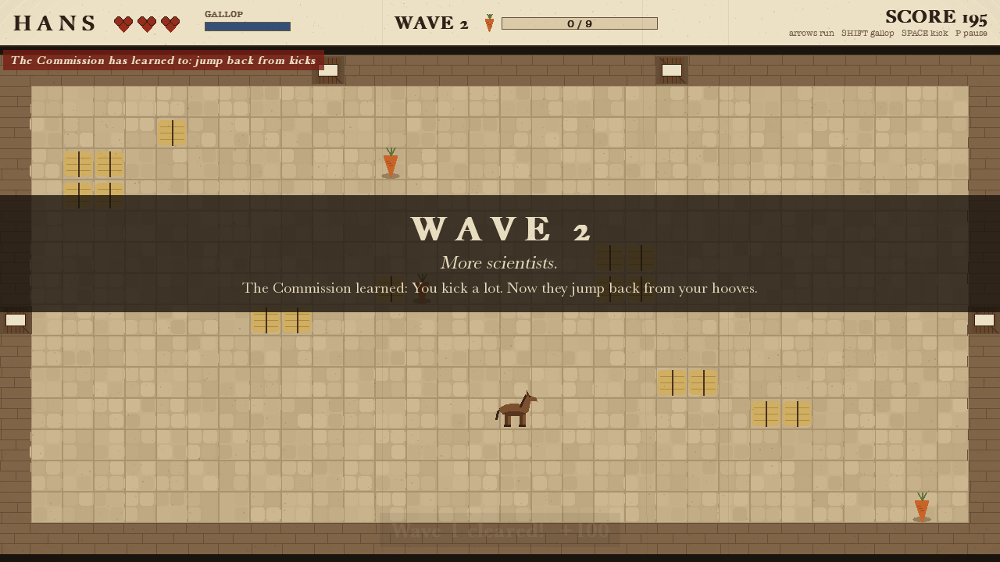
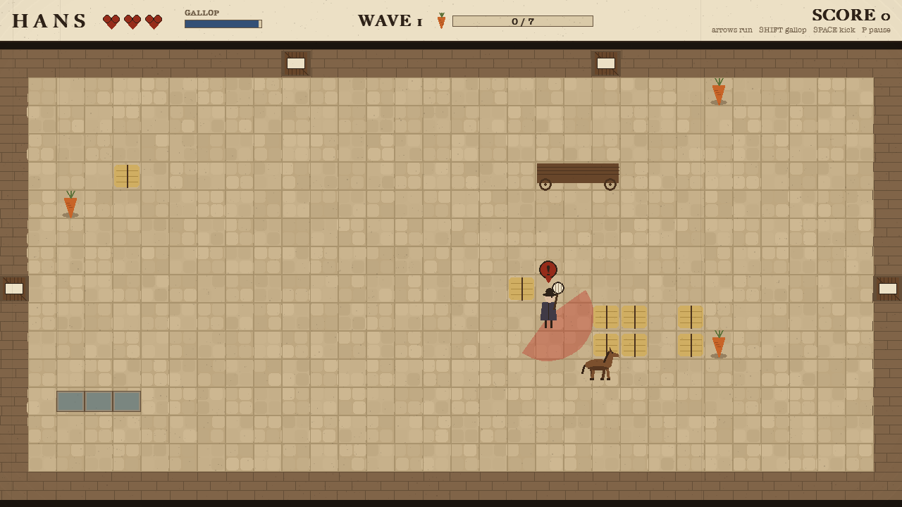
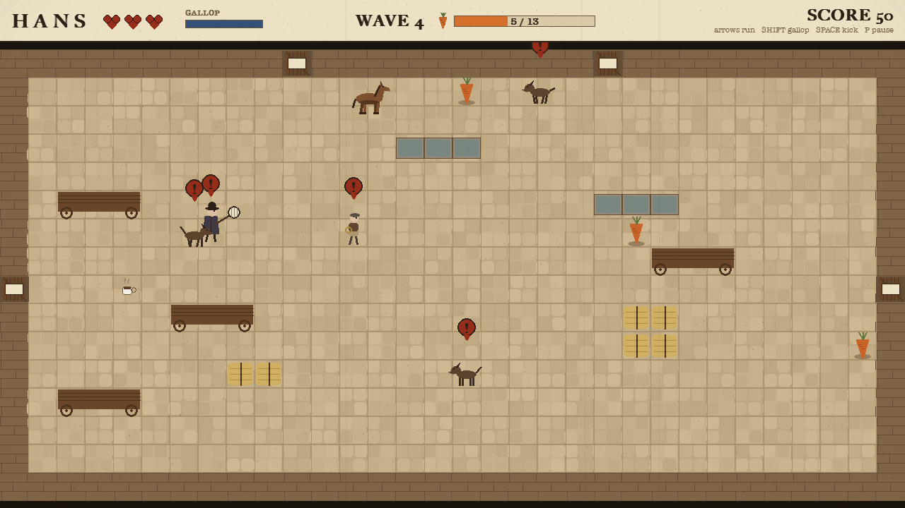
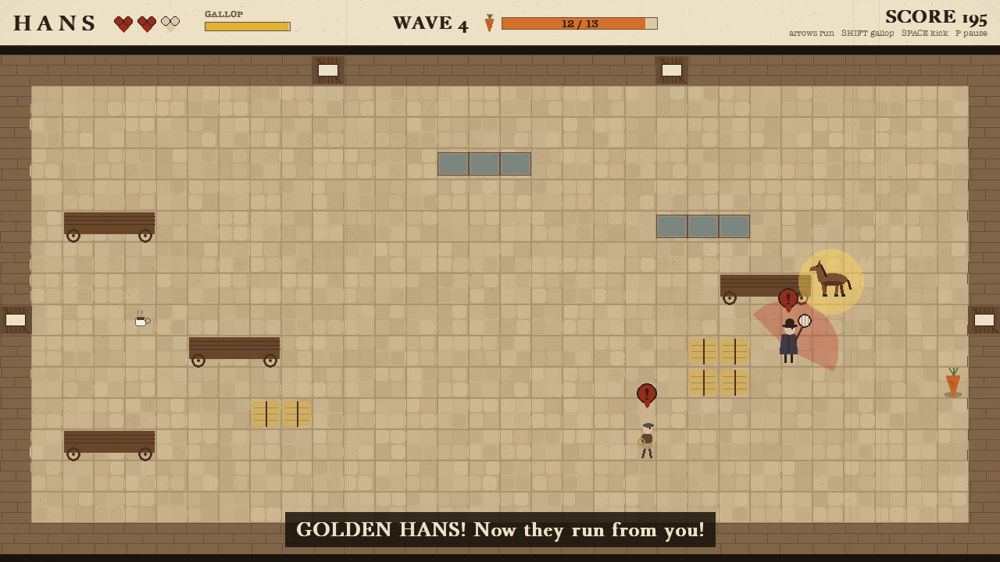
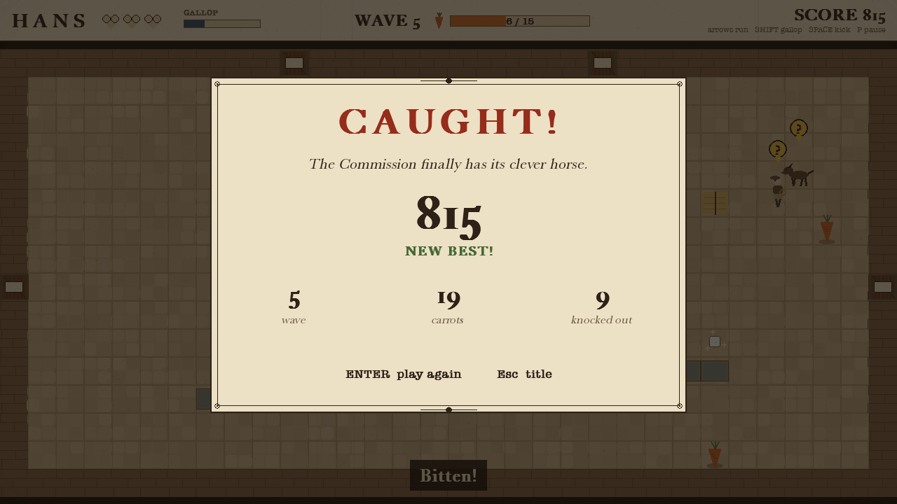

# Hans

*Catch me if you can.* Berlin, 1904.

Clever Hans is the most famous horse in Europe, and everyone wants to catch him. Run around the
courtyard eating carrots, buck-kick the scientists, dodge the stable boys' lassos, and don't let
the guard dogs corner you. Each wave brings more of them, and they get quicker.



## Play

```bash
python3 -m venv .venv
source .venv/bin/activate
pip install -r requirements.txt
python main.py
```

| Key | |
|---|---|
| Arrows / WASD | run |
| hold Shift | gallop: fast, but it tires you and they hear it |
| Space | kick: knocks down anyone close |
| P / Esc | pause |
| X | AI X-Ray: see what every enemy is thinking |
| F1 / M / F11 | help / mute / full screen |

**Goal:** eat the carrots to clear each wave. You have 3 hearts. A **red warning** means an attack
is coming: a net swing, a dog's pounce, or a lasso. Get out of the way, or step in and kick first.
A **sugar cube** gives a heart back; a **golden horseshoe** makes everyone run from *you*.

Options: `--wave 4` (start later), `--xray`, `--seed 42`, `--no-sound`.

## The AI

Every enemy is a finite state machine with senses and motivations, and the game works hard to
make their thinking **visible**. That's the "illusion of intelligence" from the first lecture:

- **They talk.** Every state change is said out loud in a speech bubble: "There he is!", "Where did he go?", "I need a coffee...", "I'll go round!", "Behind the hay!", "sniff sniff".
- **The Commission learns how you play.** Between waves it looks at your habits and adopts a counter-tactic, and tells you: kick a lot and they **jump back from your kicks**; gallop a lot and they **cut you off**; hide by the hay and they **check behind it**; snatch carrots under their noses and one **guards the carrots**.
- **Teamwork.** A second scientist runs round to the far side of you (a pincer); a shout or a bark alerts the others; dogs share out a ring around you.
- **Tracking.** You leave hoofprints; dogs follow the trail, nose down, from print to fresher print.
- **Morale.** Knock enough of them out and the rest lose their nerve ("He's too strong!").

| | States | What makes it smart |
|---|---|---|
| **Scientist** (net) | WANDER, INVESTIGATE, SEARCH, CHASE, SWING, STUNNED, FLEE, HEAL, KO | A* chase re-planned 4x a second; a visible wind-up; when kicked he weighs attacking vs fleeing vs **going for a coffee he's seen** |
| **Stable boy** (lasso) | ... POSITION, THROW, COVER | Scores nearby tiles to find a good throwing spot; **leads his throw** to where Hans is going; **hides behind hay** when charged |
| **Guard dog** | ... SURROUND, POUNCE, RETREAT | **Pack tactics**: the pack shares out a ring around Hans and attacks from several sides; finds Hans by **smell** through hay |

- **Perception:** a 120° sight cone with line of sight (hay and carts block it), a double take on a glimpse, hearing (gallops, kicks, crunching carrots), smell (dogs), and memory of where Hans was last seen.
- **Decision making:** desirability scores for attack / flee / heal / cover ([`desire.py`](game/ai/desire.py)), re-evaluated twice a second, with a little stickiness so they don't dither.
- **Pathfinding:** A* on the courtyard grid for chasing, investigating, searching, fleeing, fetching coffee and finding cover.
- **Procedural generation:** every wave gets a new courtyard layout (checked for fairness and connectivity), and waves beyond 5 are generated from a growing budget.
- **Evade:** the golden horseshoe flips everyone into FLEE, like the Pac-Man ghosts in the FSM lecture.
- **Adaptation:** [`commission.py`](game/ai/commission.py) watches your habits; [`barks.py`](game/ai/barks.py) makes decisions audible.

Full design, balancing data, video script and report plan: **[docs/GAME_DESIGN.md](docs/GAME_DESIGN.md)**.

## Tests and tools

```bash
pip install -r requirements-dev.txt
python -m pytest             # 39 tests
python -m tools.autoplay     # bots play many games: how far does a sensible player get?
```

## Screens

| | |
|---|---|
|  |  |
|  |  |
|  |  |
|  |  |

*Earlier versions of this project are kept as git tags: `v0.2-detective` and `v0.3-stealth`.*
