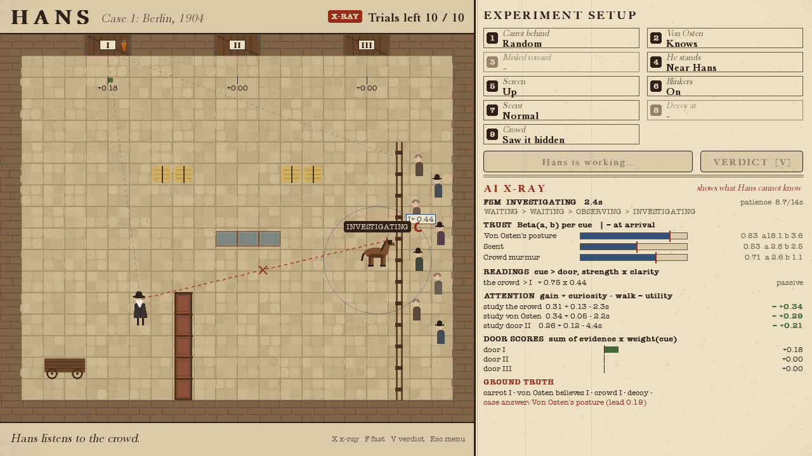
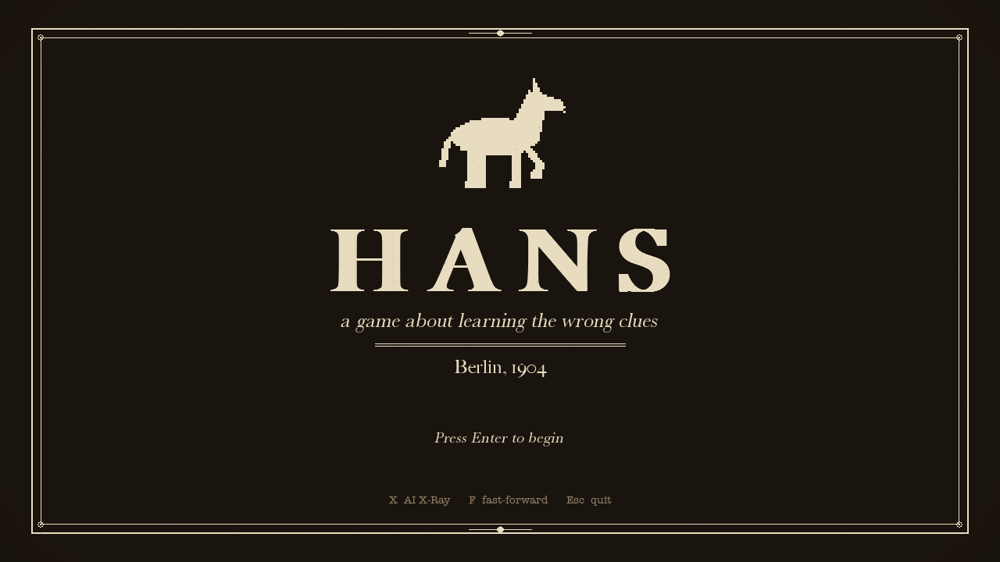
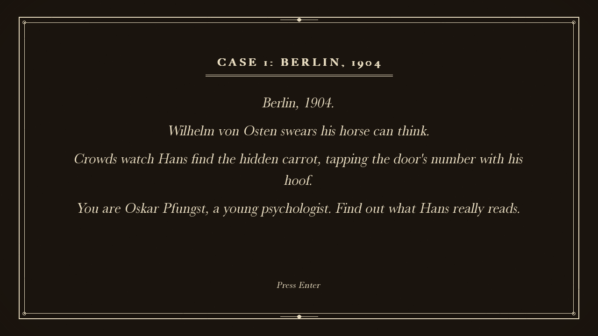
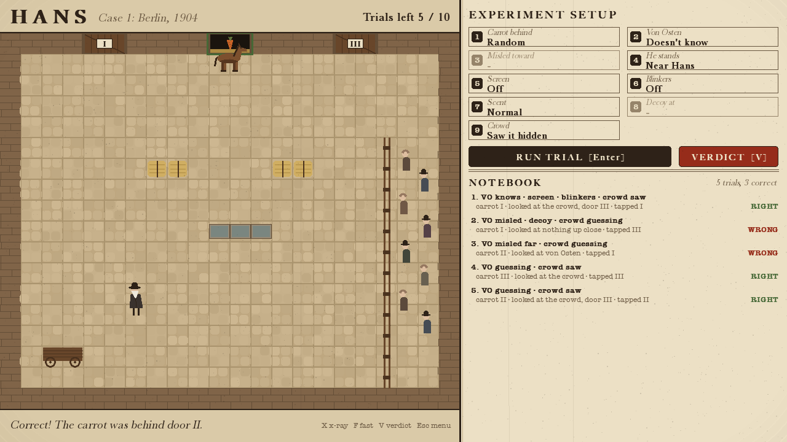
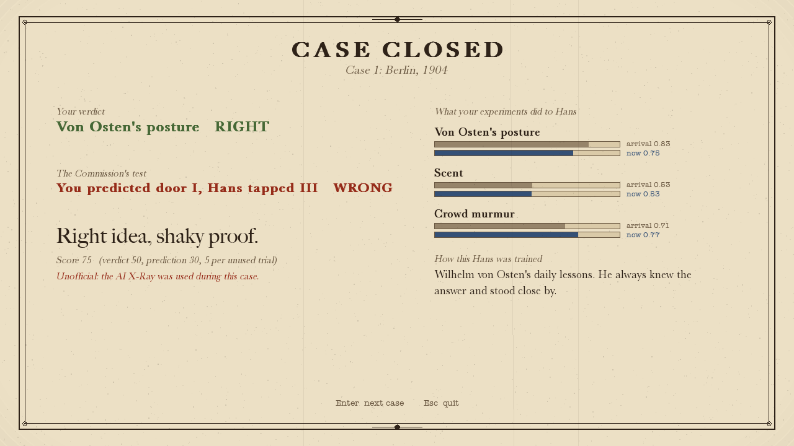

# Hans

*A game about learning the wrong clues.* Berlin, 1904.

Everyone believes Clever Hans the horse can think. You are **Oskar Pfungst**, the young
psychologist sent to find out how he really does it. Design experiments, watch what Hans
looks at, name what he actually relies on, and prove it to the Commission, before your own
experiments teach him something new.



Hans is a fully autonomous game-AI agent: a **finite state machine** with **perception**
(sight, smell, sound, line of sight, noise), **utility-based decisions** about what to study and
which door to tap, **A\* pathfinding**, **online trust learning**, and **procedurally generated**
training histories. Python + pygame-ce, AI for Games coursework.

## Run it

```bash
python3 -m venv .venv
source .venv/bin/activate
pip install -r requirements.txt
python main.py
```

Options: `--xray` (start with the AI X-Ray on), `--seed 42` (reproducible run),
`--case 2` (jump to a generated case), `--no-log` (don't write `logs/`).

## How to play

1. **Set up an experiment** in the panel: where the carrot is, whether von Osten knows the answer (or is misled, or absent), how far away he stands, screen, blinkers, scent (normal / masked / decoy) and the crowd.
2. **Run the trial** (Enter). Hans observes, walks over to study whatever he trusts, decides, and taps the door's number with his hoof.
3. **Read the notebook**: what he looked at, what he tapped, right or wrong. Every trial also teaches Hans something.
4. **Verdict** (V): von Osten's posture, scent, or the crowd?
5. **The Commission's test**: set up one last trial and predict the door he'll tap.

| Input | Action |
|---|---|
| Click setup box / `1`–`9`, `0` | Cycle option (right-click or Shift = back) |
| `Enter` / `Space` | Run trial · continue |
| `V` | Verdict |
| `X` | AI X-Ray (shows what Hans can't know) |
| `F` | Fast-forward ×3 |
| `Esc` | Back / quit |

## The AI

| Technique | Where | What it does |
|---|---|---|
| Finite state machine | [`game/ai/hans_states.py`](game/ai/hans_states.py), [`state_machine.py`](game/ai/state_machine.py) | WAITING → OBSERVING ⇄ INVESTIGATING → DECIDING → ANSWERING → LEARNING |
| Perception | [`game/ai/perception.py`](game/ai/perception.py) | Clarity by sense, distance, line of sight, blinkers; misreads. Hans never sees the answer |
| Decision making | [`game/ai/utility.py`](game/ai/utility.py) | Door score = evidence × trust; attention = value of a closer look + curiosity − walking cost |
| Learning | [`game/ai/beliefs.py`](game/ai/beliefs.py) | Beta(α, β) trust per cue with decay, which is why your experiments change him |
| Pathfinding | [`game/ai/pathfinding.py`](game/ai/pathfinding.py) | 8-way A*, octile heuristic; travel time feeds the attention decision |
| Procedural generation | [`game/case.py`](game/case.py) | Each Hans is trained by simulated history; his dominant cue *emerges* |

Full design, maths, roadmap, demo script and report plan: **[docs/GAME_DESIGN.md](docs/GAME_DESIGN.md)**.

## Tests

```bash
pip install -r requirements-dev.txt
python -m pytest
```

## Screens

| | |
|---|---|
|  |  |
|  |  |

## Status

Playable core done: the Hans AI, cases, verdict and Commission test, X-Ray, and experiment logs.
Next up: Professor Stumpf's hints and an AI-scientist autopilot (see the roadmap).

*Historical note:* Clever Hans, his owner Wilhelm von Osten, the 1904 Commission and Oskar
Pfungst's experiments are real. The carrot-behind-doors task, scent and crowd cues and later
cases are inventions for the game.
