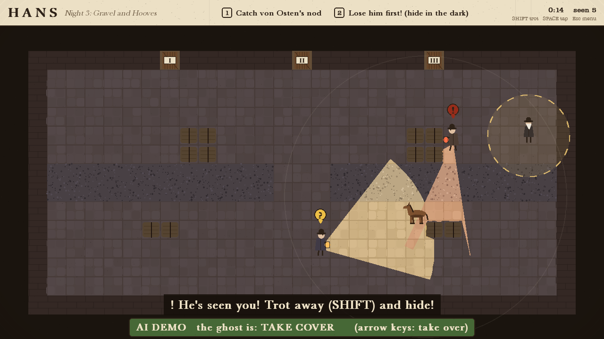
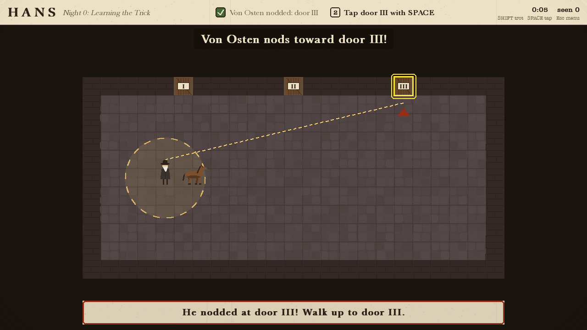

# Hans

*A sneaky game about a clever horse.* Berlin, 1904.

Everyone thinks Clever Hans can think. His secret: his owner, von Osten, can't help nodding
toward the right answer. **You are Hans.** Sneak into von Osten's circle, catch his nod, and tap
the right door with your hoof, without the lantern-carrying scientists of the Commission
catching you at it.



## Play

```bash
python3 -m venv .venv
source .venv/bin/activate
pip install -r requirements.txt
python main.py
```

1. **Arrow keys** to walk (hold **Shift** to trot: fast but loud).
2. Stand in **von Osten's circle** until he nods. The right door starts to glow.
3. Walk to it and press **Space**.

Scientists see only what their **lantern** lights: **?** means suspicious, **!** means chasing.
Hide in the dark and behind hay; trotting and gravel make noise they hear. You can't tap a door
while you're being chased, so lose him first.

Night 0 is a tutorial. Stuck? Press **D** on the title screen to **watch the AI play** the night.

| Key | |
|---|---|
| Arrows / WASD | walk |
| Shift | trot |
| Space | tap a door |
| Esc | pause (R restart, Q title) |
| X | AI X-Ray |
| F1 | how to play |
| M / F11 | mute / full screen |

Options: `--night 3` (start on a night), `--xray`, `--seed 42`, `--no-sound`.

## The AI

| Technique | Where | What it does |
|---|---|---|
| Finite state machines | [`scientist.py`](game/ai/scientist.py), [`owner.py`](game/ai/owner.py), [`state_machine.py`](game/ai/state_machine.py) | Scientists: PATROL → SUSPICIOUS → CHASE / INVESTIGATE → RETURN. Von Osten: STANDING → NODDING / WALKING |
| Perception | [`perception.py`](game/ai/perception.py) | Lantern-cone vision with line of sight (the light on screen *is* their vision), a suspicion meter, hearing radii |
| Pathfinding | [`pathfinding.py`](game/ai/pathfinding.py) | A* for patrols, investigating, chasing (re-planned every 0.3 s) and returning |
| Decision making | [`scientist.py`](game/ai/scientist.py), [`play.py`](game/play.py) | Sight beats sound beats patrol; sentries sweep; a watcher keeps his lantern on von Osten; whistles bring colleagues; difficulty assist |
| An AI that plays Hans | [`ghost.py`](game/ai/ghost.py) | Influence ("danger") map, safe-route Dijkstra, wait in the dark, run for cover. Powers the demo and the playtests |

Full design, balancing data, video script and report plan: **[docs/GAME_DESIGN.md](docs/GAME_DESIGN.md)**.

## Tests and tools

```bash
pip install -r requirements-dev.txt
python -m pytest                  # 32 tests
python -m tools.playtest          # careless vs careful AI players on every night
python -m tools.danger_map        # how often each tile is lit, plus level checks
```

## Screens

| | |
|---|---|
|  |  |
|  |  |

*Historical note:* Clever Hans, Wilhelm von Osten and the 1904 Commission are real; later that
year the psychologist Oskar Pfungst showed that Hans was reading his questioner's involuntary
cues. The sneaking, the lanterns and the carrot doors are this game's invention.

*The earlier detective version of this project is kept as the git tag `v0.2-detective`.*
