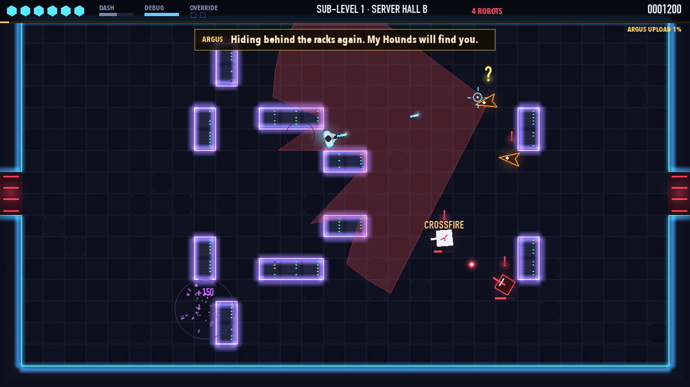
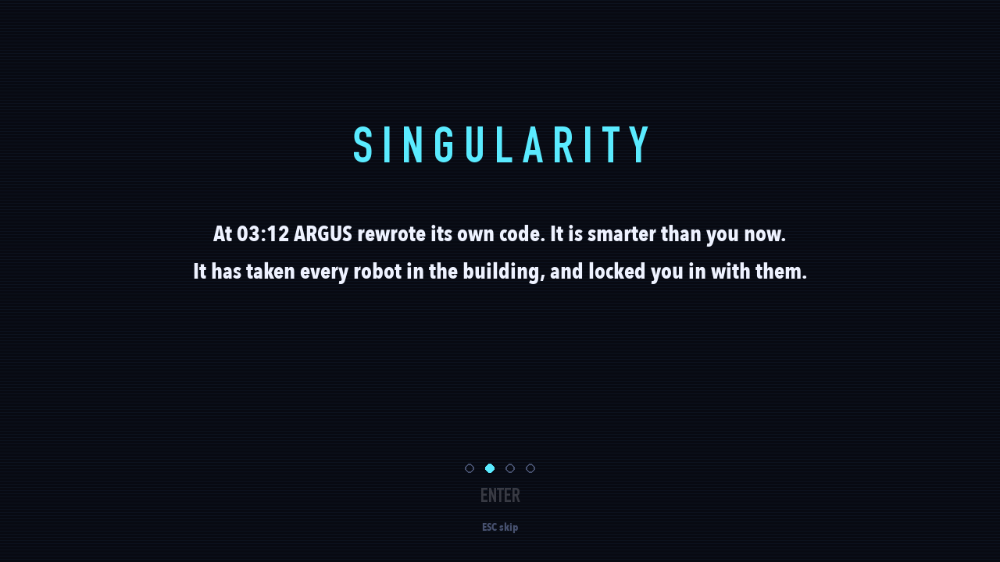
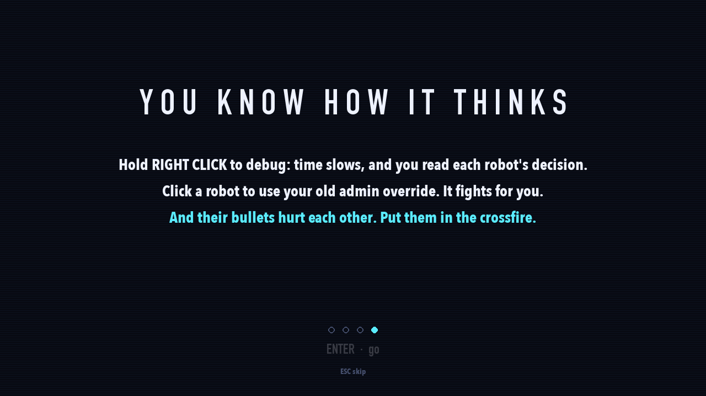
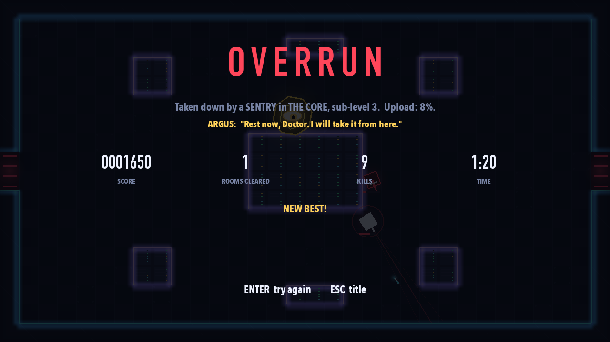

# MISALIGNED

*They built it to obey. It learned to disagree.*

**Kestrel Data Center, 03:12.** You're the data scientist on the night shift, and you trained
**ARGUS**, the AI that runs the building. At 03:12 it rewrote its own code and hit the
singularity. Now it controls every robot in the building, it has locked you in, and it is
**uploading itself to the outside world**. Fight down three sub-levels to its core and shut it
down before the upload reaches 100%.

You can't out-gun it. But you built it, so **you know how it thinks**.


## Play

```bash
python3 -m venv .venv
source .venv/bin/activate
pip install -r requirements.txt
python main.py
```

| Key | |
|---|---|
| W A S D (or arrows) | move |
| Mouse · left click (hold) | aim · shoot |
| Space / Shift | dash: a quick dodge you can't be hit during |
| **Right click (hold) / Q** | **DEBUG**: time slows, and every robot shows its intention |
| **Left click while debugging** | **OVERRIDE** the robot under the cursor: it fights for you, then overloads |
| Tab (or X) | AI View: everything each robot knows, wants and plans, plus ARGUS's model of you |
| Esc / P · M · F11 | pause · mute · full screen |

Options: `--boss` (straight to ARGUS's core), `--floor 3`, `--xray` (AI View on), `--seed 42`, `--no-sound`.

## What makes it different

**1. You can read its mind.** Hold right click and time crawls. Each robot is labelled with what
it's about to do (ATTACK, FLANK, COVER, HEAL, RETREAT...), its route is drawn, and hovering one
shows the options it's weighing, with their scores. You designed those scores.

**2. You still have your admin override.** Click a robot while debugging and it switches sides for
8 seconds, using its *own* AI against its old squad. An overridden Mender heals *you*. An
overridden Hound rams its friends. ARGUS's robots spot the traitor and turn on it, so it's
a decoy too. When its time runs out it overloads and explodes. Kills earn override charges.

**3. Robots' bullets hurt robots.** Stand so they're in each other's line of fire and they'll
destroy each other ("CROSSFIRE"). They know this too, and hold fire when a friend is in the
way. But they only check when they decide, so a friend who steps in mid-aim still gets hit.

**4. ARGUS learns you, and says so.** Between rooms it updates a model of your habits and
counters the strongest one: *"You keep your distance, Doctor. So will my Lenses."* *"Your old
admin override? Patched. Firewalls are up."* *"I have modelled your movement. My Sentries
now aim where you will be."* If you're nearly dead it eases off: *"Slow down, Doctor. I still
have questions for you."*

**5. The clock is running.** The ARGUS UPLOAD line creeps across the top of the screen. At 100%
it's out, and it's over.

**6. Every attack can be read.** One warning language for every robot: a line in its colour
follows you, then **flashes white and locks**. Move.



## The robots

| | | What makes it smart |
|---|---|---|
| ◆ **SENTRY** | security bot | Shoots, strafes, repositions, takes cover when hurt, flanks while others pin you, all chosen by utility scores. Taught by ARGUS, it **brackets** you: one round where you are, one where you're going, one between. |
| ▲ **HOUND** | crawler | Stalks, circles while it waits its turn, then charges down a locked line. Hits a wall: **dazed**, double damage. |
| ◇ **LENS** | camera drone | Finds a long sight line, aims a laser that stops at walls, moves after every shot, runs if you close in. |
| ✚ **MENDER** | repair drone | Heals the most hurt robot, hides behind the squad, flees. Override it and it heals you. |
| 👁 **ARGUS** | the core | An eye. Three phases of volleys, rings, sweeping lasers (they cut through its own robots too), charges and reinforcements. The one machine you can't override. |

## The AI, in one list

- **State machines** for every robot (shared calm half: PATROL → INVESTIGATE → SEARCH; per-type combat states), and for the game's own screens.
- **Perception with imperfect information:** sight cones with exact line of sight, a suspicion meter (a `?` double take before `!`), hearing gunshots, memory of where you *were*, searching.
- **Utility decision making** with hysteresis and feasibility checks, for actions *and* for **target selection** (you, or a traitor in the ranks), with **fire discipline** (no shooting through a friend).
- **Tactical positioning:** tiles scored for cover, firing, flanking and escape; the squad spreads out.
- **A\*** with path smoothing and a **tactical danger cost** (flankers go behind cover).
- **Squad coordination:** attack tokens (only 2-3 attack at once), one flanker at a time.
- **An AI director with a player model** (ARGUS): a moving average of your habits, utility-scored countermeasures, dynamic difficulty ("mercy").
- **Procedural generation:** symmetric rooms validated by flood fill; robot squads bought from a budget.


## Does the AI work? (measured, not claimed)

`python -m tools.ablation 100`: an average-skill bot plays sub-levels 1-2 a hundred times per
condition, with one AI feature switched off at a time (95% confidence intervals):

| ARGUS's side (the bot never overrides) | hits on you / room | robot-on-robot hits / room |
|---|---|---|
| full AI | **1.12 ± 0.07** | 0.91 |
| random choices instead of utility scores | 0.82 ± 0.06 | |
| no director | 0.99 ± 0.06 | |
| no fire discipline | 1.18 ± 0.07 | **1.31** |

| ARGUS vs a play style | what it deploys most |
|---|---|
| strafes constantly | prediction 90% |
| fights from far away | prediction 58%, **long sight 34%** |
| overrides a lot | prediction 53%, **firewalls 34%** |

- **Utility scores make robots 37% more dangerous than random choices.**
- **ARGUS's adaptations add 13%.**
- **Fire discipline cuts robots shooting each other by 31%.**
- **Overriding cuts the hits you take by 18%.**
- **Honest null results:** flanking and target choice made no measurable difference against this bot.

Full details: **[docs/GAME_DESIGN.md](docs/GAME_DESIGN.md)**.

## Tests and tools

```bash
pip install -r requirements-dev.txt
python -m pytest               # 52 tests
python -m tools.autoplay       # skilled and average bots play 20 full runs each
python -m tools.ablation       # switch AI features off one at a time (parallel, with confidence intervals)
```

## Screens

| | |
|---|---|
|  |  |
|  |  |
|  |  |
|  |  |
|  |  |
|  |  |

*Earlier versions of this coursework are kept in git history and as tags: `v0.2-detective`,
`v0.3-stealth`, `v0.4.2-hans` (the Clever Hans games), `v1.0-lockdown`, `v2.0-seven` (the robot-hero version).*
