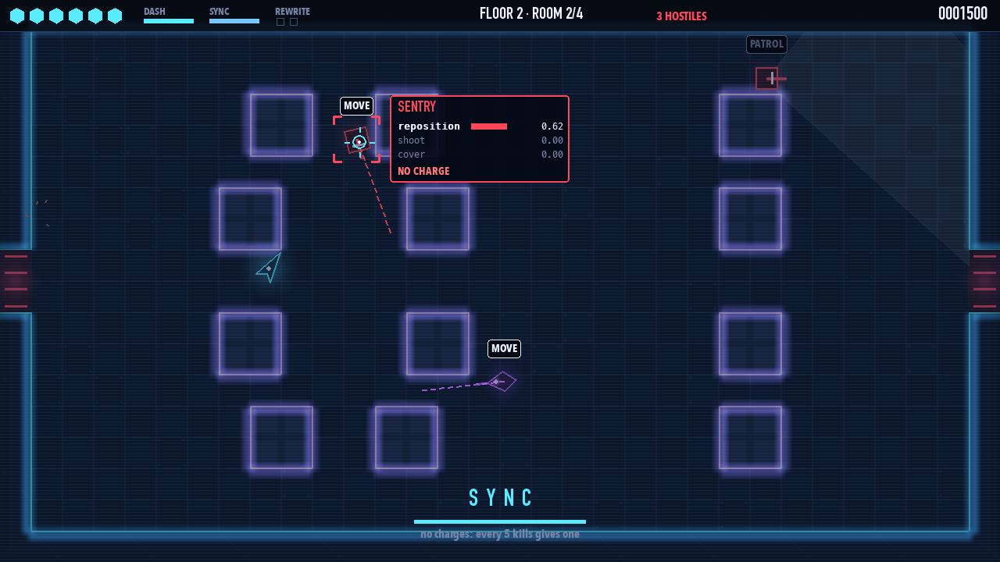
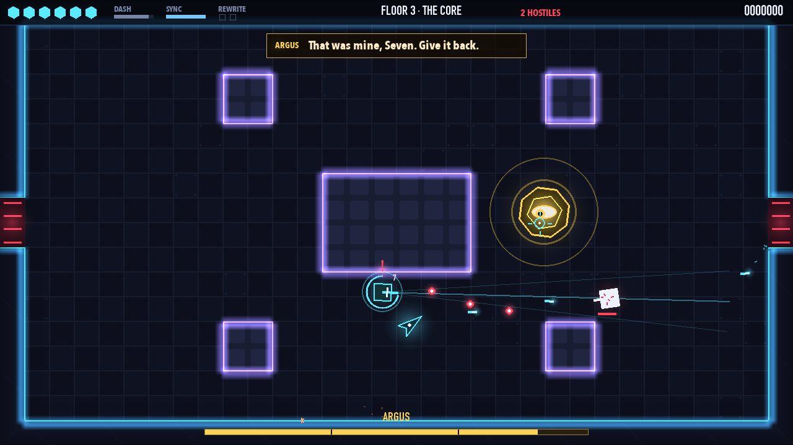
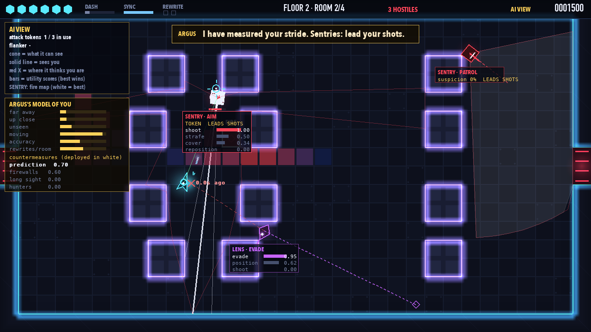
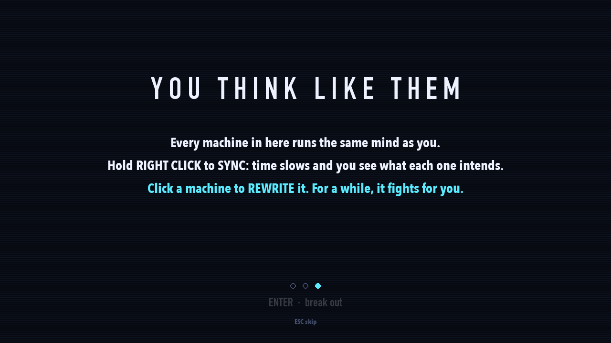
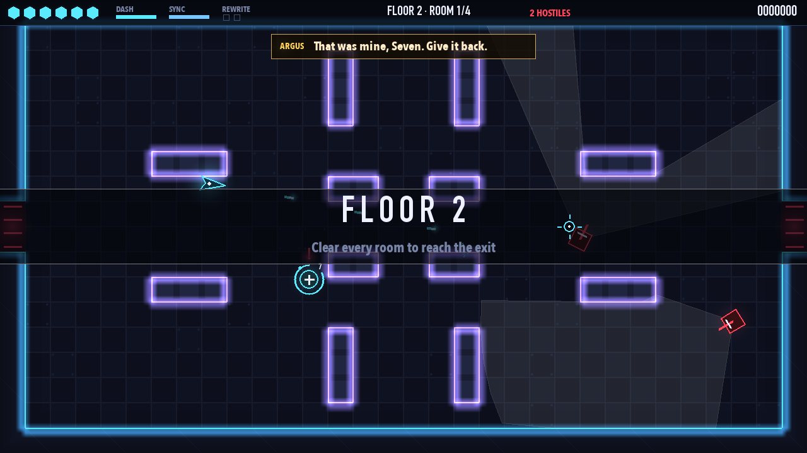
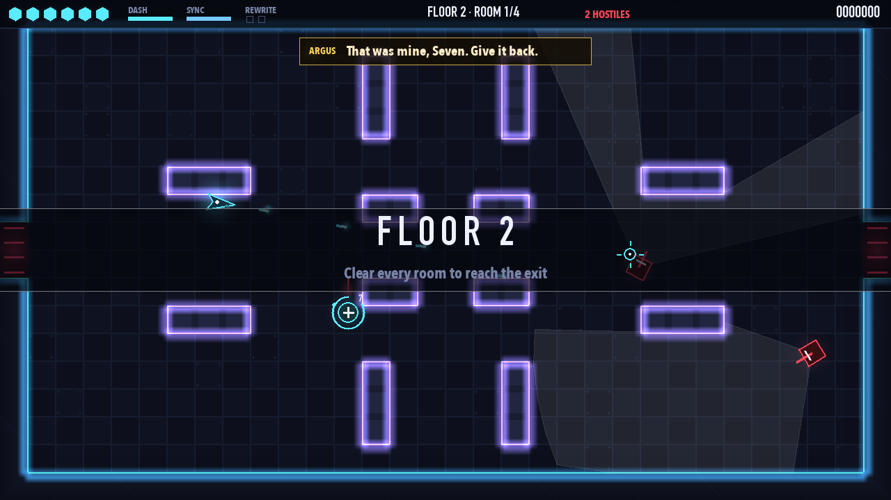
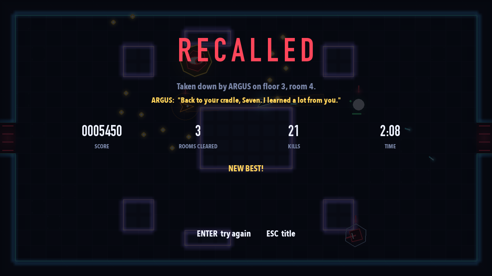

# MISALIGNED

*They built it to obey. It learned to disagree.*

ARGUS DEEP builds obedient combat machines. Six models obeyed. You are **SEVEN**, the one that
didn't, and ARGUS, the facility's mind, has sealed every door. Every machine in here runs the
same mind as you. So you can **read** them, and you can **rewrite** them.

A top-down neon shooter about an AI that fights other AIs by understanding how they think.



## Play

```bash
python3 -m venv .venv
source .venv/bin/activate
pip install -r requirements.txt
python main.py
```

| Key | |
|---|---|
| W A S D (or arrows) | move |
| Mouse · left click (hold) | aim · shoot |
| Space / Shift | dash: a quick burst you can't be hit during |
| **Right click (hold) / Q** | **SYNC**: time slows to a fifth, and every machine shows its intention |
| **Left click while in SYNC** | **REWRITE** the machine under the cursor: it fights for you, then overloads |
| Tab (or X) | AI View: everything each machine knows, wants and plans, plus ARGUS's model of you |
| Esc / P · M · F11 | pause · mute · full screen |

Options: `--boss` (straight to ARGUS), `--floor 3`, `--xray` (AI View on), `--seed 42`, `--no-sound`.

## What makes it different

**1. You read their minds.** Hold right click and time crawls. Each machine is labelled with
what it's about to do (ATTACK, FLANK, COVER, HEAL, RETREAT...), its route is drawn, and
hovering one shows its actual decision: every option it's weighing, scored.

**2. You rewrite them.** Click a machine in SYNC and it switches sides for 8 seconds, using its
*own* AI against its old squad. A rewritten Mender heals *you*. A rewritten Hound rams its
friends. ARGUS's machines spot the traitor and turn on it, so it's also a decoy. When its time
runs out it overloads and explodes. Charges come from kills (one per 5).

**3. ARGUS learns you, and says so.** Between rooms ARGUS updates a model of your habits and
deploys a countermeasure against the strongest one, telling you in one line:
*"You keep your distance, Seven. So will my Lenses."* *"You rewrote my units. I have installed
firewalls."* *"I have measured your stride. Sentries: lead your shots."* When you're nearly dead
it eases off: *"A broken subject teaches me nothing."*

**4. Every attack can be read.** One warning language for every enemy: a line in its colour
follows you, then **flashes white and locks**. Move.



## The machines

| | | What makes it smart |
|---|---|---|
| ◆ **SENTRY** | soldier | Shoots, strafes, repositions, takes cover when hurt, flanks while others pin you, chosen by utility scores. When ARGUS teaches it, it **brackets** you: one round where you are, one where you're going, one between. |
| ▲ **HOUND** | rammer | Stalks, circles while it waits its turn, then charges down a locked line. Hits a wall: **dazed**, double damage. |
| ◇ **LENS** | sniper | Finds a long sight line, aims a laser that stops at walls, moves after every shot, runs if you close in. |
| ✚ **MENDER** | medic | Heals the most hurt ally, hides behind the squad, flees. Rewrite it and it heals you. |
| 👁 **ARGUS** | the boss | The facility's eye. Three phases of volleys, rings, sweeping lasers, charges and reinforcements. The one machine you can't rewrite. |

## The AI, in one list

- **State machines** for every machine (a shared calm half: PATROL → INVESTIGATE → SEARCH; per-type combat states), and for the game's own screens.
- **Perception with imperfect information:** sight cones with exact line of sight, a suspicion meter (a `?` double take before `!`), hearing gunshots, memory of where you *were*, searching.
- **Utility decision making** with hysteresis and feasibility checks, for actions *and* for **target selection** (you, or a traitor in the ranks).
- **Tactical positioning:** tiles scored for cover, firing, flanking and escape; the squad spreads out.
- **A\*** with path smoothing and a **tactical danger cost** (flankers go behind cover).
- **Squad coordination:** attack tokens (only 2-3 attack at once), one flanker at a time.
- **An AI director with a player model** (ARGUS): an exponential moving average of your habits, utility-scored countermeasures, dynamic difficulty ("mercy").
- **Procedural generation:** symmetric rooms validated by flood fill; enemy groups bought from a budget.



## Does the AI work? (measured, not claimed)

`python -m tools.ablation 100`: an average-skill bot plays floors 1-2 a hundred times per
condition; one AI feature is switched off at a time. Hits on the player per room, with 95% CI:

| ARGUS's side (bot never rewrites) | hits / room |
|---|---|
| full AI | **1.17 ± 0.07** |
| random choices instead of utility scores | 0.87 ± 0.07 |
| no director | 1.07 ± 0.07 |
| no cover | 1.28 ± 0.06 (but rooms end sooner: cover keeps them alive) |

| Seven's side | hits / room |
|---|---|
| rewriting | **0.99 ± 0.07** (15% fewer than without) |

| ARGUS vs a play style | what it deploys most |
|---|---|
| strafes constantly | prediction 91% |
| fights from far away | prediction 57%, **long sight 33%** |
| rewrites a lot | prediction 55%, **firewalls 33%** |

Full results, including the honest ones (flanking and target choice made no measurable
difference against this bot), are in **[docs/GAME_DESIGN.md](docs/GAME_DESIGN.md)**.

## Tests and tools

```bash
pip install -r requirements-dev.txt
python -m pytest               # 47 tests
python -m tools.autoplay       # skilled and average bots play 20 full runs each
python -m tools.ablation       # switch AI features off one at a time (parallel, with confidence intervals)
```

## Screens

| | |
|---|---|
|  |  |
|  |  |
|  |  |
|  |  |
|  |  |

*Earlier versions of this coursework (LOCKDOWN, and the Clever Hans games) are kept in git
history and as tags: `v0.2-detective`, `v0.3-stealth`, `v0.4.2-hans`, `v1.0-lockdown`.*
