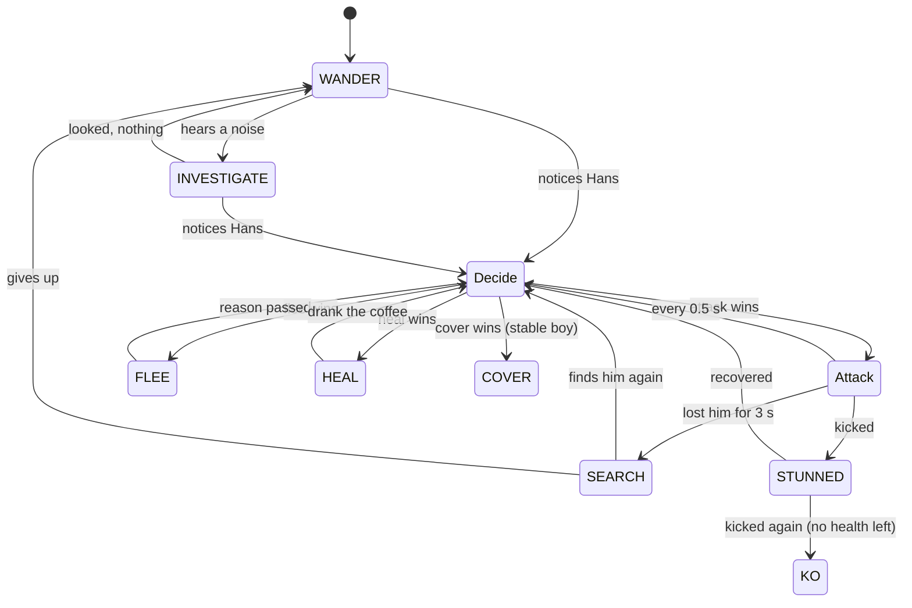
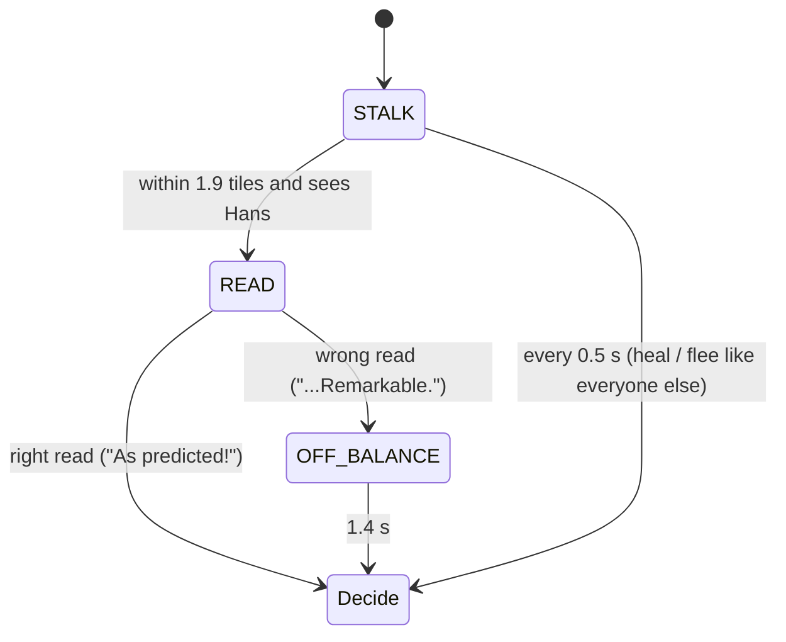

# Hans: Game Design Document

*Catch me if you can.*
AI for Games individual coursework · Python + pygame-ce · v0.4.2 · 26 Sep 2026
**Deadline: Friday 27 November 2026, 3pm** (2–3 min video 50% + 2,000-word report 50%)

> Earlier directions are kept in git: `v0.2-detective` (player as the scientist) and `v0.3-stealth`
> (sneak past lantern guards). Both were too much reading and thinking; v0.4 is pure action.

---

## 1. Pitch

Clever Hans is the most famous horse in Europe, and everyone wants to catch him. You play Hans
in a 1904 courtyard: **run, gallop, kick, eat carrots, survive the waves.** Scientists with
butterfly nets, stable boys with lassos and packs of guard dogs come through the stable doors.
Each type is its own AI, and each wave there are more of them and they're quicker.

**The story is the mechanic.** The real Hans couldn't count; he *read people*, spotting the tiny
involuntary cues of whoever asked the question. The psychologist Oskar Pfungst exposed him (1907)
by reading Hans just as closely. So in the game:

| History | Game |
|---|---|
| Hans read people's tells | Every red warning is a tell Hans reads: see red, move |
| Pfungst studied Hans until he could predict him | Boss every 5th wave: a **player model** of your dodges, a chalk X on his prediction, and **bluffing** if you read his X |
| Wilhelm von Osten believed in Hans and unknowingly cued him with a nod | Your **AI companion**: protects you, argues with scientists (E), and *nods* toward sugar cubes |
| The Hans Commission (13 experts, 1904) | The enemies, coordinated by a **tactics blackboard** and learning your habits between waves |

Three silent-film intertitles tell this before the first game (skippable).

## 2. How it plays

| Input | |
|---|---|
| Arrows / WASD | run (4.2 tiles/s) |
| hold Shift | gallop (6.8 tiles/s): drains stamina, and enemies hear it |
| Space | kick: everyone within 1.3 tiles is knocked back and stunned |
| E | von Osten argues with the nearest scientist (3.5 s; 12 s cooldown) |
| Q | von Osten waits here / follows again |
| P / Esc, X, F1, M, F11 | pause, AI X-Ray, help, mute, full screen |

- **A wave** is cleared by eating its carrots (7 in wave 1, then 2 more each wave). Up to 3 are on the field at once; eating one makes a crunch that enemies can hear.
- **3 hearts.** A net, a bite, or being caught loses one; then you blink invulnerable for 1.6 s.
- **Red warnings** tell you what's coming: a red arc (net swing), a red dashed line (a dog about to leap), a spinning rope (a lasso). Dodge, or step in and kick during the wind-up.
- **Pick-ups:** sugar cube (+1 heart), golden horseshoe (6 s: you can't be hurt, and everyone flees; touching them knocks them out), coffee (enemies only: +1 health).
- **Score:** carrot 10, knockout 25, wave cleared 100 × wave number. Best score is saved.

## 3. The enemies

### 3.1 Shared brain (`game/ai/enemy.py`)



"Attack" is a different sub-machine for each enemy type (below). States are classes on one
reusable `StateMachine` (`game/ai/state_machine.py`), the "state classes" pattern from the FSM
lecture, created once and never allocated at run time. The same class runs the game's screens.

**Senses** (`game/ai/perception.py`, `enemy.py`):
- **Sight:** a cone 7.5 tiles long and 120° wide, needing a clear line of sight. Hay and carts block it; troughs don't.
- **Noticing:** sight must last a moment (faster when close) before "!". Meanwhile he does a **double take**: stops and turns toward the glimpse, shown as "?".
- **Hearing:** a gallop carries 6 tiles, a kick 5, a crunching carrot 4.5. An unaware enemy goes to look (INVESTIGATE); an aware one updates where he thinks Hans is.
- **Smell (dogs):** within 5.5 tiles, through hay.
- **Memory:** the last place Hans was seen. Out of sight for 3 s, he SEARCHes there.
- **Word of mouth:** a spotting scientist or stable boy shouts to others within 7 tiles; a bark brings the whole pack within 12.

**Desirability** (`game/ai/desire.py`): when aware, each enemy scores its options:

| option | score |
|---|---|
| attack | aggression × (0.4 + 0.6 × health); 0 if Hans is golden |
| flee | 1.3 if Hans is golden, else cowardice × wounds × closeness |
| heal | wounds × (0.4 + 0.6 × closeness of the nearest coffee he has *seen*) × 2 |
| cover | (1.1 − 0.5 × health) if Hans is galloping at him (stable boys only) |

The best wins, with 0.12 stickiness so they don't dither. It's re-evaluated twice a second, so a
scientist kicked once will break off a chase for a nearby coffee, and everyone scatters the
moment Hans turns golden (the lecture's Pac-Man EVADE).

### 3.2 Scientist: butterfly net (`scientist.py`)

**CHASE:** A* to Hans (or his last known spot), re-planned every 0.25 s → **SWING:** stops, winds
up (the red arc), swings. It hits if Hans is still within 1.6 tiles and in front of him. The net
outreaches the kick (1.3), so you must either dodge the wind-up or step in and kick during it.

### 3.3 Stable boy: lasso (`stableboy.py`)

**POSITION:** scores ~30 tiles near Hans (ideal 3.5–6.5 tiles away, clear line of sight, short
walk) and goes to the best → **THROW:** spins the rope, then throws where Hans *will be* (leading
the target by his velocity, with a little human error). A hit tangles Hans for 1.8 s at half speed
→ reload → POSITION. **COVER:** if Hans gallops at him, he runs to the nearest tile Hans can't see.

### 3.4 Guard dog: pack (`dog.py`)

**SURROUND:** the pack shares out a ring 2.4 tiles around Hans, evenly spaced and starting from
the side they come from; each dog runs to its place → **POUNCE:** crouches (red dashed line),
leaps 3 tiles; a bite costs a heart → **RETREAT:** backs off, then circles again. They find Hans by
smell and track his scent while wandering.

## 3.5 The illusion of intelligence

Lecture 1: *"Game AI is about creating the illusion, or giving the user the impression, that they
are engaged in gameplay with 'intelligent' opponents."* Clever AI the player never notices is
wasted, so v0.4.1 makes the thinking visible.

| Feature | What the player sees | What's really happening |
|---|---|---|
| **Barks** (`barks.py`) | Speech bubbles: "There he is!", "Where did he go?", "I need a coffee...", "Cut him off!", "sniff sniff" | Every state change posts an event; each enemy type has its own lines, 3 s cooldowns, at most 3 on screen, never covering Hans |
| **The Commission learns** (`commission.py`) | Between waves: "The Commission learned: you kick a lot. Now they jump back from your hooves." A red label keeps what it has learned on screen | It counts kicks/min, share of time galloping, time lurking by cover, carrots snatched near enemies; the strongest habit over its threshold gets a counter-tactic, remembered all game (max 4) |
| WARY (vs kicking) | Scientists hop back from a missed kick: "Ha! Missed me!" | Aware enemies within 2.8 tiles are knocked back 1.3 tiles when a kick misses them |
| INTERCEPT (vs galloping) | "Cut him off!": they run to where you're going | Chase target = Hans + velocity × look-ahead (up to 1.2 s) |
| SWEEP (vs hiding) | "Check behind the hay!": searchers look behind cover | SEARCH visits up to 3 tiles beside hay/carts that are hidden from where Hans vanished |
| GUARD (vs greed) | "I'll watch the carrots." | One enemy per wave takes a GUARD state beside the nearest carrot, sweeping the approach |
| **Pincer** | "I'll go round!": two scientists close in from opposite sides | If a colleague is already chasing and closer, run to the point 1.8 tiles beyond Hans on the far side |
| **Tracking** | Hoofprints on the ground; dogs follow them nose-down | Prints every 0.45 tiles, fading over 14 s; TRACK steers to the freshest print within 3 tiles, fresher each time |
| **Morale** | "He's too strong!": the rest start running as you knock them out | Each KO lowers the wave's morale by 0.18; flee desire uses wounds + lost morale |
| **Double take** | "?" and a turn toward a glimpse | Noticing takes a moment; while it builds, calm enemies stop and face the glimpse |

In the X-Ray, a panel shows the Commission's live habit bars filling toward their thresholds.

## 3.6 Reading and being read (v0.4.2)

### The tactics blackboard (`tactics.py`)

A shared blackboard turns individual enemies into a team. Every frame:

- **Goal recognition.** For each carrot or pick-up, how well does Hans's velocity point at it? likelihood = e^(4(cos θ − 1)) / (1 + d/8), where θ is the angle between his heading and the item and d the distance. Each belief is smoothed toward its likelihood (rate 3/s), then normalised; the top item is "his goal" once it passes 45% ("He's after that carrot!").
- **Escape route.** Of 16 points 4 tiles around Hans, the reachable one furthest from every enemy.
- **Reading Hans.** Stamina under 20% or one heart left means **pressing**: +0.25 to every attack desire ("He's tiring!").

Every 0.5 s (0.25 s while Pfungst is on the field) it hands out **roles** to aware scientists:
the nearest is the **chaser**. If the goal is confident and far enough away, whoever can reach it
first becomes the **blocker** and stands on Hans's side of it. The next is a **flanker** (the
pincer), and the rest are **cutoffs** who run to the escape route. Enemies call their new role
out loud. Switching `_assign` off makes bots score **22% more** (§5).

### Oskar Pfungst, the boss (`pfungst.py`, `playermodel.py`)



- **STALK:** A* toward Hans, but he stops just outside the range Hans usually kicks from (the model tracks the average distance of Hans's kicks).
- **The player model.** Whenever *any* enemy winds up an attack, the model notes where Hans was. At the release it classifies his escape relative to the attacker: **left / right** (sidestep), **back** (away), **in** (toward, to kick), or nothing if he moved under 0.35 tiles. Counts start at 1 (a Laplace prior) so nothing is certain at first.
- **READ:** predicts the most frequent side and chalks an **X** 1.6 tiles that way. A red ring marks where Hans stands. After 0.85 s (shortened by wave speed) the net comes down: **caught** if Hans stood still or dodged the side Pfungst is netting (up to 6 tiles away: he throws it); otherwise **OFF-BALANCE** for 1.4 s, open to kicks.
- **Second-order bluff.** The model also records the player's *reply to the X*: did he dodge to the opposite side? If P(away) > 0.5, Pfungst bluffs with probability P(away): the X goes on his guess, but the net goes to the opposite side. It's a mixed strategy, so the bluff itself can't be read reliably. The X-Ray shows "BLUFF: X right, nets left".
- 5 hit points, aggression 1.4, cowardice 0.15. Knocking him out is worth 200. Between waves the banner shows **Pfungst's notebook**: "when attacked, you dodge LEFT 45% of the time."

### Wilhelm von Osten, the companion (`vonosten.py`)

An FSM whose transitions come from a **utility** score recomputed four times a second:

| option | utility |
|---|---|
| follow | 0.3 (keeps 1.8 tiles behind Hans via A*) |
| protect | 1.5 if a net or pounce is winding up at Hans within his reach and he isn't winded |
| point | item worth × 0.9: sugar 1.0 if Hans is hurt (0.2 if not), golden horseshoe 0.8. Skipped if Hans is already going for it (read from the blackboard's goal) |

- **PROTECT:** sprints in and grabs the net (the scientist is stunned 1.2 s, von Osten winded 8 s). A growling dog gets "Down, boy!" from up to 3 tiles away.
- **POINT:** walks toward the item and **nods** at it. This is the historical cue that made Hans look clever, now an honest hint (a dotted line in the game).
- **DISTRACT (E):** marches to the nearest scientist; the scientist goes into DISTRACTED for 3.5 s.
- **STAY (Q):** holds position, e.g. by a gate, to intercept nets there.
- **Watching your back:** "Behind you, Hans!" when an attack winds up behind Hans (at most every 4 s).

## 4. Waves and procedural generation

- **Courtyards** (`game/arena.py`): each wave places 6–12 hay bales, carts and troughs at random. It keeps a clear ring inside the walls and clear space around the start and the four stable doors. Obstacles never touch each other (no dead ends), and a flood fill proves every tile is reachable; otherwise the layout is re-rolled.
- **Waves** (`game/waves.py`): waves 1–5 are hand-made to introduce one enemy at a time (wave 1 sends its two scientists 8 s apart). From wave 6, waves are generated from a budget (4 + 0.9 × wave; scientist 1, stable boy 1.5, dog 0.8). Enemy speed grows from 0.82× to 1.35×, and **attack wind-ups shorten with it**, so later waves give you less time to react.
- **Every 5th wave** Pfungst joins, 3 s in ("Oskar Pfungst arrives!").
- A one-line intro banner names each new enemy; from wave 2 it names what the Commission learned, and after a wave clears it reads from Pfungst's notebook.

## 5. Balancing by bots (`tools/autoplay.py`)

Two bots play 30 games each (v0.4.2):

| bot | waves reached (median) | best | died in wave 1 |
|---|---|---|---|
| naive: runs at carrots, kicks when anything is close | 2 | 4 | 13/30 |
| player: dodges wind-ups, sidesteps lassos and pounces, kicks during wind-ups, gallops when crowded, grabs pick-ups, dodges away from Pfungst's X | 4 | 7 | 3/30 |

**Ablation** (player bot, 40 games each). Switch one AI system off and see what changes:

| | mean wave | mean score |
|---|---|---|
| everything on | 3.85 | 1227 |
| no tactics roles (no blocker / flanker / cutoff) | 4.30 | 1571 (+28%) |

**Pfungst duels** (`tools/pfungst_lab.py`, 8 × 90 s each). Share of Pfungst's reads that catch Hans:

| player | full Pfungst | guessing (no player model) | no bluffing |
|---|---|---|---|
| always dodges left | **95%** | 34% | 95% |
| reads the X and dodges away | **70%** | 39% | 0% |
| dodges at random | 36% | 25% | 34% |

The player model beats a habit (95% vs 34%), and bluffing beats a reader (70% vs 0%). A random
dodger beats both, just as a truly unpredictable Hans would have beaten Pfungst.

The bots drove real changes:
- **The net outreaches the kick.** At first the kick won every fight, and the naive bot survived 4 minutes untouched.
- **Dogs got smell and scent tracking.** At first they wandered and rarely found Hans.
- **Lassos got aim error.** They were hitting 52 of 56.
- **Double takes.** Enemies turned away mid-glimpse.
- **Wounded enemies want coffee more.** Coffee never won against attacking.
- **Carrots are topped up every frame.** A failed spawn could soft-lock a wave.
- **Gentler wave 1.**
- **Von Osten shouts at dogs.** Dogs caused most of the damage he couldn't prevent.
- **Pfungst throws the net at his prediction.** At first a gallop escaped every read, so the prediction didn't matter.
- **Bluffing is learned, not scripted.** A fixed "bluff after being fooled twice" caught readers 24% of the time; learning P(dodges away from the X) caught them 70%.

## 6. Module topic coverage

| Topic | Where |
|---|---|
| Finite state machines | 3 enemy types on one shared FSM core (10–11 states each, incl. GUARD, TRACK); game screens use the same class |
| Desirability / motivations | attack / flee / heal / cover scores, re-evaluated twice a second |
| Pathfinding | A* for chase, investigate, search, flee, heal, cover; re-planned while chasing |
| Perception | sight cone + line of sight, noticing, double take, hearing, smell, memory, shouting |
| Imperfect information | enemies only know what they sense or are told; coffee only if seen; search the last known spot; dogs follow a trail; Hans's goal is *inferred* from his heading, never known |
| Adaptation | the Commission learns the player's habits and counters them wave by wave; Pfungst's player model predicts dodges and learns whether to bluff |
| Coordination | tactics blackboard: goal recognition, escape-route analysis, chaser / blocker / flanker / cutoff roles |
| Companion AI | von Osten: utility-scored FSM with player commands |
| Procedural generation | a fair courtyard every wave; generated waves after 5 |

## 7. AI X-Ray (X)

For each enemy: its **state** and **role**, its top **desire scores**, its **sight cone** (orange =
unaware, red = aware), its **A* path**, its **last-seen marker**, a dog's **ring slot**, and a stable
boy's chosen **throwing spot**. Also shown:
- the blackboard's **goal belief** ("his goal? 60%") and **escape route**;
- **von Osten's** state and utilities;
- Pfungst's guess or **bluff** ("BLUFF: X right, nets left");
- a panel with the Commission's habit bars, Pfungst's **dodge model**, and how often you dodge away from his X.

## 8. Code map

```
main.py                     entry point (--wave, --xray, --seed, --no-sound)
game/config.py              every tunable number
game/arena.py               procedural courtyards
game/waves.py               hand-made and generated waves
game/level.py               the grid: walls, sight, rays, collision, cached A*
game/match.py               one game: waves, spawning, kicks, hits, items, lassos, score
game/entities/hans.py       the player's horse
game/entities/walker.py     A*-following / steering body shared by all enemies
game/ai/state_machine.py    reusable FSM
game/ai/enemy.py            shared senses, memory and states
game/ai/desire.py           desirability scores
game/ai/scientist.py        CHASE, SWING
game/ai/stableboy.py        POSITION, THROW, COVER
game/ai/dog.py              SURROUND, POUNCE, RETREAT (+ smell)
game/ai/perception.py       sight cones, hearing
game/ai/pathfinding.py      A*
game/scenes.py, app.py      title / play / game over, and the main loop
game/audio.py               synthesised sound (no files)
game/save.py                best score
game/ui/                    theme, sprites, view (arena, warnings, HUD, X-Ray), cards
tools/autoplay.py           balancing bots
game/ai/commission.py       learns the player's habits, picks counter-tactics
game/ai/barks.py            speech bubbles for decisions
game/ai/tactics.py          blackboard: goal recognition, escape route, roles
game/ai/playermodel.py      how the player dodges (and replies to the chalk X)
game/ai/pfungst.py          the boss: STALK, READ, OFF-BALANCE, bluffing
game/ai/vonosten.py         the companion: FOLLOW, STAY, PROTECT, POINT, DISTRACT
tools/pfungst_lab.py        duels that measure the player model and the bluff
tests/                      54 tests
```

## 9. Video plan (2–3 minutes)

1. **0:00** Story cards: Hans reads people; red = his reading of their tells; Pfungst is coming.
2. **0:15** Wave 1: a scientist spots you (? then !), dodge his wind-up, step in and kick. Von Osten grabs a net: "Unhand my horse!"
3. **0:35** X-Ray on: states, desires, roles. Head for a carrot: "He's after that carrot!" and the blocker gets there first.
4. **0:55** Kick a lot, then the wave 2 banner: the Commission learned it; they hop back "Ha! Missed me!". Press E: von Osten argues with a scientist.
5. **1:15** Wave 3–4: lasso leads its throw; a dog tracks your hoofprints; von Osten "Down, boy!"; he nods toward a sugar cube.
6. **1:40** Wave 5, Pfungst: dodge left three times, then his chalk X appears on the left, "Predictable, Hans." Caught. Dodge right instead: OFF-BALANCE, kick him.
7. **2:10** Keep dodging away from the X: X-Ray shows "BLUFF: X right, nets left", "He knows that I know!"
8. **2:30** The duel table (95% / 70% / 36%) and the ablation: the AI measurably works.

## 10. Report plan (2,000 words)

| Section | Words |
|---|---|
| Concept: the Clever Hans story as the mechanic (reading and being read) | 150 |
| The shared FSM core and the state-class pattern | 250 |
| Perception: sight, noticing, double take, hearing, smell, tracks, memory, shouting | 200 |
| Desirability and decision making (enemies) and utility (von Osten) | 250 |
| Coordination: the tactics blackboard, goal recognition, roles | 200 |
| Pfungst: player modelling and second-order bluffing | 250 |
| The illusion of intelligence: barks, the learning Commission, visible tells | 200 |
| Pathfinding, steering, procedural courtyards and waves | 150 |
| Evaluation: bots, ablation and the Pfungst duels | 250 |
| Reflection | 100 |

## 11. Roadmap to 27 November

| When | What |
|---|---|
| ✅ now | Playable wave game, 3 enemy AIs, X-Ray, bots |
| ✅ now | Illusion of intelligence: barks, learning Commission, pincers, tracking, morale |
| ✅ now | Story + deep AI: Pfungst (player model, bluffing), von Osten (companion), tactics blackboard, 54 tests |
| weeks 1–2 | Play it yourself; tune what feels unfair or dull (especially Pfungst's wind-up) |
| optional | A 4th enemy (a goat that steals carrots) |
| weeks 5–7 | Record the video (§9), write the report (§10) |
| before 27 Nov 3pm | Submit early |
