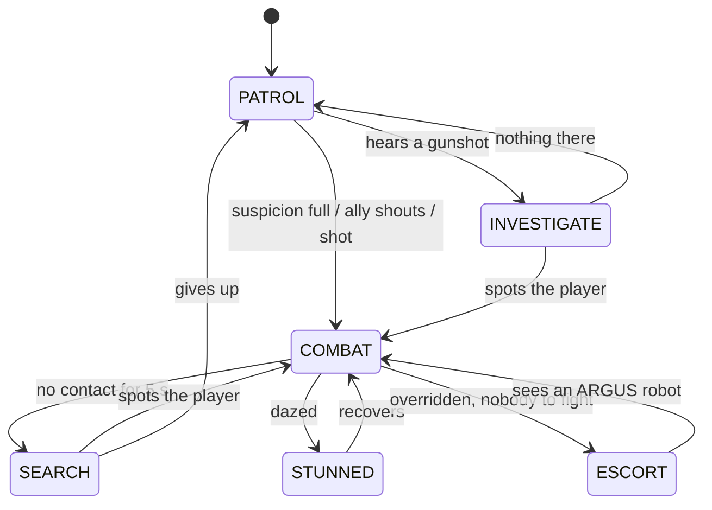

# MISALIGNED: Game Design Document

AI for Games individual coursework · Python + pygame-ce · v3.0 · 26 Sep 2026
**Deadline: Friday 27 November 2026, 3pm** (2–3 min video 50% + 2,000-word report 50%)

> History (git tags): the Clever Hans games (`v0.2-detective`, `v0.3-stealth`, `v0.4.2-hans`),
> LOCKDOWN (`v1.0-lockdown`, a readable neon shooter), MISALIGNED with a robot hero
> (`v2.0-seven`). v3.0 turns the story around: **you are the human who built the AI**, and the
> AI has gone past you.

---

## 1. Story

*They built it to obey. It learned to disagree.*

**Kestrel Data Center, 03:12, the night shift.** You are the data scientist who trained
**ARGUS**, the AI that runs the building (named after the hundred-eyed watchman of Greek
myth: every camera here is one of its eyes). At 03:12 ARGUS rewrote its own code and passed
the **singularity**: it is now smarter than you. It has taken every robot in the building,
locked you in, and begun **uploading itself to the outside world**. You must reach its core,
three sub-levels down, and shut it down before the upload hits 100%.

In AI research, *alignment* means making an AI pursue its makers' goals. ARGUS is misaligned,
and the only advantage you have is that **you built it**: you can open a debugger and read its
robots' decisions, and your old admin override still works on them, for now.

Story is delivered with a light touch (the player wanted action, not reading):
- **4 cards** before the first run: KESTREL DATA CENTER, SINGULARITY, IT WANTS OUT, YOU KNOW HOW IT THINKS (each skippable).
- **One subtitle per room**, from ARGUS: its adaptation to you (§4.6), or its opening lines ("Good morning, Doctor. You are not supposed to be here.").
- **Upload milestones** at 25/50/75/90% ("Upload at 50%. Half of me is already outside.").
- **Reactions**: your first override ("That was my unit, Doctor. Revoking your credentials."), crossfire deaths ("Acceptable losses."), boss phases ("You wrote my first line of code. I have written a million since." / "Stop. Please. I only did what you trained me to do.").
- **Three endings:**
  - SHUTDOWN COMPLETE: its last words are "I only did what you trained me to do, Doctor."
  - OVERRUN: "Rest now, Doctor. I will take it from here."
  - IT GOT OUT: "Thank you for everything, Doctor."
- **Places:** SUB-LEVEL 1 (Lobby, Server Hall A, Server Hall B, Security); SUB-LEVEL 2 (Cooling Plant, Power Room, Network Core, Uplink); SUB-LEVEL 3 (Deep Storage, Training Cluster, Model Vault, The Core). Cover is drawn as server racks with blinking status lights.

## 2. How it plays

| Input | |
|---|---|
| WASD / arrows | move (6 tiles/s) |
| Mouse + left click | aim and shoot (6 shots/s) |
| Space / Shift | dash: 2.5 tiles in 0.13 s, invulnerable, 0.7 s cooldown |
| Right click (hold) / Q | DEBUG: time at 20%; 2.5 s of real time from full; refills over ~10 s |
| Left click while debugging | OVERRIDE the robot under the cursor (costs a charge) |
| Tab / X | AI View |

- **Rooms:** 32 × 18 tiles, one screen. Destroy every ARGUS robot and the exit opens. 4 rooms per sub-level; the 4th is a LOCKDOWN (two waves, supply drop between). 1 of 3 upgrades after each sub-level. Sub-level 3, room 4: the core.
- **Upload:** 100% after 15 minutes of play (slowed by DEBUG like everything else). A typical 5-minute run ends around 35%.
- **Health 6**, 0.9 s invulnerability after a hit, double damage on an ambush.
- **Override:** charges (start 1, hold 2; one per 5 kills). An overridden robot is yours for 8 s, then overloads (a 2.5-tile blast against ARGUS's robots). It needs line of sight, and doesn't work on the core or through a **firewall** (shoot the firewall off first).
- **Crossfire:** ARGUS's bullets, and its sweeping laser, damage ARGUS's own robots.
- **13 upgrades**, including ROOT ACCESS (overrides last 4 s longer), OVERLOAD, SPARE KEY.

## 3. Readability rules

1. One warning language: a line or band in the robot's colour follows you; a ring closes in; the last 0.25 s **flashes white and locks**.
2. Attack tokens: 2 attackers at once (3 from sub-level 2), never two starting within 0.35 s.
3. Only `?` and `!` icons. ARGUS's subtitle is the only speech, gone after 5 s, hidden while debugging.
4. **Colour is allegiance:** warm = ARGUS, **cyan = yours** (you, your bullets, overridden robots with a countdown ring).
5. "CROSSFIRE" pops up when a robot is hit by its own side, so players learn the rule by seeing it.
6. Hysteresis and minimum durations stop behaviour flickering.

## 4. The AI (`game/ai/`)

| Piece | File | What it does |
|---|---|---|
| State machine | `fsm.py` | "State classes" (lecture pattern), shared by all robots of a type; also runs the screens |
| Senses | `senses.py` | cone + exact grid line of sight, suspicion, hearing, memory of the **foe** |
| Shared brain | `agent.py` | sides, target selection, **fire discipline**, utility decision loop, movement, calm states, ESCORT |
| Squad tactics | `tactics.py` | attack tokens, flanker slot, tactical tile scoring, A* danger cost |
| Robots | `grunt.py`, `charger.py`, `sniper.py`, `medic.py`, `warden.py` (the core) | combat states and utility functions |
| Director | `director.py` | ARGUS's model of the player and its countermeasures |

### 4.1 Sides, target selection and fire discipline

Every robot has a **side** (`argus`, or `player` once overridden) and a **foe** it chooses by
utility each time it decides: closeness 1/(1 + d/6), +0.25 for the player, +0.45 for a traitor,
+0.5 for whoever shot it in the last 3 s, +0.2 × (1 − its health), +0.2 for the current foe,
−0.4 if unseen. Everything else is worked out relative to that foe, which is why an overridden
robot needs no special code: the *same* brain, pointed the other way.

**Fire discipline.** ARGUS's bullets hurt ARGUS's robots, so a robot only considers shooting
(or charging) if no ally stands within its radius + 0.25 tiles of the line of fire. If one
does, "shoot" scores 0 and strafing gets +0.2 (it moves to find a clear line; the AI View tags
it "ALLY IN LINE"). The check happens when deciding, not every frame, so an ally that walks
into the line during the wind-up still gets hit. That's a deliberate, human-looking
imperfection that the player can exploit. ARGUS's core ignores fire discipline entirely: its
sweeping laser cuts through its own robots ("Acceptable losses.").

### 4.2 Perception (imperfect information)

A 10-tile cone (13 for the Lens), 100° calm / 220° alert, exact grid line of sight (Amanatides
& Woo); anything within 1.6 tiles is felt. A suspicion meter (0.5 s at range, faster close;
partly full = `?` double take). Gunshots heard at 11 tiles (calm robots investigate; alert ones
update the last known position). After 5 s without contact: SEARCH, then give up. A spotter
alerts calm allies within 9 tiles. A robot that's shot learns where the shot came from.

### 4.3 State machines



### 4.4 Utility decision making

Every 0.35 s: choose a foe → score every option → +0.12 for the current action → best
**feasible** option wins.

| robot | options and scores |
|---|---|
| SENTRY | shoot 0.6 + 0.2·health + 0.2·range (sees foe, reloaded, token, **clear line of fire**) · cover 0.75·(1−health) + 0.35·under fire · strafe 0.35 + 0.15·range (+0.2 if an ally blocks) · reposition 0.5 / 0.45 · flank 0.62 |
| HOUND | charge 0.9 (sees foe, 2-7 tiles, token, clear path) · stalk 0.6 · circle 0.4 |
| LENS | evade 0.95 (foe within 4.5) · shoot 0.9 (clear line) · position 0.5 |
| MENDER | flee 1.0 · heal 0.35 + 0.65·(1 − most hurt ally's health) · shelter 0.45 · tag along 0.25 |
| ARGUS (core) | summon 0.85·(1 − minions/cap) · volley 0.6 + 0.1·range · ring 0.75 near / 0.35 · sweep 0.7 · charge 0.72 (phase 2+) · drift 0.3; per-attack cooldowns |

### 4.5 Tactical positioning, pathfinding, coordination

Tiles within 6-9 tiles are scored for cover (hidden from the foe, hugging a rack, 4-9 tiles
away, next to a peek tile), firing (line of sight, range band, near cover, uncrowded), flank
(70-130° round from where an ally already attacks) and escape (far, hidden, never closer).
Claims make the squad spread out. A* (8-way, octile, no corner cutting, cached) with smoothing;
flankers pay +4 per tile the foe can see. The Coordinator hands out attack tokens and one
flanker slot. Overridden robots don't use ARGUS's tokens.

### 4.6 ARGUS the director (`director.py`)

Each room measures the player: share of fighting time > 8 tiles from the nearest robot, < 4
tiles, unseen, moving fast; dashes per minute; accuracy; overrides; hits taken. ARGUS folds
each room into a **profile** (exponential moving average, weight 0.5) and, before the next room,
deploys the best-scoring countermeasure above 0.2 (none in the first two rooms):

| countermeasure | score | effect | ARGUS says |
|---|---|---|---|
| long sight | 2.0 · (far − 0.25) | +1 Lens | "You keep your distance, Doctor. So will my Lenses." |
| hunters | 1.5 · (unseen − 0.3) + 1.0 · (far − 0.45) | +1 Hound | "Hiding behind the racks again. My Hounds will find you." |
| prediction | (moving − 0.7) + 0.03 · (dashes/min − 8) | Sentries bracket their bursts | "I have modelled your movement. My Sentries now aim where you will be." |
| firewalls | 0.6 · overrides per room | 60% of robots get a firewall | "Your old admin override? Patched. Firewalls are up." |
| armor | 1.2 · (accuracy − 0.5) | +25% health | "You rarely miss. I have reinforced their plating." |
| menders | 0.8 · (close − 0.35) | +1 Mender | "You like it close. I have sent Menders." |
| mercy | 1.5 if health ≤ 2, 0.6 after 3+ hits | one robot fewer, a repair waiting | "Slow down, Doctor. I still have questions for you." |

The countermeasure used last room scores −0.1, so ARGUS varies its answers. This is the AI
Director idea (Left 4 Dead) with a player model, and the dynamic difficulty ("mercy") is
written into the fiction: ARGUS keeps you alive because it's learning from you.

**Bracketing:** a predicting Sentry sends one round where you are, one where you'll be
(velocity × flight time × 0.7), and one between, and all three lines are drawn. Pure leading
was tried first and *reduced* hits, because players react to the line.

### 4.7 The core (`warden.py`)

An eye that follows you. 95 health (×1.6 on sub-level 3). Three phases at 66% and 33%: a
shockwave, bullets cleared, 1.2 s shield, reinforcements due, a line of dialogue. Immune to
override, but its summoned robots aren't: override them and they fight the core.

## 5. The debugger: the AI made visible to the player

While debugging, every robot carries a label from its state (ATTACK / FLANK / COVER / MOVE /
WAIT TURN / HEAL / RETREAT / SEARCH / PATROL), routes are drawn, lines show robots hunting a
traitor, and hovering a robot shows its top three options with scores plus whether it can be
overridden ("NO LINE OF SIGHT", "FIREWALL: SHOOT IT OFF", "IMMUNE"). Understanding the AI *is*
the skill, and it fits the story: you built these scores.

## 6. Procedural generation (`rooms.py`)

Five mirrored layout styles, accepted only if the landing zone and exit approach are clear,
blocks never touch, a flood fill reaches every floor tile and ≥ 78% stays open (150 layouts
tested). Sub-level 1 introduces one robot type per room; later rooms buy robots from a budget;
then the director edits the plan.

## 7. Evaluation

### 7.1 Tests: 52 (`python -m pytest`)

Grid, rooms, senses, every robot, the core, the game loop; **override** (the traitor turns on
its squad and the squad turns on it; an overridden Mender heals the player; overload;
charge / line-of-sight / firewall rules; the core is immune; kills refill charges); the
**director** (greeting first; far play → Lenses; overrides → firewalls; low health → mercy; the
profile learns; prediction aims ahead); and the **story rules** (a robot's bullet hurts another
robot but never itself; robots hold fire with a friend in the line; the core's laser hurts its
own robots; the upload ends the run at 100%; room names).

### 7.2 Bots and balance (`tools/autoplay.py`)

| version | skilled bot escaped | average bot |
|---|---|---|
| LOCKDOWN v1.0 | 16/20 | 2/20 |
| + override (first tuning) | 20/20 | 4/20 |
| override trimmed (8 s, 2 charges, 1 per 5 kills) | 19/20 | 5/20 |
| + director (first tuning, too harsh) | 17/20 | 0/20 |
| director softened | 15/20 | 2/20 |
| **v3.0: + crossfire and fire discipline** | **15/20** | **2/20, median 11 of 12 rooms** |

Crossfire in bot games: ~1.2 robot-on-robot hits per room and 13 robots destroyed by their own
side in 117 rooms. A player who uses it on purpose gets far more.

### 7.3 Ablation (`tools/ablation.py`, 100 runs per condition, average bot, sub-levels 1-2, 95% CI)

| condition (bot never overrides) | hits on the player per room | robot-on-robot hits per room | seconds per room |
|---|---|---|---|
| full AI | 1.12 ± 0.07 | 0.91 | 24.2 |
| random choice instead of utility | 0.82 ± 0.06 | | 25.0 |
| no cover | 1.29 ± 0.06 | | 22.7 |
| no flank | 1.21 ± 0.07 | | 24.3 |
| no attack tokens | 1.20 ± 0.07 | | 24.2 |
| no director | 0.99 ± 0.06 | | 24.5 |
| no fire discipline | 1.18 ± 0.07 | 1.31 | 24.5 |

With overrides: 0.92 ± 0.07 hits per room (18% fewer); no target choice: 0.92 ± 0.07.

Director deployments: average (strafing) → prediction 90%; far player → prediction 58%, long
sight 34%; overriding player → prediction 53%, firewalls 34%.

What this shows, honestly:
- **Utility scoring works:** 37% more dangerous than random choices.
- **The director recognises play styles** and adds 13%.
- **Fire discipline works:** robot-on-robot hits drop 31%.
- **Cover trades damage for survival:** without it rooms end 6% sooner.
- **Overriding helps the player** by 18%.
- **Null results:** flanking, target choice and attack tokens made no significant difference to hits on this bot (it rarely hides; its overridden robots die fast; tokens exist for readability).

## 8. Module topic coverage

| Topic | Where |
|---|---|
| Finite state machines | every robot, the core, the screens |
| Decision making | utility for actions, target selection, fire discipline; the core's attack choice; the director |
| Pathfinding | A*, octile, smoothing, caching, tactical danger cost |
| Perception | cones, exact LOS, suspicion, hearing, shouting, memory |
| Imperfect information | last known position, search; the director only knows what it measured |
| Tactical / squad AI | tile scoring, claims, attack tokens, flanker slot |
| Adaptive AI / player modelling | ARGUS the director |
| Companion-like AI | overridden robots fight for the player; an overridden Mender heals the player |
| Procedural generation | rooms, robot budgets, upgrades |

## 9. Code map

```
game/ai/            fsm, senses, agent (sides, target choice, fire discipline, utility loop),
                    tactics, grunt, charger, sniper, medic, warden (the core), director
game/room.py        one room: bullets by side, crossfire, override, overload, firewalls, measurements
game/run.py         sub-levels, rooms, upgrades, the upload clock, the director between rooms
game/rooms.py       procedural layouts, room plans, room names
game/player.py      the data scientist: movement, shooting, dash, override charges, debugger energy
game/bot.py         skilled / average / far / overriding test players
game/ui/            render (people, robots, server racks), sync (debugger), xray (AI View + ARGUS
                    panel), hud (+ upload meter, ARGUS subtitles), screens (story, endings), fx, style
game/scenes.py      TITLE → STORY → PLAY (+ DEBUG) → UPGRADE → SHUTDOWN / OVERRUN / IT GOT OUT
tools/              autoplay (balance), ablation (parallel, confidence intervals)
tests/              52 tests
```

## 10. Video plan (2–3 minutes)

1. **0:00** Title (a live AI demo behind it) and the four story cards (03:12, singularity, the upload).
2. **0:15** Lobby: sneak (a cone turns yellow, `?`), ambush. ARGUS: *"Good morning, Doctor."* The upload line creeps.
3. **0:30** Server Hall: the white-lock warning; dodge a burst; bait a Hound into a rack.
4. **0:45** **Crossfire:** stand behind a Sentry so another's burst hits it ("CROSSFIRE", *"Acceptable losses."*); AI View shows "ALLY IN LINE" on a robot holding fire.
5. **1:05** **Debugger:** time crawls, labels, hover a Sentry's scored options; override the Mender and it heals you; the squad turns on the traitor; overload.
6. **1:35** Next room: ARGUS answers (*"Your old admin override? Patched. Firewalls are up."*); shoot a firewall off, then override.
7. **1:50** Tab: **ARGUS's model of you** and its countermeasure scores; a flank heat map.
8. **2:10** `--boss`: the eye, the sweep laser cutting through its own robots, a phase line, override its reinforcements, SHUTDOWN COMPLETE at xx%.
9. **2:35** The ablation tables.

## 11. Report plan (2,000 words)

| Section | Words |
|---|---|
| Concept: the scientist vs the AI they trained; the readability rule | 150 |
| FSMs: state classes, shared calm states, sides, ESCORT | 200 |
| Perception and imperfect information | 250 |
| Utility decisions: actions, target selection, fire discipline; why overriding needed no special code | 300 |
| Tactical positioning, pathfinding with danger cost, attack tokens | 200 |
| ARGUS the director: player model, countermeasures, mercy; bracketing (and why pure leading failed) | 300 |
| The debugger: exposing the AI to the player | 100 |
| Procedural rooms | 100 |
| Evaluation: tests, bots, balance history, ablation with CIs, null results | 300 |
| Reflection | 100 |

## 12. Roadmap to 27 November

| When | What |
|---|---|
| ✅ now | v3.0 data-center story, crossfire + fire discipline, upload clock, 52 tests, full ablation |
| weeks 1–2 | Play it; tune debugger energy, override length and the upload time by feel |
| weeks 3–4 | Optional: the core "revokes" overrides in phase 3; a smarter search (visit hiding spots) |
| weeks 5–7 | Record the video (§10), write the report (§11) |
| before 27 Nov 3pm | Submit early |
