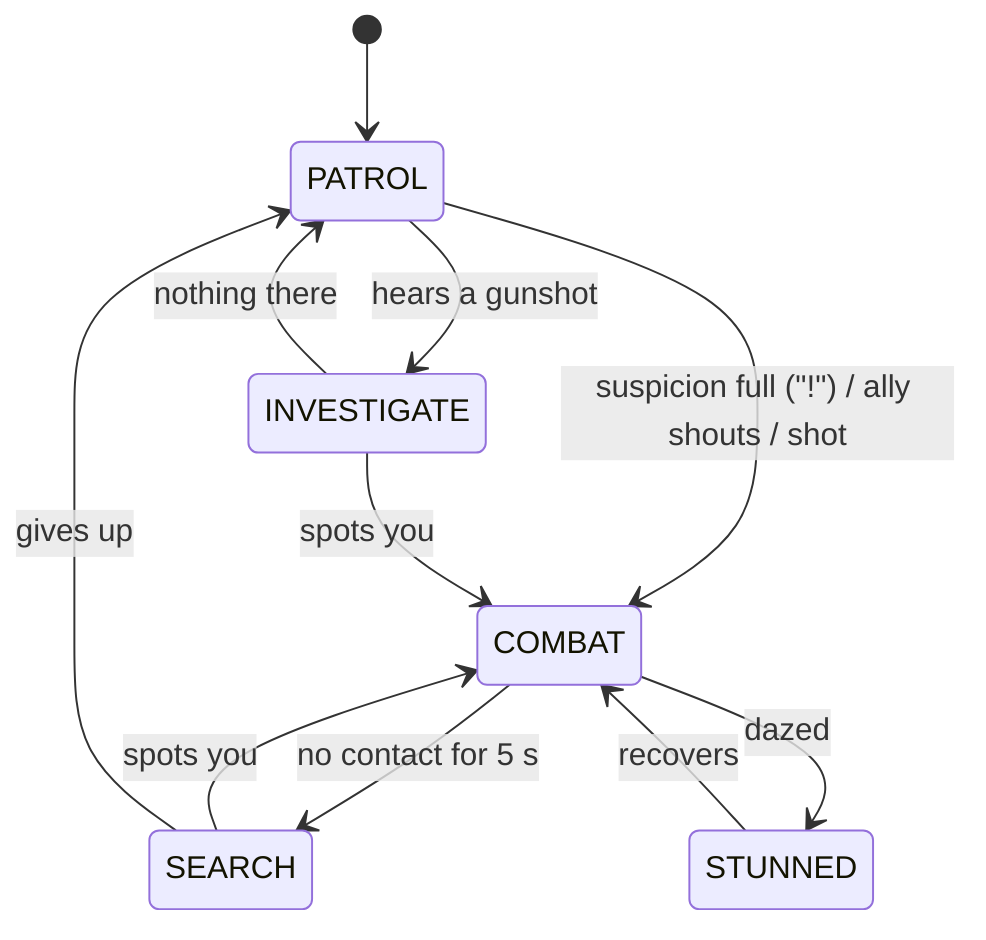

# LOCKDOWN: Game Design Document

AI for Games individual coursework · Python + pygame-ce · v1.0 · 26 Sep 2026
**Deadline: Friday 27 November 2026, 3pm** (2–3 min video 50% + 2,000-word report 50%)

> Earlier directions (the Clever Hans games) are kept as git tags `v0.2-detective`,
> `v0.3-stealth` and `v0.4.2-hans`. Their lesson: the more the AI did *at* the player without the
> player being able to read it, the more "random" the game felt. LOCKDOWN is built around one rule:
> **every AI decision must be readable.**

---

## 1. Pitch

A top-down neon shooter. You are an escaped combat unit breaking out of a facility, one
single-screen room at a time. The security AI fights like a squad: soldiers take cover and flank,
hounds ram, snipers reposition, medics heal, and they take turns to attack. At the end, the
Warden. The brief asks for dynamic AI that copes with imperfect information; every enemy here
only knows what it has seen, heard or been told.

## 2. How it plays

| Input | |
|---|---|
| WASD / arrows | move (6 tiles/s, quick acceleration) |
| Mouse + left click | aim and shoot (6 shots/s) |
| Space / right click / Shift | dash: 2.5 tiles in 0.13 s, can't be hit, 0.7 s cooldown |
| Tab / X | AI View |
| Esc / P, M, F11 | pause, mute, full screen |

- **Rooms:** 32 × 18 tiles, one screen. The entry locks behind you; clear every enemy and the exit opens (a green chevron shows the way).
- **Floors:** 4 rooms. Rooms 1-3 are normal; room 4 is a **LOCKDOWN**: a second wave warps in (red markers, 1.1 s warning) and a supply drop lands between the waves. After each floor: **pick 1 of 3 upgrades** (fire rate, damage, split shot, piercing, ricochet, plating, afterburner, ram dash, nano-repair, thrusters).
- **Floor 3, room 4:** the Warden. Beat him and walk out: **YOU ESCAPED**.
- **6 health.** Getting hit gives 0.9 s of invulnerability. Enemies drop repairs sometimes (the medic usually does).
- **Ambush:** shooting an enemy that hasn't noticed you does double damage.
- **Score:** kills (100-150, the Warden 2,500), 250 × floor per room cleared, +500 for a room cleared without a hit. The best run is saved.

## 3. Readability rules (why it doesn't feel random)

1. **One warning language for every attack.** A line or band in the enemy's colour shows *where* the attack will go and *follows* you; a ring closing in shows *when*; for the last 0.25 s it **flashes white and locks**. Learn it once, read every enemy.
2. **Attack tokens.** Only 2 enemies (3 from floor 2) may attack at once, and never two starting within 0.35 s. You can always see who is about to shoot.
3. **Few, clear icons.** `?` (suspicious or searching) and `!` (spotted you). No speech bubbles.
4. **Calm enemies show sight cones**, which go white → yellow → red as they notice you. Alert enemies hide theirs to keep the fight clean.
5. **Distinct silhouettes and colours:** Sentry ◆ red, Hound ▲ orange, Lens ◇ purple, Mender ✚ green, the Warden ⬢ gold. Enemy bullets are round and warm; yours are cyan streaks.
6. **Hysteresis in decisions.** An enemy gets +0.12 for continuing what it's doing, and actions like "hide" run for a minimum time, so behaviour never flickers.

## 4. The AI

### 4.1 Architecture (`game/ai/`)

| Piece | File | What it does |
|---|---|---|
| State machine | `fsm.py` | "State classes" pattern from the FSM lecture: `enter / update / exit / on_event`, states created once and shared; per-enemy data lives on the enemy. Also runs the game screens. |
| Senses | `senses.py` | sight cone + exact line of sight, suspicion meter, hearing, memory |
| Shared brain | `agent.py` | body, movement (A* + path smoothing + steering), reactions, **utility decision loop**, the calm states |
| Squad tactics | `tactics.py` | attack tokens, flanker slot, tactical tile scoring, danger cost |
| Enemy types | `grunt.py`, `charger.py`, `sniper.py`, `medic.py`, `warden.py` | combat states and utility functions |

### 4.2 Perception (imperfect information)

- **Sight:** a cone 10 tiles long (13 for the sniper) and 100° wide while calm, 220° once alert. It needs a clear line of sight, tested exactly on the tile grid (Amanatides & Woo traversal), so cover really hides you. Anything within 1.6 tiles is felt regardless.
- **Noticing:** while calm, seeing you fills a suspicion meter (0.5 s at range, 2.5× faster up close). Partly full: `?`, the enemy stops and stares (a double take). You can still break line of sight. Full: `!`.
- **Hearing:** gunshots carry 11 tiles. A calm enemy goes to INVESTIGATE the spot; an alert one updates where it thinks you are.
- **Memory:** last known position + when it was confirmed. After 5 s without contact, an alert enemy SEARCHes: it goes to the spot, looks around and tries two nearby places, then gives up.
- **Word of mouth:** a spotter shouts; every calm ally within 9 tiles becomes alert and learns where you were.
- **Being shot:** an enemy that's hit learns where the shot came from.

### 4.3 The shared state machine



"COMBAT" is each type's own set of states. On entering combat an enemy spends 0.2 s turning
toward the threat before it decides (a reaction beat that also reads naturally).

### 4.4 Utility decision making

In combat each enemy re-decides every 0.35 s (and whenever an action finishes):

1. Score every option 0 to ~1 from what it *knows* (never from the true player position unless it can see you).
2. Add +0.12 to the current action (hysteresis).
3. Try options best-first; take the first **feasible** one (is there actually a cover spot? is an attack token free?). Feasibility checks also prepare the action: finding the spot, acquiring the token.

**SENTRY** (`grunt.py`), states ENGAGE → AIM → FIRE, STRAFE, REPOSITION, FLANK, TAKE COVER → HIDE:

| option | score |
|---|---|
| shoot | sees you, reloaded, token free: 0.6 + 0.2 × health + 0.2 × in range (2.5-8.5 tiles) |
| cover | health < 60% or under fire: 0.75 × (1 − health) + 0.35 × under fire (not for 3 s after leaving cover) |
| strafe | sees you: 0.35 + 0.15 × in range (3-8) |
| reposition | lost sight but memory fresh: 0.5; sees you but too close / far: 0.45 |
| flank | no shot, an ally has you in sight, flank slot free, health > 40%: 0.62 |

"Under fire" is 1 just after being hit *or* after one of your bullets passes within 0.8 tiles
(suppression), fading over 1.5 s. The AIM telegraph lasts 0.6 s; the burst is 3 rounds fanned
±5° down the locked line.

**HOUND** (`charger.py`), states STALK, CIRCLE, WINDUP → CHARGE → RECOVER / DAZED:
charge 0.9 (sees you, 2-7 tiles, token, recovered) · stalk 0.6 (no sight or > 7 tiles) · circle
0.4 (waiting its turn at ~4.5 tiles). The charge line is ray-cast: if it ends at a wall, the hound
slams in and is dazed for 1.6 s taking double damage (the telegraph shows an impact marker).

**LENS** (`sniper.py`), states POSITION, AIM, EVADE: evade 0.95 (you within 4.5) · shoot 0.9
(sees you, 4+ tiles, token) · position 0.5. The laser tracks for 0.8 s, locks for 0.25 s, is
ray-cast so it stops at walls, and the lens moves to a new perch (3+ tiles away) after each shot.

**MENDER** (`medic.py`), states HEAL, SHELTER, FLEE, TAG ALONG: flee 1.0 (you within 4) ·
heal 0.35 + 0.65 × (1 − health of the most hurt ally) · shelter 0.45 (you can see it; it stands
behind its nearest ally, on the far side from you) · tag along 0.25. Heals 1.2 health/s within
3.5 tiles with line of sight.

### 4.5 Tactical positioning (`tactics.py`)

Tiles within 6-9 tiles are scored for a purpose; the best wins and is **claimed** (claimed
tiles and their neighbours score −2 for everyone else, so the squad spreads out). Every
evaluation is kept for the AI View heat map.

| spot | must | scores higher for |
|---|---|---|
| cover | hidden from the threat, next to a solid tile, ≥ 2.5 tiles away | 4-9 tiles away, close to the enemy, one step from a tile that *can* see you (a peek spot) |
| firing | line of sight to the target | right range band, near cover, not crowded, (sniper) far |
| flank | line of sight, 3-7.5 tiles | 70-130° round from the ally already attacking you |
| escape | not closer to the threat than now | far from the threat, hidden |

### 4.6 Pathfinding

Grid A* (8-way, octile heuristic, no corner cutting) with cached routes. Paths are smoothed
while walking (skip to the next corner whenever there's a clear line for the enemy's body). A
**tactical cost** can be added per tile: flankers pay +4 for every tile the player can see, so
their route goes behind cover (tested in `tests/test_grid.py`).

### 4.7 Squad coordination

The **Coordinator** hands out attack tokens (2 on floor 1, 3 later, one fewer in the boss room),
enforces a 0.35 s gap between attacks starting, and allows **one flanker** at a time. An enemy
without a token strafes, circles or repositions instead: from the outside it looks like the
squad is deliberately taking turns and pinning you while one goes round.

### 4.8 The Warden (`warden.py`)

Three phases by health (100-66-33%). A phase change: a shockwave pushes you back, enemy bullets
vanish, 1.2 s invulnerability, and reinforcements are due. Between attacks it re-decides with
utility, and every attack has its own cooldown:

| attack | utility | cooldown |
|---|---|---|
| summon | 0.85 × (1 − minions / cap) if below the cap (2, or 3 in phase 3) | 9 s |
| volley (a 7-round fan; two in phase 2+) | 0.6 + 0.1 × range | 2.2 s |
| ring (18 rounds; two rings in phase 3) | 0.75 if you're within 5, else 0.35 | 4 s |
| sweep (a 120° laser; walls stop it) | 0.7 | 6 s |
| charge (phase 2+; dazed and exposed if it hits a wall) | 0.72 | 5 s |
| drift toward the centre | 0.3 | - |

## 5. Procedural generation (`rooms.py`)

- **Layouts:** five styles (pillars, bunkers, crates, center, lanes). Cover is placed in the top half and **mirrored** top-to-bottom (40% of rooms also left-to-right), so rooms look designed. Accepted only if the entry landing zone and the exit approach are clear, blocks never touch (every gap is walkable), a flood fill reaches every floor tile, and ≥ 78% stays open. Tested on 150 random rooms.
- **Contents:** floor 1 introduces one enemy type per room (2 sentries → + hound → + lens → a lockdown with a mender). After that a budget of 3 + 1.2 × (floor − 1) + 0.6 × room buys enemies (sentry 1, hound 1, lens 1.5, mender 1.5; at most one mender).
- **Tuning per floor:** enemy health +30% per floor, telegraphs 10% shorter (min 75%), bullets 8% faster.

## 6. Evaluation

### 6.1 Tests (33, `python -m pytest`)

Grid (line of sight, ray casts, sliding, A*, tactical cost), rooms (fairness of 150 layouts,
mirroring, floor plans), senses (cones, suspicion, cover, hearing, shouting, memory → search),
each enemy (sentry telegraph + locked burst, token limit, cover spot really hidden, flanking
angle, hound slam + exposure, hound hit, lens laser + evade, mender heal + flee), the Warden
(phases, shield, minion cap, sweep blocked by cover), and the game (dash, invulnerability,
ambush, room → room, floor → upgrade, a full title → play → AI View → pause run).

### 6.2 Bots and balancing (`tools/autoplay.py`)

Two bot profiles play full runs: **skilled** (notices a telegraph 30-45% of the way in, dashes
through last-moment bullets) and **average** (notices late, dodges bullets only at 1.5 tiles,
aims ±1 tile, never dashes through bullets).

| version | skilled bot | average bot |
|---|---|---|
| first playable | escaped 10/10 in 147 s, rooms cleared in 6-12 s, ~1 enemy burst per room | - |
| + tougher enemies, slower gun, faster enemy attacks, less hiding | escaped 14/20, boss fight ~60 s | escaped 0/20, 6/20 died in the floor 2 lockdown |
| + supply drop between lockdown waves, smaller 2nd wave | 16/20 | 0/20, median 11 rooms (reaches the Warden) |
| + Warden 95 health, 2 minions until phase 3 | **16/20** | **2/20**, median 11 rooms |

Bot-driven fixes along the way: enemies decided before they had turned toward you (added the
0.2 s reaction beat); a hound whose charge ended exactly at a wall wasn't dazed (arriving at a
wall-bound line's end now counts as a slam); pierce bullets could skip enemies after a kill.

### 6.3 Ablation (`tools/ablation.py`, average bot, floors 1-2, 16 runs each)

| condition | hits on the player per room | seconds per room |
|---|---|---|
| full AI | 0.70 | 33.8 |
| random choice among feasible options (no utility) | 0.57 | 34.1 |
| no cover | 0.90 | 29.8 |
| no flank | 0.69 | 31.4 |
| no attack tokens | 0.89 | 33.6 |

- Utility scoring makes enemies **23% more dangerous** than picking options at random.
- Cover **trades damage for survival**: sentries that never hide land more hits but die sooner (rooms 12% shorter).
- Attack tokens **cut unfair damage by ~21%** without making rooms shorter: turns, not weakness.
- Flanking made no measurable difference against this bot, which rarely hides behind cover (flanking targets a hiding player). An honest limit worth discussing in the report.

## 7. Module topic coverage

| Topic | Where |
|---|---|
| Finite state machines | every enemy (shared calm states + per-type combat states), the boss, the game screens |
| Decision making / desirability | utility scores with hysteresis and feasibility for 5 enemy types; the Warden's attack choice with cooldowns |
| Pathfinding | A*, octile heuristic, path smoothing, cached routes, tactical danger cost |
| Perception | cones + exact line of sight, suspicion (double take), hearing, proximity, shouting |
| Imperfect information | last known position, memory age, investigate, search; hit enemies learn the shot's origin |
| Tactical AI | cover / firing / flank / escape tile scoring, claims, attack tokens, flanker slot |
| Procedural generation | mirrored room layouts validated by flood fill, budget-bought enemy groups, upgrades |
| Game feel (supporting) | telegraph language, hit-stop, screen shake, particles, synthesised sound |

## 8. Code map

```
main.py                    entry point (--floor, --xray, --seed, --no-sound)
game/config.py             every tunable number
game/geometry.py           points, angles, response curves
game/grid.py               tiles, exact line of sight, ray casts, collision, routes
game/pathfinding.py        A* with optional tactical cost
game/rooms.py              procedural layouts and room contents
game/room.py               one room's simulation (headless): bullets, hits, waves, rules
game/run.py                floors, rooms, upgrades, score
game/player.py             movement, shooting, dash
game/upgrades.py           the 10 upgrades
game/ai/                   fsm, senses, agent (shared brain), tactics, grunt, charger, sniper, medic, warden
game/bot.py                the playtesting bot (also plays the title-screen demo)
game/ui/                   style, fx (particles/shake), render, hud, xray (AI View), screens
game/scenes.py, app.py     title / play / upgrade / game over / escaped, and the main loop
game/audio.py              synthesised sound effects and a bass pulse (no audio files)
tools/autoplay.py          skilled and average bots, 20 runs each
tools/ablation.py          switch AI features off one at a time
tests/                     33 tests
```

## 9. Video plan (2–3 minutes)

1. **0:00** Title (a live AI demo plays behind it) → floor 1, room 1. Sneak: a calm sentry's cone turns yellow (`?`), you break line of sight, then ambush it for double damage.
2. **0:20** Tab → AI View. Walk through one sentry: cone, "sees you" line, utility bars; shoot it and watch **cover** win; hover it to show its **cover map**; it hides, then peeks.
3. **0:50** Hide behind a block: the red X shows where they *think* you are; one sentry takes the **flank** slot, its heat map and route go round your cover.
4. **1:15** Room 2: a hound winds up (band follows, flashes white, locks). Dodge so it slams the wall, DAZED, double damage.
5. **1:30** Room 3: the lens laser stops at a wall; rush it and it EVADEs. Attack tokens in the AI View panel: only two attack at once.
6. **1:50** Lockdown: warp markers, the mender heals under fire, kill it first.
7. **2:10** `--floor 3`, the Warden: sweep laser blocked by cover, phase change, summons.
8. **2:35** Bots and ablation tables: the AI measurably matters.

## 10. Report plan (2,000 words)

| Section | Words |
|---|---|
| Concept and the readability rule (why the earlier versions felt random) | 150 |
| FSM architecture: state classes, shared calm states, per-type combat states | 250 |
| Perception and imperfect information: cones, exact LOS, suspicion, hearing, memory, search | 300 |
| Utility decision making: scores, hysteresis, feasibility; the four enemies | 350 |
| Tactical positioning and squad coordination: tile scoring, claims, tokens, flanker | 250 |
| Pathfinding: A*, smoothing, tactical danger cost | 150 |
| The Warden: phases, utility with cooldowns | 150 |
| Procedural rooms and contents | 100 |
| Evaluation: tests, bots, balancing history, ablation | 250 |
| Reflection and limits (flanking vs this bot; what I'd do next) | 50 |

## 11. Roadmap to 27 November

| When | What |
|---|---|
| ✅ now | Complete game: 12 rooms, 4 enemy AIs + boss, AI View, upgrades, bots, ablation, 33 tests |
| weeks 1–2 | Play it yourself; tune anything that feels unfair or dull |
| weeks 3–4 | Optional: a 5th enemy (a shield bearer that protects others), a smarter search (visit hiding spots) |
| weeks 5–7 | Record the video (§9), write the report (§10) |
| before 27 Nov 3pm | Submit early |
