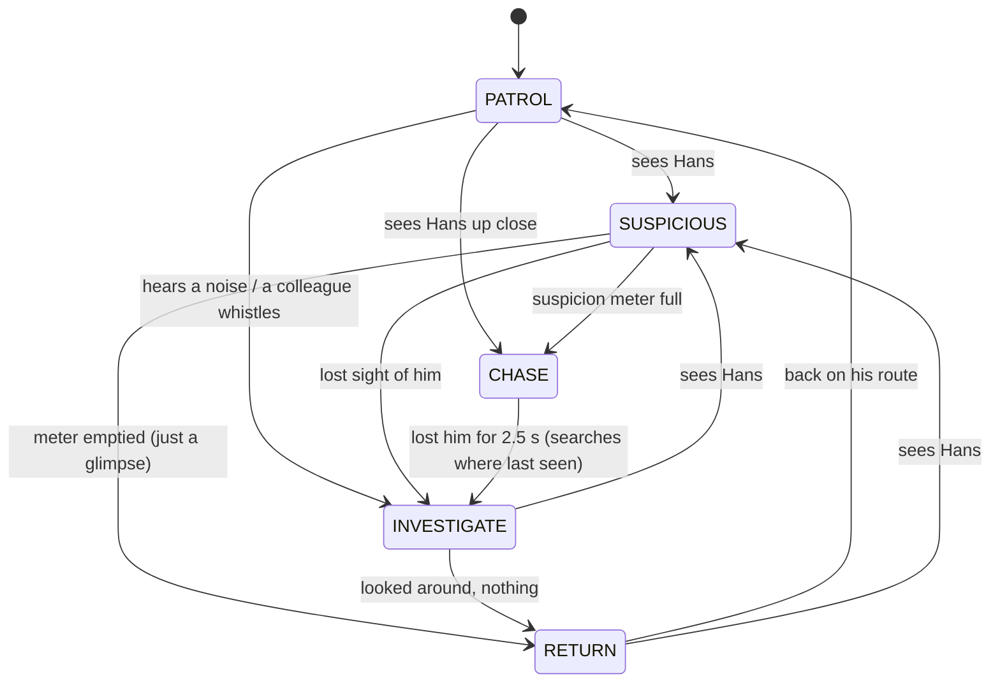

# Hans: Game Design Document

*A sneaky game about a clever horse.*
AI for Games individual coursework · Python + pygame-ce · v0.3 · 25 Sep 2026

> v0.3 replaces the earlier detective design (player as the scientist), which play-testing
> showed was too hard to understand. That version is kept in git as the tag `v0.2-detective`.

---

## 1. Pitch

**Berlin, 1904. Everyone thinks Clever Hans can think. His secret: his owner, von Osten,
can't help nodding toward the right answer.**

You *are* Hans. Each night the carrot is hidden behind one of the doors. Sneak into von Osten's
circle, catch his involuntary nod, and tap the right door with your hoof, all without the
lantern-carrying scientists of the Commission catching you at it.

**Understandable in 30 seconds:** arrow keys to walk, stand in von Osten's circle, walk to the
glowing door, press Space. Stay out of the lantern light.

## 2. Decisions

| Topic | Decision | Why |
|---|---|---|
| Genre | **Stealth**, played as Hans | The previous detective version confused players: they didn't know what to do. Stealth is a genre everyone already understands, and it shows off classic game AI. |
| Goal | Get the hint (stand in von Osten's circle), then tap that door | One clear two-step objective, always shown in the top bar with checkboxes. |
| The AI | **Scientists**: FSM guards with lantern vision, hearing, A*, whistles to colleagues | The module's FSM / perception / pathfinding / decision-making topics, all visible on screen. |
| Losing | A scientist reaches Hans while chasing him | Standard, fair, readable. |
| Key rule | **You can't tap a door while being chased** | Without it, careless play won by out-walking the chase (measured, §9). |
| Learning | **Tutorial night** + one new idea per night + contextual tips | "Didn't know what to do" was the main complaint. |
| Look | 1904 sepia, moonlit: lantern light *is* the scientists' vision | The theme and the mechanic are the same thing. |
| Help | Difficulty assist after repeated failures; **AI demo** (the ghost) on the title screen | You can always watch how it's done. |
| Engine | Python + pygame-ce | As before. |

## 3. How it plays

| Input | Action |
|---|---|
| Arrow keys / WASD | Walk (quiet) |
| hold Shift | Trot: faster than a chasing scientist, but loud |
| Space | Tap the door you're standing at |
| Esc / P | Pause (R restart, Q title) |
| R | Restart the night |
| X | AI X-Ray |
| F1 | How to play |
| M / F11 | Mute / full screen |
| title: ←/→, Enter, D | Choose a night, play it, or watch the AI play it |

**One night:**
1. The carrot is hidden behind a random door (every attempt).
2. Walk into **von Osten's circle** and stay. A ring fills. He nods, and that door **glows**.
3. Walk to the glowing door and press **Space**. Win; stars for how unseen you stayed.

**The scientists:** they see only what their **lantern** lights (the light stops at walls, hay,
carts, screens). In the light a **?** appears and a ring fills; when it's full it becomes **!**
and he chases you, whistling for colleagues. They also **hear**: trotting, gravel and a wrong
door all make noise, drawn as expanding rings. Hide in the dark, wait for them to turn away.

**Stars:** ★★★ never seen · ★★ seen but never chased · ★ chased but made it.

## 4. The six nights

| # | Night | New idea | Scientists |
|---|---|---|---|
| 0 | Learning the Trick | walking, von Osten's nod, tapping | none |
| 1 | The Night Watch | lantern light, ? and ! | 1 patrols in front of the doors |
| 2 | Behind the Hay | hay blocks light; a guard watches von Osten | 1 sentry (sweeping), 1 patrol |
| 3 | Gravel and Hooves | hearing: gravel and trotting | 1 guards the quiet path, 1 patrol |
| 4 | The Wandering Master | von Osten walks; he only nods standing still | 2 patrols |
| 5 | The Commission | everything, four doors | patrol, sentry, side sentry, and a watcher circling von Osten |

Levels are text maps in `game/levels.py` (legend in `game/level.py`), so they're easy to edit.

## 5. The AI

### 5.1 Scientists: finite state machine (`game/ai/scientist.py`)



| State | Does |
|---|---|
| PATROL | walks his route (A* between waypoints), pauses and looks around. A one-point route is a **sentry** who sweeps his lantern; a **watcher** keeps his lantern on von Osten as he walks. |
| SUSPICIOUS | stops, stares at where he saw Hans, **?** and a filling meter |
| INVESTIGATE | walks (A*) to a noise or the last sighting, then sweeps his lantern around |
| CHASE | **!**, lantern turns red, **whistles** (colleagues within 9 tiles come to investigate), runs at Hans (A*, re-planned every 0.3 s) |
| RETURN | walks (A*) back to the nearest point on his route |

States are classes on a reusable `StateMachine` (`game/ai/state_machine.py`), the "state classes"
pattern from the FSM lecture. The same class runs von Osten and the game's own screens.

### 5.2 Perception (`game/ai/perception.py`)

- **Sight = lantern light**: a cone 6 tiles long and 68° wide, with a clear line of sight (sampled every 0.15 tiles against tall tiles). No light, no sight: Hans is invisible in the dark even beside a scientist. The same raycast draws the lit polygon on screen, so what you see is exactly what he sees.
- **Suspicion**: rises only while he sees Hans, faster when close (instant within 1.5 tiles) or when Hans trots; drains when he doesn't.
- **Hearing**: noises have a radius (walk on gravel 3, trot 5, trot on gravel 7.5, a wrong door everyone). Walls don't stop sound, but a noise only says *where*, so he has to go and look.

### 5.3 Pathfinding

Grid A* (`game/ai/pathfinding.py`: 8-way, octile heuristic, no corner cutting), cached per
level. Used for patrols, investigating, chasing (re-planned as Hans moves), returning, and
von Osten's walks. The X-Ray draws the paths, the explored nodes, and each patrol route.

### 5.4 Von Osten (`game/ai/owner.py`)

A small FSM: **STANDING → NODDING** (Hans in his 2.2-tile circle with line of sight: the hint
fills over 1.4 s; it fades slowly if Hans steps out) **→ WALKING** (on the wandering night, no
nodding while he walks). Like the real von Osten, his cue is involuntary, not cheating.

### 5.5 Group behaviour and difficulty assist

- A chasing scientist's **whistle** brings colleagues to investigate Hans's position.
- **Dynamic difficulty**: after every 2 failures on a night, scientists get 12% slower and 20% slower to become suspicious (up to twice). A message says "The scientists look tired tonight."

### 5.6 The ghost: an AI that plays Hans (`game/ai/ghost.py`)

Powers the title-screen demo (D) and the automated playtests:
1. **Learns the night**: watches the patrols for 40 s and builds a **danger map** (influence map: how often each tile is lit).
2. **Plans** with Dijkstra where lit tiles cost ×30 and gravel ×4, so its route hugs the dark.
3. **Waits** in the dark if its next step would be lit.
4. **Takes cover** when seen: runs (trotting) to the nearest tile that scientist can't see.
5. **The trick**: stands in von Osten's circle until the nod, then taps.

## 6. Procedural elements

- The carrot door is random every attempt, so the hint always matters.
- Levels are validated automatically: equal row widths, ≥ 2 doors, everything reachable, every route's waypoints exist (`python -m tools.danger_map`).

## 7. Module topic coverage

| Topic | Where |
|---|---|
| Finite state machines | Scientists (5 states), von Osten (3), game screens: one reusable class |
| Perception | Lantern-cone vision with line of sight, suspicion meter, hearing radii |
| Pathfinding | A* for patrol, investigate, chase (re-planned), return, von Osten |
| Decision making | Stimulus priority (sight > sound > patrol), sentry sweeps, watchers, whistles; the ghost's wait / take-cover choices |
| Imperfect information | Scientists only know what they see and hear, and remember a last-seen position; the player doesn't know the door until the nod |
| Supporting: procedural / tooling | Random carrot per attempt; influence (danger) maps; automated playtesting |

## 8. AI X-Ray (X)

Each scientist's **state and suspicion %**, his **patrol route** (blue), current **A* path**
(red) with explored nodes, and **last-seen marker** (red ✕); von Osten's state and hint progress.
Lantern cones and noise rings are always visible.

## 9. Balancing by automated playtest

`python -m tools.playtest` plays each night 24 times with a **careless** ghost (walks straight
there) and a **careful** one (§5.6), each starting at a random moment:

| night | careless: won | careful: won | careful: avg stars | careful: avg time |
|---|---|---|---|---|
| 0 Learning the Trick | 24/24 | 24/24 | 3.0 | 10s |
| 1 The Night Watch | 17/24 | 23/24 | 2.9 | 15s |
| 2 Behind the Hay | 13/24 | 24/24 | 3.0 | 19s |
| 3 Gravel and Hooves | 3/24 | 23/24 | 1.8 | 29s |
| 4 The Wandering Master | 1/24 | 24/24 | 2.5 | 26s |
| 5 The Commission | 9/24 | 21/24 | 2.5 | 23s |

Careful play wins every night (≥ 87%); careless play is punished more as the nights go on. The
table drove real changes: faster suspicion (careless strolled through the light), the
no-tapping-while-chased rule (careless out-walked chases), night 3's guarded quiet path (the
old layout was pure luck), and night 5's watcher (von Osten was never lit).

`python -m tools.danger_map` prints each night's danger map:
`space` never lit · `.` < 10% · `:` < 25% · `*` < 50% · `#` ≥ 50%.

## 10. Look and sound

- **Moonlit sepia**: the yard is drawn in daylight, darkened for night; each frame the lantern polygons cut the daylight version back in, tinted warm (red when chasing).
- **Film**: grain, scratches, vignette, silent-film intertitles between nights.
- **Figures from code**: Hans, von Osten (beard, slouch hat), scientists (coats, bowlers, lanterns), doors with Roman numerals, hay, carts, screens, gravel.
- **Sound synthesised at start-up**: hoof-falls (walk / louder trot), hoof taps, the scientist's rising "hmm?", a police-style whistle, a bell for the nod and for winning, door creak, thud when caught.

## 11. Code map

```
main.py                     entry point (--night, --xray, --seed, --no-sound)
game/config.py              every tunable number
game/level.py               map parsing, walls, sight, raycasts, collision, cached A* routes
game/levels.py              the six nights (text maps, routes, tutorial tips)
game/play.py                one attempt: objectives, winning, catching, noise, whistles, tips, stars
game/ai/state_machine.py    reusable FSM
game/ai/scientist.py        the scientists' FSM, perception, hearing
game/ai/owner.py            von Osten's FSM
game/ai/perception.py       lantern cones, line of sight, hearing
game/ai/pathfinding.py      A*
game/ai/ghost.py            the AI that plays Hans (danger map, safe routes, cover)
game/entities/hans.py       the player's horse (movement, collision, hoof noise)
game/entities/walker.py     A*-following body shared by scientists and von Osten
game/scenes.py, app.py      screens and main loop
game/audio.py               synthesised sound
game/save.py                progress (unlocked nights, best stars)
game/ui/                    theme, sprites, view (night, lanterns, HUD, tips, X-Ray), cards
tools/playtest.py           automated playtests
tools/danger_map.py         level checks + danger maps
tests/                      32 tests
```

## 12. Video plan (2–3 minutes)

1. **0:00** Title → "Night 0" intertitle: the story in one card.
2. **0:15** Tutorial: walk, von Osten's circle fills, nod, the door glows, tap. The goal is instantly clear.
3. **0:40** Night 1: a lantern cone sweeping; step into the light → **?** → step out.
4. **1:00** X-Ray on: FSM states, patrol routes, A* paths.
5. **1:20** Night 3: trot on gravel → noise ring → scientist INVESTIGATES; a chase: **!**, red lantern, whistle, colleague arrives, A* re-planning, Hans hides behind hay → search → RETURN → PATROL.
6. **2:00** Night 5: the watcher circling von Osten.
7. **2:20** The ghost (D on the title) sneaking through a night; the playtest table.

## 13. Report plan (2,000 words)

| Section | Words |
|---|---|
| Concept and why stealth suits the Clever Hans story | 150 |
| Architecture (pure-logic AI, pygame only in the UI) | 150 |
| Scientist FSM, state by state | 350 |
| Perception: lantern vision, suspicion, hearing | 300 |
| Pathfinding: A* and re-planning | 200 |
| Decision making: priorities, sentries, watchers, whistles, difficulty assist | 250 |
| Von Osten's FSM | 100 |
| The ghost and the danger map | 200 |
| Evaluation: automated playtests and how they changed the design | 200 |
| Reflection and limitations | 100 |

## 14. Roadmap

| Status | Item |
|---|---|
| ✅ | Six nights with a tutorial, scientists' FSM, vision, hearing, A*, whistles, von Osten's FSM |
| ✅ | Lantern-light rendering, HUD objectives, tips, toasts, stars, progress saving, sound |
| ✅ | AI X-Ray, difficulty assist, AI demo, automated playtests, danger maps, 32 tests |
| ⏳ | Human playtests: does a new player get it in 30 seconds? Tune tips and numbers |
| ⏳ | Optional: a distraction (e.g. kick over a bucket to make a noise elsewhere) |
| ⏳ | Record the video, write the report |

## 15. Questions for the lecturer

1. Is a stealth game with FSM guards a good fit for the brief? (It covers FSMs, perception, pathfinding and decision making directly.)
2. Is the AI-playtester / danger-map tooling worth describing in the report, or should the word count stay on the guards?
3. Python/pygame-ce confirmed for the artefact?
