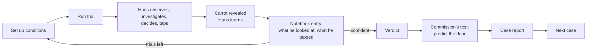
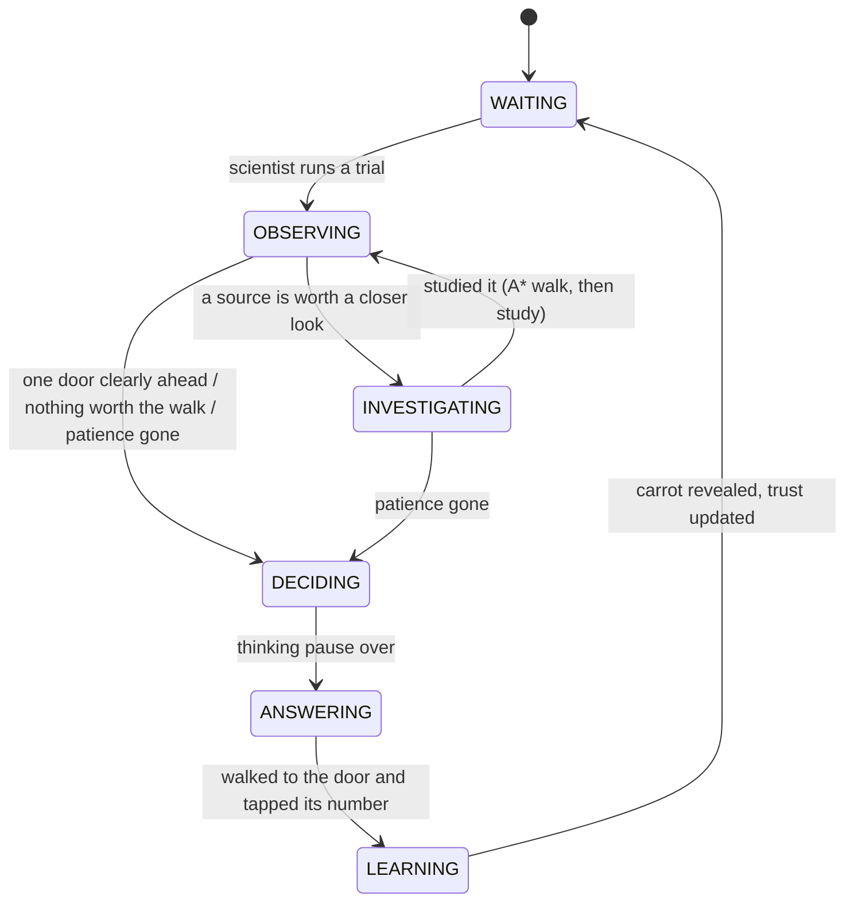

# Hans: Game Design Document

*A game about learning the wrong clues.*
AI for Games individual coursework · Python + pygame-ce · v0.1 (playable core) · 24 Sep 2026

---

## 1. Pitch

**Berlin, 1904. Everyone believes Clever Hans can think. You are Oskar Pfungst, the young
psychologist sent to find out how he really does it.**

Each case gives you a horse with a hidden training history. You run experiments in a
courtyard: blinkers, screens, a misled owner, a decoy scent, a crowd that did or didn't
see where the carrot went. Hans reasons about everything he can perceive, walks over to
study whatever he trusts, taps the door he believes in, and **learns from every trial,
including yours**. Your job is to name what he actually relies on, then prove it by
predicting his choice in front of the Commission, before your experiments teach him
something new.

## 2. Decisions made

| Topic | Decision | Why |
|---|---|---|
| Name | **Hans** | Short, and the story is the horse. |
| Player role | **The scientist (Oskar Pfungst)** | Hans becomes a fully autonomous agent, so *all* the assessed AI is visible in one character. The player's job (reading behaviour, designing controlled tests) is the Clever Hans story itself. |
| Win condition | **Name the cue, then prove it**: a verdict plus one Commission test where you predict the door | It turns deduction into a dramatic finale and tests real understanding of Hans's AI, not luck. |
| Hans adapts while tested | **Yes, the observer effect** | The core tension. Misleading von Osten repeatedly teaches Hans to stop trusting him and erases the evidence. |
| Scientist AI | **Rule-based**, used as *Professor Stumpf's hints* plus an *autopilot* (AI runs the investigation) | Deterministic and explainable, and works offline. The autopilot gives an AI-vs-AI demo for the video. *Planned, see §14.* |
| LLM | **Not used** | The report must explain AI implemented personally. No API dependency in the demo. |
| Engine | **Python + pygame-ce** | Transparent AI code, fast iteration, and the lecturer supports Python. |
| Structure | **Case 1 is historical (Berlin 1904), then endless generated cases** | A story start, then replayability from procedural Hans histories. |
| Look | **Vintage 1904**: sepia, period serif, silent-film intertitles, film grain | Strong theme at the cost of shapes; no art assets needed. |
| Repo | **Public GitHub** | The student's choice. |
| Timeline | **1–2 months** | Minimum viable version + story arc + assistant + polished X-Ray (§14). |

## 3. From history to mechanics

| Historical fact | In the game |
|---|---|
| Hans answered by tapping his hoof. | Hans taps the door's number (I, II or III) with his hoof. |
| Wilhelm von Osten, a maths teacher, believed Hans could think. | Von Osten stands in the courtyard. His body leans slightly toward the door he believes in. |
| The 1904 Hans Commission (13 people incl. a psychologist, circus trainer, vet and zoo director) found no trickery. | The finale: you must convince "the Commission" with one test and a prediction. |
| Pfungst found Hans failed when the questioner **didn't know** the answer. | Setup: *Von Osten: Doesn't know* (he guesses, and his cues become random). |
| Hans failed when he **couldn't see** the questioner (blinkers, screens). | Setup: *Blinkers*, *Screen*. Blinkered Hans walks right up to von Osten to see him, as the real Hans strained to. |
| Accuracy fell as the questioner stood **farther away**. | Setup: *He stands: Far away* (visual clarity drops with distance). |
| Nobody was cheating; the cues were unconscious. | Hans is never told the answer. He reads noisy cues, and the scientist must work out which. |

**Creative liberties:** the carrot-behind-doors task (instead of arithmetic), the scent and
crowd cues, a "misled" von Osten, and later cases with other Hanses are inventions for
gameplay.

## 4. What Hans is, and is not

**It is**
- a game about **imperfect information**: Hans only ever gets noisy, partial observations;
- a showcase of **classic real-time game AI** (FSM, perception, utility decisions, A*, procedural generation) inside one agent the marker can watch;
- a **detective game**: the fun is forming a hypothesis from behaviour, then designing a test that isolates it;
- **replayable**: every generated Hans has a different emergent history.

**It is not**
- an arithmetic quiz, a perfect-information puzzle, or a board-game search problem;
- machine learning in the academic sense: no neural networks, no deep reinforcement learning, no LLM. Learning is a lightweight Beta success/failure count;
- scripted: Hans's choices come from his beliefs and perceptions each time, not from authored outcomes;
- an art project: shapes and a strong palette, with time spent on the AI and the X-Ray.

## 5. The player's goal

1. **Investigate** with a budget of **10 trials** per case. For each trial choose the conditions, then watch Hans.
2. **Verdict** (press V, any time after the first trial): what does Hans rely on? *Von Osten's posture*, *Scent* or *Crowd murmur*.
3. **The Commission's test**: set up one final trial and **predict the door** Hans will tap.
4. **Case report**: verdict right/wrong, prediction right/wrong, score, and *what your experiments did to Hans* (his trust at arrival vs now).

| Outcome | Rank |
|---|---|
| Verdict ✓ and prediction ✓ | *Pfungst would be proud.* |
| Verdict ✓ only | *Right idea, shaky proof.* |
| Prediction ✓ only | *A lucky demonstration.* |
| Neither | *Hans fooled you too.* |

Score = 50 (verdict) + 30 (prediction) + 5 per unused trial. Using the X-Ray marks the case *unofficial*.

The **answer** to a case is the cue Hans trusted most **the day you arrived** (it's stored
separately from the live Hans). Your experiments change the live Hans, so the evidence you
gather late in a case may describe a different horse from the one you were sent to study.

## 6. Core loop



## 7. The scientist's tools

| Setup box | Options | What it changes in the world | What it tests |
|---|---|---|---|
| 1 Carrot behind | Random / I / II / III | Where the carrot is hidden | Lets you engineer conflicts for the final test |
| 2 Von Osten | Knows / Doesn't know / Misled / Absent | Which door his posture leans toward, and how strongly | Is Hans reading his questioner? |
| 3 Misled toward | Any / I / II / III | The wrong door he's told | Precise conflicts |
| 4 He stands | Near Hans / Far away | Distance, so less visual clarity and a longer walk | Distance effect (historical) |
| 5 Screen | Off / Up | Blocks line of sight from Hans's start; Hans must walk around | Does Hans need to *see* him? |
| 6 Blinkers | Off / On | Hans can't see von Osten unless he walks right up to him | Same, from Hans's side |
| 7 Scent | Normal / Masked / Decoy | Carrot smell removed, or a second false smell | Is Hans smelling it? |
| 8 Decoy at | Any / I / II / III | Where the false smell is | Precise conflicts |
| 9 Crowd | Absent / Saw it hidden / Didn't see | Crowd murmur points to the carrot, or to wherever von Osten leans | Is Hans listening to the audience? |
| 0 Prediction | – / I / II / III | *(Commission test only)* | Your proof |

The notebook records, for every trial, the conditions, the carrot, **what Hans walked over
to study**, what he tapped, and right/wrong. In play you also see diegetic tells: Hans turns
toward whatever he's reading most, lowers his head to sniff, hesitates when unsure.

## 8. Hans's AI (the assessed part)

### 8.1 Architecture and information boundaries

```
Trial (ground truth: carrot, who believes what)        <- only the World/Perception read this
   │ signals
Senses (perception)  ── noisy CueObservations ──>  HansMind (beliefs, readings, decisions)
   ▲                                                   │ what to study / which door
World (grid, sight, positions)  <── A* paths ──  Hans (body + FSM)
```

- **Hans never sees the Trial.** `Senses` is the only door from ground truth to his mind, and it returns observations that may be faint or misread.
- The **carrot is revealed only after he taps** (`Senses.reveal()` is called in LEARNING).
- `HansMind` has no position or timing, so the *same* reasoning code runs in real time (FSM) and in instant training rehearsals (§8.9).

### 8.2 Finite state machine



Implemented as state classes (`game/ai/hans_states.py`) on a reusable `StateMachine`
(`game/ai/state_machine.py`): each state has `enter / update / exit / on_event`, states are
created once and reused, and per-agent data lives on Hans. The same `StateMachine` class
drives the game's own screens (TITLE → INTRO → LAB → RESULT). The original proposal's 8 states
were merged to 6: MOVING became part of INVESTIGATING and ANSWERING, and RECEIVING_FEEDBACK
became part of LEARNING.

### 8.3 Perception

Every source gives off a signal (`door`, `polarity` ±1, `strength`). Hans perceives it with a
**clarity** in 0..1 that depends on the sense:

| Cue | Sense | Passive (from where Hans stands) | Focused (after walking over) | Blocked by |
|---|---|---|---|---|
| Von Osten's posture | sight | 0.9 × (1 − d/20) | 0.95 | no line of sight (screen, cart, walls); blinkers (focused drops to 0.45) |
| Scent | smell | 0.8 × (1 − d/2.5), so only right at a door | 0.9 | masking |
| Crowd murmur | sound | 0.5 × max(0.3, 1 − d/25) | 0.85 | – |

**Misreads:** with probability (1 − clarity) × 0.4 Hans gets it wrong: a pointing cue suggests a
different door, or a scent reading flips. Line of sight is sampled along the segment every
0.2 tiles against sight-blocking tiles. Signal strengths: von Osten sure 0.9 / guessing 0.5,
crowd saw 0.75 / guessing 0.6, scent present 0.85 / absent 0.6.

### 8.4 Trust learning (Beta per cue type)

```
trust(cue)  = α / (α + β)                       starts at α = β = 1  → 0.5
weight(cue) = max(0, (trust − 1/3) / (1 − 1/3))  0 = no better than guessing a door
```

After the carrot is revealed, every **positive** reading Hans perceived ("the carrot is behind
II") is checked: `α += clarity` if right, `β += clarity` if wrong. "No scent here" readings are
not learned from; they are too often right by chance. Before each update all evidence
**decays** toward the prior (`α ← 1 + (α − 1)·0.97`), so Hans can re-learn when the world
changes. That decay is what makes the observer effect possible.

### 8.5 Which door? (utility)

```
score(door) = Σ readings  polarity × strength × clarity × weight(cue)      ("not here" × 0.5)
```

Hans picks the highest score (random among ties). The margin to the runner-up gives the
visible mode: **CONFIDENT** (≥ 0.45), **UNSURE**, or **GUESS** (no evidence at all).

### 8.6 What to look at? (attention utility)

This is Hans's second decision and the main source of *observable behaviour*:

```
utility(source) = weight(cue) × (expected focused clarity − current clarity)   value of a closer look
                + 0.6 × uncertainty(cue)                                         curiosity (Beta std)
                − 0.04 × walking time                                            cost (from A*)
```

Hans studies the best source if its utility exceeds 0.1 and he can afford walk + study with
his remaining patience. He stops investigating once one door is CONFIDENTLY ahead. Hans
therefore walks toward what he trusts. An owner-follower glances at von Osten and goes
straight to a door; blinkered, he walks right up to von Osten. A scent-follower sniffs at doors.
The notebook records all of this, and it is the player's main evidence.

### 8.7 Pathfinding

Grid A* (`game/ai/pathfinding.py`) with 8-way movement, octile heuristic and no corner
cutting. It serves three purposes:
1. moving Hans to study spots and doors around hay, the trough, the fence and the screen;
2. **travel time is an input to the attention utility**, so the screen makes von Osten "expensive" to read, and a trusted cue is still worth the detour while an untrusted one isn't;
3. the X-Ray draws the explored set and the path.

### 8.8 Motivation: patience

Hans has 14 s of patience per trial. It drains 1.3× faster with a crowd watching, since he gets
restless. When it runs out he decides with whatever he has ("Hans runs out of patience").
Patience bounds how much investigating is affordable (desirability over time).

### 8.9 Procedural cases: emergent Hans histories

A case = **training regime** + seed. The generator runs 60 instant rehearsals through the
*same* `HansMind` (perception → attention → decision → learning, with walking replaced by its
A* travel time) and reads off the cue Hans ended up trusting most. That is the case's answer,
and it is **emergent, not authored**.

| Regime | Who trained him (revealed at the end) | Typical result |
|---|---|---|
| lessons (Case 1) | Von Osten's daily lessons: he always knew, stood close, little carrot smell | Von Osten's posture |
| stable | A stable boy hid carrots in straw and never watched | Scent |
| fair | A travelling fair: food smells, and the crowd always saw the carrot hidden | Crowd |
| mixed | A bit of everything | Varies by seed |

Validity rule: the top cue must lead the runner-up by ≥ 0.10 in weight (up to 40 seeds are
tried), so every case is solvable. Case 1 searches seeds from 1904 until the historical answer
(von Osten) emerges.

### 8.10 The observer effect

Every trial you run is also a training trial for Hans. Run several "misled" trials in a row
and his trust in von Osten falls with each one, while his trust in scent rises whenever he
sniffs out the carrot. An owner-follower can drift into a scent-follower during your
investigation. The case report shows arrival vs now for each cue, so the player sees exactly
what their method did.

## 9. Module topic coverage

| Module topic | Where in Hans |
|---|---|
| Finite state machines | Hans's 6-state FSM; the game-flow FSM reuses the same class |
| Decision making / desirability / motivation | Door utility, attention utility (value vs cost vs curiosity), patience |
| Perception | Sight / smell / sound with range, line of sight, blinkers, noise, misreads |
| Pathfinding | A* for movement *and* as the travel-cost input to decisions |
| Procedural generation (supporting) | Case generation from training regimes, validity check, seeded |
| Imperfect information / adaptation | Hans never sees the answer; online Beta learning with decay |

## 10. AI X-Ray (press X)

A debug overlay drawn as Pfungst's *red pencil and blue ink* markup.

**On the courtyard:** FSM state tag and patience ring above Hans · A* explored nodes (blue
dots) and current path (red dashes) · scent range circle · line of sight to von Osten
(blue = clear, red ✕ = blocked) · reading tags at each source (door, ±, clarity; misreads in red)
· live door-score bars · ground truth: carrot location, decoy, who believes which door.

**In the panel:** state + history + time in state · trust bars with α/β and a red tick at
the arrival value · readings (strength × clarity, passive/focused, misread) · attention
options (gain + curiosity − walk = utility) · door scores with the chosen door and mode ·
ground truth and the case answer.

## 11. Look and feel

- **Palette:** paper `#ECE0C5`, ink `#2E2218`, film black `#1A140E`, red pencil `#962C1A`, blue ink `#345076`, green `#466836`.
- **Type:** Big Caslon / Didot for titles, Baskerville for text, American Typewriter for the notebook (with fallbacks for other systems).
- **Cards:** silent-film intertitles with ornate double borders for the title and case intros.
- **Film:** cycling grain, faint scratches, vignette.
- **Figures:** Hans, von Osten (beard, slouch hat), the crowd (bowlers and bonnets), stable doors with Roman-numeral plaques, all drawn from primitives, so there are no asset files.

## 12. Controls

| Input | Action |
|---|---|
| Click a setup box | Cycle its option (right-click cycles back) |
| 1–9, 0 | Cycle setup boxes (Shift = back) |
| Enter / Space | Run trial · continue |
| V | Verdict (then 1–3) |
| X | AI X-Ray on/off |
| F | Fast-forward ×3 |
| Esc | Back / quit |

## 13. Code map

```
main.py                     entry point (--seed, --xray, --case, --no-log)
game/config.py              every tunable number
game/world.py               grid, obstacles, line of sight, doors, cue sources
game/trial.py               TrialSetup (scientist) -> Trial (ground truth + signals)
game/ai/state_machine.py    reusable FSM
game/ai/hans_states.py      Hans's 6 states
game/ai/perception.py       Senses + CueObservation
game/ai/beliefs.py          Beta trust model
game/ai/utility.py          door scores, decision, attention ranking
game/ai/pathfinding.py      A*
game/ai/mind.py             HansMind: shared by real time and rehearsal
game/entities/hans.py       Hans: mind + body + FSM
game/case.py                regimes, training rehearsal, case generation, scoring
game/investigation.py       one case in progress (stages, notebook, logging)
game/scenes.py, app.py      screens and main loop
game/ui/                    theme, sprites, arena (incl. X-Ray), panel, cards
tests/                      37 tests: A*, beliefs, perception, trials, utility, FSM, cases, smoke
```

## 14. Roadmap (1–2 months)

| # | Milestone | Status |
|---|---|---|
| M0 | Courtyard, doors, Hans, trials, vintage style | ✅ done |
| M1 | Hans FSM (6 states) | ✅ done |
| M2 | Perception: sight / smell / sound, LOS, blinkers, misreads | ✅ done |
| M3 | Door utility + attention utility | ✅ done |
| M4 | Beta trust learning + decay (observer effect) | ✅ done |
| M5 | A* movement + travel cost in decisions | ✅ done |
| M6 | Procedural cases from training regimes | ✅ done |
| M7 | Scientist loop: setup, notebook, verdict, Commission test, report | ✅ done |
| M8 | AI X-Ray overlay + JSONL experiment log | ✅ done |
| M9 | **Professor Stumpf** (rule-based scientist AI): hint button (H) | ⏳ week 1–2 |
| M10 | **Autopilot**: the scientist AI runs a whole case (AI vs AI demo) | ⏳ week 2–3 |
| M11 | Notebook comparison view (accuracy by condition) | ⏳ week 3 |
| M12 | Balancing pass + playtests (does a new player solve Case 1 in 10 trials?) | ⏳ week 3–4 |
| M13 | Report figures: script that turns logs into charts (trust over trials, accuracy by condition) | ⏳ week 4–5 |
| M14 | Polish: sound (hoof taps, murmur), tutorial hints for Case 1, demo seed | ⏳ week 5–6 |
| M15 | Record the video, write the report | ⏳ week 6–8 |

### 14.1 Professor Stumpf and the autopilot (M9–M10 design)

A rule-based scientist that only reads the **notebook** (observable results), never Hans's
internals.

- **Evidence:** for each cue, compare accuracy when that cue *agrees with the carrot* vs when it is *removed or misleading* (e.g. von Osten knows vs doesn't/misled; scent normal vs masked/decoy; crowd saw vs absent), plus how often Hans *walked over to study* each source.
- **Hypotheses:** confidence per cue = accuracy drop when the cue is removed (Laplace-smoothed) + attention share.
- **Test choice:** pick the intervention with the largest expected separation between the top two hypotheses, penalising interventions already run many times (to limit the observer effect).
- **Hint text:** *"Hans went to von Osten in 4 of 5 trials and failed both times he was misled. I suspect his posture. Try masking the scent while he's misled."*
- **Autopilot:** loops hint → run until confidence ≥ 0.8 or trials run out, then gives the verdict and designs a conflict test (misled owner + masked scent for owner, decoy + absent owner for scent, and so on) and predicts the door.

## 15. Video plan (2–3 minutes)

1. **0:00** Title → Case 1 intertitle (the story in 10 s).
2. **0:15** X-Ray on. A normal trial: FSM tag, von Osten reading, CONFIDENT, taps.
3. **0:40** Screen + blinkers: Hans walks around the screen (A* path + explored nodes), studies von Osten up close.
4. **1:05** Misled owner + masked scent: Hans taps the wrong door. Show the trust update (red arrival tick vs bar).
5. **1:30** Crowd trial: patience drains faster, attention options re-rank.
6. **1:50** Verdict → Commission test with a correct prediction → case report showing the observer effect.
7. **2:20** (M10) Autopilot on Case 2: the AI scientist investigates a different, generated Hans.

## 16. Report plan (2,000 words)

| Section | Words |
|---|---|
| Concept and why it suits game AI (imperfect info, agent visible) | 200 |
| Architecture and information boundaries | 200 |
| FSM (states, transitions, why 6) | 250 |
| Perception (senses, LOS, noise) | 250 |
| Decisions: door utility + attention utility + patience | 300 |
| Learning: Beta trust, decay, observer effect | 250 |
| A* and its role in decisions | 150 |
| Procedural cases (emergent histories, validity) | 150 |
| Evaluation from logs (accuracy by condition, trust curves) | 150 |
| Reflection and limitations | 100 |

## 17. What gets logged

`logs/session-*.jsonl`, one line per trial: case, seed, regime, answer, stage, conditions
(carrot, who believed what), every reading (cue, door, polarity, strength, clarity,
focused, misread), what Hans studied, door scores, choice, mode, success, trust
before/after, verdict and prediction.

## 18. Risks

| Risk | Mitigation |
|---|---|
| Cases too hard in 10 trials | Diegetic tells + notebook "looked at"; Stumpf hints; tune TRUTH_MARGIN / budget |
| Observer effect feels unfair | Answer is fixed at arrival; report shows the drift; Stumpf warns about repeated tests |
| Learning looks like academic ML | It's a count-based trust model inside a classic FSM/utility agent; no NN/RL |
| Scent dominates every history | Regimes tuned (masked/decoy scents), verified by tests on seeds |
| Marker can't see the AI | X-Ray overlay + scripted demo seed |

## 19. Questions for the lecturer

1. Is a player-as-scientist game (the AI agent is the subject, not the opponent) acceptable for the brief?
2. Does online Beta trust learning fit "game AI", given it's a count-based model inside an FSM/utility agent?
3. Is a rule-based "AI scientist" autopilot worth including, or should all effort stay on Hans?
4. Python/pygame-ce confirmed for the artefact?
