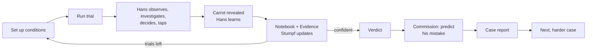
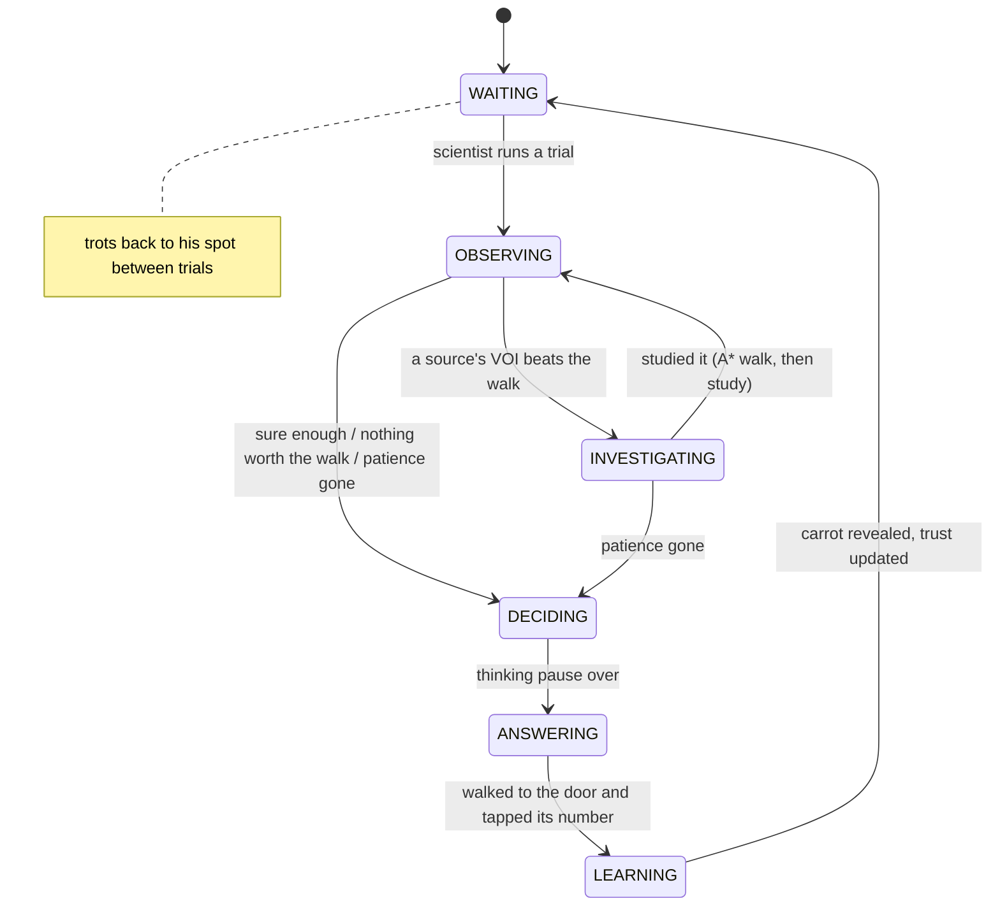
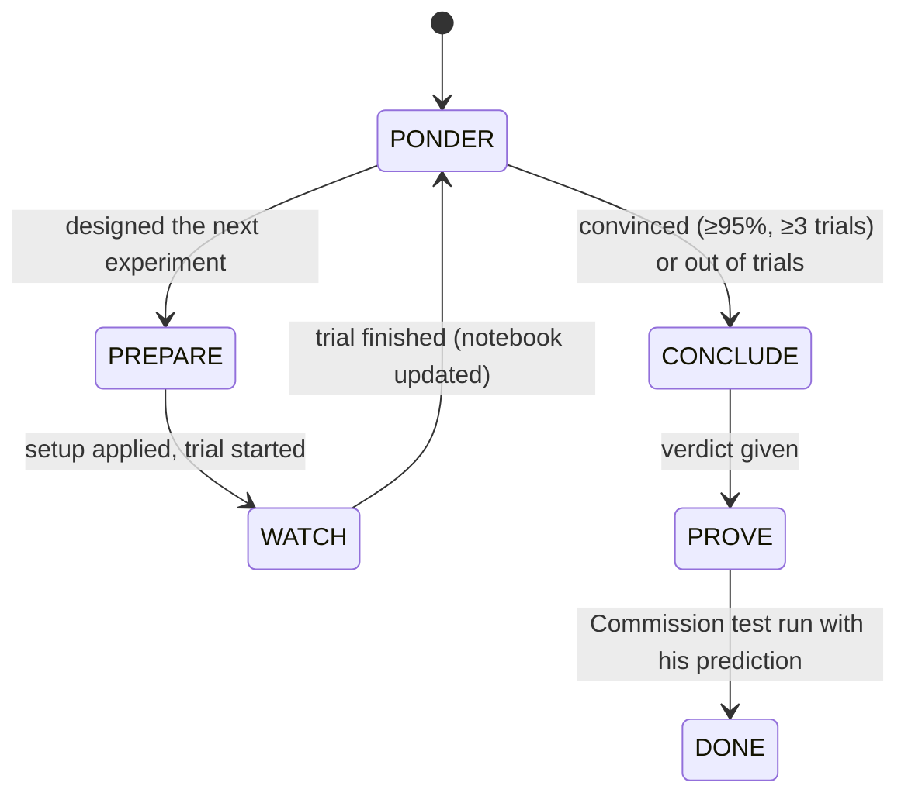

# Hans: Game Design Document

*A game about learning the wrong clues.*
AI for Games individual coursework · Python + pygame-ce · v0.2 · 25 Sep 2026

---

## 1. Pitch

**Berlin, 1904. Everyone believes Clever Hans can think. You are Oskar Pfungst, the young
psychologist sent to find out how he really does it.**

Each case gives you a horse with a hidden training history and his own temperament. You run
experiments in a courtyard: blinkers, screens, a misled owner, a planted decoy scent, a crowd
that did or didn't see where the carrot went. Hans reasons about everything he can perceive,
walks over to study whatever could change his mind, taps the door he believes in, and
**learns from every trial, including yours**. Name what he really relies on, then prove it:
make him tap the wrong door in front of the Commission, and predict which one.

Two AIs are on stage. **Hans** is an autonomous agent: FSM, perception, Bayesian cue
integration, value-of-information attention, A*, online learning. **Professor Stumpf** is a
rule-based scientist: hypothesis tracking and experiment design. He can advise you, or solve the
case himself.

## 2. Decisions made

| Topic | Decision | Why |
|---|---|---|
| Name | **Hans** | The story is the horse. |
| Player role | **The scientist (Oskar Pfungst)** | Hans is fully autonomous, so all the assessed AI is visible in one character; the player's job (reading behaviour, designing controlled tests) *is* the Clever Hans story. |
| Win condition | **Name the cue, then prove it**: verdict + one Commission test | Deduction with a dramatic finale that tests understanding of Hans's AI. |
| Commission rule | **Predict Hans's *mistake***: carrot behind a chosen door, prediction ≠ that door | Predicting success proves nothing (and could be gamed by making every cue agree). It's also what Pfungst did: he showed Hans failing. |
| Hans adapts while tested | **Yes, the observer effect** | The core tension. Your experiments retrain the horse you're studying. |
| Scientist AI | **Rule-based Professor Stumpf**: hints (cost points) + autopilot | Deterministic, explainable, offline. The autopilot is an AI-vs-AI demo for the video. |
| LLM | **Not used** | The report must explain AI implemented personally. No API dependency. |
| Engine | **Python + pygame-ce** | Transparent AI code, fast iteration, and the lecturer supports Python. |
| Structure | **Case 1 is historical (Berlin 1904), then endless generated cases** with fewer trials each time | A story start, then replayability and rising difficulty. |
| Look and sound | **Vintage 1904**: sepia, period serif, silent-film intertitles, film grain; sound synthesised in code | Strong theme, no asset files. |
| Repo | **Public GitHub** | The student's choice. |
| Timeline | **1–2 months** | See the roadmap (§16). |

## 3. From history to mechanics

| Historical fact | In the game |
|---|---|
| Hans answered by tapping his hoof. | Hans taps the door's number (I, II or III). |
| Wilhelm von Osten, a maths teacher, believed Hans could think. | Von Osten stands in the courtyard; his posture leans toward the door he believes in. |
| The 1904 Hans Commission (13 people incl. a psychologist, circus trainer, vet and zoo director) found no trickery. | The finale: convince "the Commission" with one test. |
| Pfungst's supervisor was the psychologist Carl Stumpf. | Professor Stumpf, the rule-based scientist AI. |
| Hans failed when the questioner **didn't know** the answer. | *Von Osten: Doesn't know* (he leans toward his own guess). |
| Hans failed when he **couldn't see** the questioner (blinkers, screens). | *Blinkers*, *Screen*. A blinkered owner-follower walks right up to von Osten, as the real Hans strained to see. |
| Accuracy fell as the questioner stood **farther away**. | *He stands: Far away* (visual clarity drops with distance). |
| Nobody was cheating; the cues were unconscious. | Hans is never told the answer. He reads noisy cues, and the scientist must work out which. |

**Creative liberties:** the carrot-behind-doors task (instead of arithmetic), the scent and
crowd cues, a misled or guessing von Osten, and the later cases with other Hanses.

## 4. What Hans is, and is not

**It is**
- a game about **imperfect information**: Hans only ever gets noisy, partial observations;
- a showcase of **classic real-time game AI** (FSM, perception, utility, A*, procedural generation) plus a **planning AI** (Stumpf), both watchable in the X-Ray / Stumpf tab;
- a **detective game**: form a hypothesis from behaviour, design a test that isolates it;
- **replayable**: every generated Hans has a different emergent history and temperament.

**It is not**
- an arithmetic quiz, a perfect-information puzzle, or a board-game search problem;
- academic machine learning: no neural networks, no deep RL, no LLM. Learning is a Beta success/failure count; inference is hand-written rules plus Bayes' rule;
- scripted: every choice Hans makes comes from his beliefs and perceptions at that moment;
- an art project: all figures and sounds are generated from code.

## 5. The player's goal

1. **Investigate** with a budget of trials (10 in Cases 1–2, then 9, 9, 8, 8, 7, 7, 6…). Set conditions, run, watch Hans.
2. **Verdict** (V, any time after the first trial): *Von Osten's posture*, *Scent* or *Crowd murmur*.
3. **The Commission's test**: hide the carrot behind a door you choose, set the courtyard, and **predict the wrong door** Hans will tap.
4. **Case report**: verdict and proof right/wrong, score, Stumpf's reading of your notebook, how this Hans was trained, and a chart of **his trust in each cue after every trial** (the observer effect, made visible).

| Outcome | Rank |
|---|---|
| Verdict ✓ and prediction ✓ | *Pfungst would be proud.* |
| Verdict ✓ only | *Right idea, shaky proof.* |
| Prediction ✓ only | *A lucky demonstration.* |
| Neither | *Hans fooled you too.* |

Score = 50 (verdict) + 30 (proof) + 5 per unused trial − 5 per piece of Stumpf's advice.
Using the X-Ray marks the case *unofficial*. Results go into a **casebook** (`saves/casebook.json`),
so you can continue with the next case later.

The **answer** is the cue Hans trusted most **the day you arrived** (stored separately from the
live Hans). Your experiments change the live Hans, so late evidence may describe a different horse.

## 6. Core loop



## 7. The scientist's tools

| Setup box | Options | What it changes | What it tests |
|---|---|---|---|
| 1 Carrot behind | Random / I / II / III | Where the carrot is | Engineering conflicts; required for the proof |
| 2 Von Osten | Knows / Doesn't know / Misled / Absent | Which door his posture leans to, and how strongly | Is Hans reading his questioner? |
| 3 Misled toward | Any / I / II / III | The wrong door he's told | Precise conflicts |
| 4 He stands | Near Hans / Far away | Less visual clarity, a longer walk | The distance effect (historical) |
| 5 Screen | Off / Up | Blocks the view from Hans's spot; Hans must walk round | Does Hans need to *see* him? |
| 6 Blinkers | Off / On | Hans can't see von Osten unless he walks right up | Same, from Hans's side |
| 7 Scent | Normal / Masked / Plus decoy / Only decoy | Which doors smell | Is Hans smelling it? *Only decoy* moves the smell entirely |
| 8 Decoy at | Any / I / II / III | Where the decoy smell goes | Precise conflicts |
| 9 Crowd | Absent / Saw it hidden / Didn't see | Murmur toward the carrot, or toward von Osten's door | Is Hans listening to the audience? |
| 0 Prediction | – / I / II / III | *(Commission only)* | Your proof |

Hovering a box explains the current option. Every notebook line records the conditions,
where each cue pointed (including where "Any" landed and where von Osten leaned when guessing),
what Hans walked over to study, what he tapped, and whether he was right.

**EVIDENCE tab**: the notebook summed up per cue. *When it lied, he followed · when it was true,
he was right · when you removed it, he was right · he walked over to study it.* A cue Hans relies
on is followed when it lies and missed when it's gone.

**The crucial experiment**: carrot at I, von Osten misled to II, *only decoy* at III, crowd saw it.
Now each explanation predicts a different door. Stumpf finds this design on his own (§9).

## 8. Hans's AI

### 8.1 Architecture and information boundaries

```
Trial (ground truth: carrot, who believes what)        <- only World/Perception read this
   │ signals
Senses (perception)  ── noisy CueObservations ──>  HansMind (trust, readings, belief, choices)
   ▲                                                   │ what to study / which door
World (grid, sight, positions)  <── A* routes ───  Hans (body + FSM + temperament)
```

- **Hans never sees the Trial.** `Senses` is the only way from ground truth to his mind, and it returns observations that may be faint or misread.
- The carrot is revealed only after he taps (`Senses.reveal()` in LEARNING).
- `HansMind` has no position or timing, so the *same* reasoning runs in real time (FSM) and in the instant training rehearsals that create each case (§8.9).
- The AI never imports pygame. States emit event names (`tap`, `sniff`, `correct`…) that the game turns into sound.

### 8.2 Finite state machine



State classes (`game/ai/hans_states.py`) on a reusable `StateMachine` (`game/ai/state_machine.py`).
Each state has `enter / update / exit / on_event`, states are created once and reused, and
per-agent data lives on Hans. The same class drives the game's screens and Stumpf's autopilot.

### 8.3 Perception

| Cue | Sense | Passive clarity (from where Hans stands) | Focused (after walking over) | Blocked by |
|---|---|---|---|---|
| Von Osten's posture | sight | 0.9 × (1 − d/20) | 0.95 | no line of sight (screen, cart, walls); blinkers (focused 0.45) |
| Scent | smell | 0.8 × (1 − d/2.5), right at a door only | 0.9 | masking |
| Crowd murmur | sound | 0.5 × max(0.3, 1 − d/25) | 0.85 | – |

Misreads: with probability (1 − clarity) × 0.4 a pointing cue suggests another door, or a sniff
reads wrong. Line of sight is sampled every 0.2 tiles against sight-blocking tiles.

### 8.4 Trust learning (Beta per cue type)

```
trust(cue)  = α / (α + β)                          starts at α = β = 1  → 0.5
weight(cue) = max(0, (trust − 1/3) / (1 − 1/3))     0 = no better than guessing a door
```

After the reveal every **positive** reading ("the carrot is behind II") is scored: `α += clarity`
if right, `β += clarity` if wrong. A "no scent here" reading is usually right by chance, so it only
counts when **refuted** (the carrot was there): `β += clarity × 0.5`. Before each update all
evidence **decays** toward the prior (`α ← 1 + (α − 1)·0.97`), so Hans can re-learn. That is what
makes the observer effect possible.

### 8.5 Which door? Bayesian cue integration

Hans keeps a belief `P(carrot behind d)` starting uniform. Each reading multiplies in a
likelihood whose sharpness is `e = weight(cue) × clarity × strength`:

```
pointing cue at door x:   P(reading | d) = 1/3 + (2/3)e   if d = x,  else the rest split evenly
sniff at door x:          P(smell | d = x) = ½ + ½e,  P(smell | d ≠ x) = ½ − ½e   (and 1 − those for "no smell")
```

He taps the most probable door. **CONFIDENT** if P ≥ his temperament's threshold, **UNSURE**
otherwise, **GUESS** if the belief is flat. A cue he doesn't trust (e = 0) changes nothing.

### 8.6 What to look at? Expected value of information

For each source Hans could walk to, he imagines every reading it could give (each door for a
pointer; smell / no smell for a sniff), and asks how likely he'd then be to pick right:

```
VOI(source) = Σ_outcomes max_d P(d) · P(outcome | d)   −   max_d P(d) now
utility     = VOI + curiosity × std(trust in that cue) − 0.012 × walking seconds (A*)
```

He studies the best source if utility > 0.03 and walk + study fit his remaining patience, and
stops once he's sure enough. Sensible behaviour follows **without special cases**:
- after sniffing two empty doors, sniffing the third is worth nothing: he goes by elimination;
- when two cues disagree, the tie-breaker is worth the most;
- a cue he doesn't trust is never worth the walk, which is why *where he walks* reveals what he trusts.

### 8.7 Pathfinding

Grid A* (`game/ai/pathfinding.py`) with 8-way movement, octile heuristic and no corner cutting,
cached per courtyard layout. It moves Hans to study spots, doors and back, and **its path cost is an
input to the attention utility**: the screen makes von Osten "expensive" to read. The X-Ray draws
the explored set and the path.

### 8.8 Motivation: patience and temperament

| Temperament | Patience | Speed | Curiosity | Sure at | Plays like |
|---|---|---|---|---|---|
| steady (Case 1) | 14 s | 3.6 | 0.25 | 72% | studies what matters, then answers |
| restless | 9 s | 4.4 | 0.12 | 62% | rarely walks anywhere |
| thorough | 20 s | 3.2 | 0.35 | 85% | checks everything; slow |
| bold | 12 s | 3.9 | 0.08 | 55% | trusts his first impression |

Patience drains 1.3× faster with a crowd watching. When it runs out he answers with what he has.
Temperament also shapes **what he learned in training**: a restless horse learns from whatever he
can see from his spot.

### 8.9 Procedural cases: emergent Hans histories

A case = **training regime** + **temperament** + seed. The generator runs 60 instant rehearsals
through the same `HansMind` (walking replaced by its A* cost) and reads off the cue Hans ended up
trusting most. That's the case's answer, **emergent, not authored**. Validity rule: the top cue must
lead the runner-up by ≥ 0.10 in weight (up to 40 seeds are tried). Case 1 searches from seed 1904
until the historical answer (von Osten) emerges.

| Regime | Who trained him (revealed at the end) | Emergent result (8 seeds × 4 temperaments) |
|---|---|---|
| lessons (Case 1) | Von Osten's daily lessons: he always knew, stood close; little carrot smell | owner 32/32 |
| stable | A stable boy hid carrots in straw and never watched | scent 32/32 |
| fair | Food smells everywhere; the crowd always saw the carrot hidden | crowd 32/32 |
| mixed | A bit of everything | owner or crowd, about half each |

`python -m tools.evaluate regimes` prints the full table.

### 8.10 The observer effect

Every trial you run is also a training trial for Hans. Mislead him with von Osten again and again
and his trust in von Osten falls; let him sniff out carrots and his trust in scent rises. The
case report charts his trust after every trial against the "chance" line.

## 9. Professor Stumpf: the scientist AI

Stumpf reads **only the notebook** (what the scientist can observe), never Hans's mind.

**ANALYSE.** He holds three explanations (Hans follows von Osten / the scent / the crowd). For each
notebook line he asks, for each explanation, *how likely was what Hans did?*
- **Where the cues pointed**: from the setup (he told von Osten, he placed the scents, he watched the crowd). For scent he credits only what Hans could have smelled **at the doors he actually sniffed** (two empty doors → the third, by elimination).
- **The choice**: under "Hans relies on X", Hans follows X 80% of the time when he can perceive it (less if it was screened, blinkered or far), otherwise falls back on the other cues; 15% of every choice is noise.
- **Where Hans walked**: a horse usually studies the cue he relies on. Stumpf first learns **this horse's study habit** (how often he studies anything), so a thorough horse's studies count for less. Going round a screen to see von Osten counts strongly.

He multiplies these into his confidence for each explanation (Bayes' rule).

**DESIGN.** He imagines all **84 experiments** (von Osten mode × blinkers × scent × crowd),
predicts Hans's choice under each explanation, and picks the one with the greatest **expected
information gain**, minus a small penalty per manipulation. He designs **as a sceptic** (posterior^0.5),
so even when he's nearly sure his next test could still prove him wrong. With a blank notebook his
first choice is the crucial three-way conflict.

**PROVE.** For the Commission he searches for the setup where his leading explanation most
confidently predicts a **wrong** door, and predicts it.

**As a hint** (H, −5 points): confidence bars, the most telling notebook line ("Trial 3: von Osten
leaned to I, the carrot smelled at III. He tapped I."), the next experiment and what each explanation
predicts, and a warning when one cue has misled Hans ≥ 3 times (the observer effect). A applies it.

**As autopilot** (S, or A on the title screen), his own FSM:



**How good is he?** `python -m tools.evaluate stumpf 200` (200 generated cases):

| regime | cases | verdict right | Commission prediction right | mean trials |
|---|---|---|---|---|
| fair | 48 | 100% | 94% | 3.1 |
| lessons | 65 | 100% | 94% | 3.5 |
| mixed | 43 | 88% | 100% | 4.0 |
| stable | 44 | 95% | 86% | 3.1 |
| **all** | 200 | **96%** | **94%** | **3.4** |

His misses are mostly "mixed" horses whose training genuinely blended cues, and cases where
Hans's own misreads or the observer effect muddied the notebook. That is the game's point.

## 10. Module topic coverage

| Module topic | Where in Hans |
|---|---|
| Finite state machines | Hans (6 states), Stumpf's autopilot (6 states), the game's screens: one reusable class |
| Decision making / desirability / motivation | Door choice by belief; attention by value of information vs walking cost vs curiosity; patience and temperament |
| Perception | Sight / smell / sound with range, line of sight, blinkers, noise, misreads |
| Pathfinding | A* for movement *and* as the cost input to decisions |
| Procedural generation (supporting) | Cases from regimes × temperaments, validated, seeded; difficulty curve |
| Imperfect information / adaptation | Hans never sees the answer; online Beta learning with decay; Stumpf infers from observations only |
| Planning (beyond the syllabus) | Stumpf's hypothesis tracking and experiment design |

## 11. AI X-Ray (press X)

Drawn as Pfungst's *red pencil and blue ink* markup.

**Courtyard:** FSM tag and patience ring above Hans · A* explored nodes and path · scent range ·
line of sight to von Osten (blue clear, red ✕ blocked) · reading tags per source (misreads in red) ·
live P(carrot) bars under each door · ground truth: carrot, decoy, who leans where.

**Panel:** state, history, time in state, temperament · trust bars with α/β and a red tick at
arrival · readings (strength × clarity, passive/focused, misread) · attention options
(VOI + curiosity − walk = utility) · belief per door, chosen door, mode · ground truth and case answer.

## 12. Look and sound

- **Palette:** paper `#ECE0C5`, ink `#2E2218`, film black `#1A140E`, red pencil `#962C1A`, blue ink `#345076`, green `#466836`.
- **Type:** Big Caslon / Didot titles, Baskerville text, American Typewriter notebook (with fallbacks).
- **Cards:** silent-film intertitles with ornate borders; "Preparing the case…" while a Hans is trained.
- **Film:** cycling grain, scratches, vignette. The window scales to any size (F11 full screen).
- **Sound (synthesised at start-up, no files):** hoof clops while walking, hoof taps, sniffs, a snort when studying, door creak, a bell for right, a thud for wrong, a crowd murmur loop while the crowd is present, page turns and clicks. M mutes.

## 13. Controls

| Input | Action |
|---|---|
| Click / 1–9, 0 | Cycle a setup box (right-click or Shift = back); hover explains it |
| Enter / Space | Run trial · continue |
| V | Verdict (then 1–3) |
| Tab | Notebook / Evidence / Stumpf |
| H / A | Ask Stumpf (−5) / apply his setup |
| S | Stumpf autopilot on/off |
| X | AI X-Ray |
| F / P / M | Fast-forward ×3 / pause / mute |
| F1 or ? | How to play |
| F11 | Full screen |
| Esc | Back to title |

## 14. Code map

```
main.py                     entry point (--seed, --xray, --case, --no-log, --no-sound)
game/config.py              every tunable number
game/world.py               grid, obstacles, line of sight, doors, cue sources, cached A* routes
game/trial.py               TrialSetup (scientist) -> Trial (ground truth + signals)
game/ai/state_machine.py    reusable FSM
game/ai/hans_states.py      Hans's 6 states
game/ai/perception.py       Senses + CueObservation
game/ai/beliefs.py          Beta trust model
game/ai/utility.py          Bayesian door belief, decision, value of information, attention ranking
game/ai/pathfinding.py      A*
game/ai/mind.py             HansMind: shared by real time and rehearsal
game/ai/temperament.py      the four temperaments
game/ai/scientist.py        Professor Stumpf: rules, inference, experiment design, autopilot FSM
game/entities/hans.py       Hans: mind + body + FSM
game/case.py                regimes, rehearsal, case generation, budgets, scoring
game/investigation.py       one case in progress (stages, notebook, advice, Commission rule, logging)
game/scenes.py, app.py      screens and main loop
game/audio.py               synthesised sound effects
game/save.py                the casebook
game/ui/                    theme, sprites, arena (+X-Ray), panel (+tabs), cards
tools/evaluate.py           report numbers: regimes, Stumpf benchmark, your play logs
tests/                      56 tests: A*, beliefs, perception, trials, utility, VOI, FSM, Stumpf, cases, smoke
```

## 15. What gets logged

`logs/session-*.jsonl`, one line per trial: case, seed, regime, temperament, answer, stage,
autopilot, conditions (carrot, who leaned where), every reading, what Hans studied, his belief,
choice, mode, success, trust before/after, Stumpf's confidence, verdict and prediction.
`python -m tools.evaluate logs` turns them into accuracy-by-condition tables.

## 16. Roadmap (1–2 months)

| # | Milestone | Status |
|---|---|---|
| M0–M8 | Courtyard, FSM, perception, decisions, learning, A*, cases, scientist loop, X-Ray, logs | ✅ v0.1 |
| M9 | Professor Stumpf: hints | ✅ v0.2 |
| M10 | Autopilot (AI vs AI) | ✅ v0.2 |
| M11 | Evidence tab (accuracy by condition) | ✅ v0.2 |
| — | Bayesian cue integration + value-of-information attention | ✅ v0.2 |
| — | Temperaments, difficulty curve, casebook, Commission rule | ✅ v0.2 |
| M13 | Report numbers (`tools/evaluate.py`) | ✅ v0.2 (charts: use the tables or the trust chart screenshot) |
| M14 | Sound, tutorial hints, help card, tooltips, pause, full screen | ✅ v0.2 |
| M12 | **Playtests**: can a new player solve Case 1 in 10 trials? Tune budgets, misread rate, hint cost | ⏳ weeks 1–2 |
| M15 | Optional: a fourth cue (footprints) or a second courtyard layout | ⏳ if time allows |
| M16 | Record the video, write the report | ⏳ weeks 5–8 |

## 17. Video plan (2–3 minutes)

1. **0:00** Title → Case 1 intertitle (the story in 10 s).
2. **0:15** X-Ray on, plain trial: Hans studies von Osten (VOI in the panel), belief bars rise, CONFIDENT, taps.
3. **0:40** Blinkers + screen: A* explored nodes, Hans walks round the screen to see him, like the real Hans.
4. **1:00** Scent-follower (Case 2): sniffs one empty door, then another, answers by elimination (VOI for the third door is 0).
5. **1:20** The crucial experiment: each explanation predicts a different door; Hans taps von Osten's; trust chart dips.
6. **1:45** Stumpf tab: confidence bars and the experiment he chose from 84.
7. **2:05** Autopilot on a generated case: Stumpf investigates, gives a verdict, predicts the mistake. Case report with the trust chart.
8. **2:40** Benchmark table: 96% / 94% over 200 cases.

## 18. Report plan (2,000 words)

| Section | Words |
|---|---|
| Concept, and why it suits game AI | 150 |
| Architecture and information boundaries | 150 |
| FSMs (Hans, Stumpf, screens: one class) | 200 |
| Perception | 200 |
| Decisions: Bayesian belief, VOI attention, patience/temperament | 350 |
| Learning: Beta trust, decay, observer effect | 200 |
| A* and its role in decisions | 100 |
| Procedural cases (emergent histories, validity, difficulty) | 150 |
| Stumpf: inference and experiment design | 300 |
| Evaluation (regime table, Stumpf benchmark, own logs) | 150 |
| Reflection and limitations | 50 |

## 19. Risks

| Risk | Mitigation |
|---|---|
| Cases too hard in the trial budget | Tells, the Evidence tab, Stumpf's hints; playtest and tune (M12) |
| Observer effect feels unfair | Answer fixed at arrival; report shows the drift; Stumpf warns about repeated fooling |
| Learning looks like academic ML | Count-based trust + hand-written rules inside an FSM/utility agent; no NN/RL/LLM |
| Marker can't see the AI | X-Ray, Stumpf tab, autopilot, benchmark numbers |
| Too much maths for the report | Each formula is one line, with a plain-English meaning next to it in the code and here |

## 20. Questions for the lecturer

1. Is a player-as-scientist game (the AI agent is the subject, not the opponent) acceptable?
2. Do Bayesian cue integration and Beta trust learning count as "game AI" here (they are rule-based, count-based and fully hand-written)?
3. Is the Stumpf scientist AI a welcome extra, or should the report focus on Hans?
4. Python/pygame-ce confirmed for the artefact?
