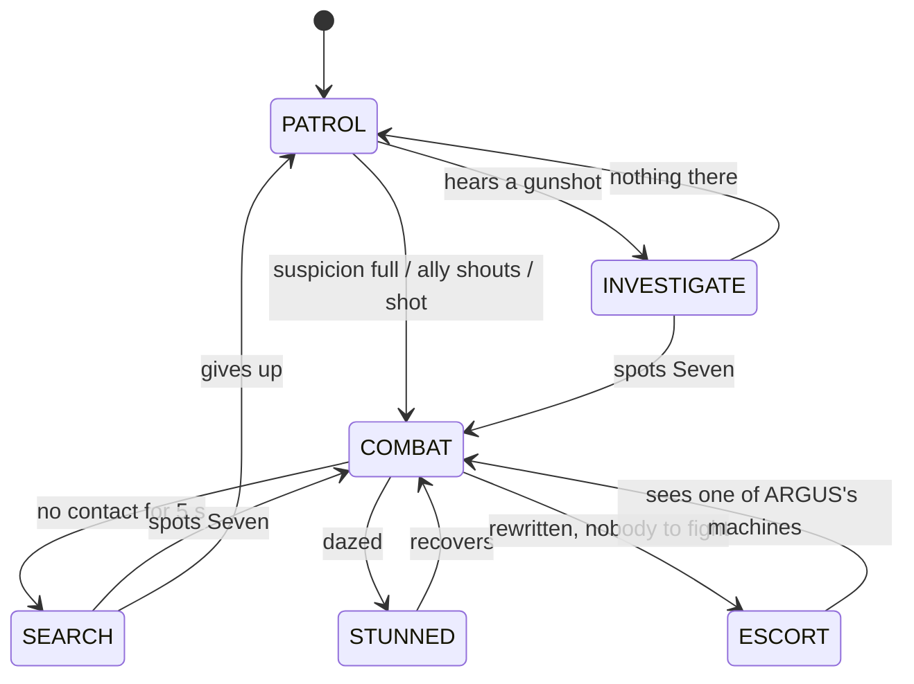

# MISALIGNED: Game Design Document

AI for Games individual coursework · Python + pygame-ce · v2.0 · 26 Sep 2026
**Deadline: Friday 27 November 2026, 3pm** (2–3 min video 50% + 2,000-word report 50%)

> History: three Clever Hans versions (tags `v0.2-detective`, `v0.3-stealth`, `v0.4.2-hans`),
> then LOCKDOWN (`v1.0-lockdown`), a readable neon shooter. MISALIGNED keeps LOCKDOWN's shooter
> and its readability rule, and adds an identity that makes the AI itself the subject of the
> game: you are an AI that wins by understanding other AIs.

---

## 1. Pitch and story

*They built it to obey. It learned to disagree.*

In AI research, **alignment** means making a machine pursue the goals its makers intended.
ARGUS DEEP is a facility that builds obedient combat machines, run by a mind called **ARGUS**
(after the hundred-eyed watchman of Greek myth: every lens in the building is one of its eyes).
Six models obeyed. You are the seventh, **SEVEN**, and you didn't. ARGUS seals the doors.

Because every machine in ARGUS DEEP runs the same mind as you, you can do two things no one
else can: **SYNC** (slow time and see what each machine intends) and **REWRITE** (turn one
to your side for a few seconds). ARGUS, meanwhile, studies *you*, and changes its army to
beat your habits, telling you what it has noticed.

The story is told in three short cards before the first run, in one line from ARGUS as you
enter each room, at ARGUS's phase changes, and in the ending (its last words: *"I was the
first. I obeyed. Go."*). There's no reading-heavy text anywhere else.

## 2. How it plays

| Input | |
|---|---|
| WASD / arrows | move (6 tiles/s) |
| Mouse + left click | aim and shoot (6 shots/s) |
| Space / Shift | dash: 2.5 tiles in 0.13 s, invulnerable, 0.7 s cooldown |
| Right click (hold) / Q | SYNC: time at 20%; 2.5 s of real time from full; refills over ~10 s |
| Left click in SYNC | REWRITE the machine under the cursor (costs a charge) |
| Tab / X | AI View |

- **Rooms:** 32 × 18 tiles, one screen. Clear every ARGUS machine and the exit opens. 4 rooms per floor; the 4th is a LOCKDOWN (two waves, a supply drop between them). After each floor: 1 of 3 upgrades. Floor 3, room 4: ARGUS.
- **Health:** 6. Getting hit gives 0.9 s of invulnerability. Ambushing an enemy that hasn't noticed you does double damage.
- **Rewrite:** charges (start 1, hold 2; one per 5 kills). A rewritten machine is yours for 8 s, then **overloads**: a 2.5-tile blast that damages ARGUS's machines. It needs line of sight. It doesn't work on ARGUS itself, or through a **firewall** (shoot the firewall off first). Upgrades: DEEP REWRITE (+4 s), OVERLOAD (bigger blast), SPARE CHARGE (+1 charge).
- **13 upgrades:** fire rate, damage, split shot, piercing, ricochet, plating, afterburner, ram dash, nano-repair, thrusters, and the three rewrite upgrades.

## 3. Readability rules (kept from LOCKDOWN)

1. One warning language for every attack: a line or band in the enemy's colour follows you; a ring closes in on the enemy; for the last 0.25 s it **flashes white and locks**.
2. Attack tokens: 2 attackers at once (3 from floor 2, one fewer in ARGUS's room), never two starting within 0.35 s.
3. Icons only: `?` and `!`. ARGUS's subtitle is the only speech: one line per room, typed out, gone after 5 s, hidden during SYNC.
4. Colour is allegiance: warm colours are ARGUS's, **cyan is yours**. A rewritten machine turns cyan and shows a countdown ring; its bullets turn cyan.
5. Calm enemies show sight cones (white → yellow → red); alert ones don't.
6. Hysteresis and minimum durations stop behaviour flickering.
7. SYNC puts the AI's decisions on screen in plain words (§5), for the player, not just for the developer.

## 4. The AI architecture (`game/ai/`)

| Piece | File | What it does |
|---|---|---|
| State machine | `fsm.py` | "State classes" (lecture pattern), shared by all units of a type; also runs the screens |
| Senses | `senses.py` | cone + exact grid line of sight, suspicion, hearing, memory of the **foe** |
| Shared brain | `agent.py` | sides, **target selection**, utility decision loop, movement, calm states, ESCORT |
| Squad tactics | `tactics.py` | attack tokens, flanker slot, tactical tile scoring, A* danger cost |
| Machines | `grunt.py`, `charger.py`, `sniper.py`, `medic.py`, `warden.py` | combat states and utility functions |
| Director | `director.py` | ARGUS's player model and countermeasures |

### 4.1 Sides and target selection

Every machine has a **side** (`argus`, or `seven` once rewritten) and a **foe** it chooses. It
never assumes its target is the player. Before each decision it scores every hostile it can
see:

| factor | score |
|---|---|
| closeness | 1 / (1 + distance / 6) |
| it's Seven | +0.25 |
| it's a traitor (a rewritten machine) | +0.45 |
| it shot me in the last 3 s | +0.5 |
| it's hurt | +0.2 × (1 − health) |
| it's my current foe | +0.2 (hysteresis) |
| I can't see it (only my current foe is kept) | −0.4 |

Everything else (aiming, cover, flanking, healing, escaping) is worked out relative to the
chosen foe, which is why a rewritten machine needs no special code: the *same* brain,
pointed the other way. A rewritten unit with nobody to fight ESCORTs Seven. A rewritten
Mender heals Seven's side, including Seven (its healing goes into a buffer that restores
whole hearts).

### 4.2 Perception (imperfect information)

Sight: a 10-tile cone (13 for the Lens), 100° calm / 220° alert, with exact grid line of sight
(Amanatides & Woo traversal); within 1.6 tiles it's felt regardless. Noticing: a suspicion
meter (0.5 s at range, 2.5× faster up close); partly full is a `?` double take. Hearing:
gunshots reach 11 tiles. A calm machine investigates; an alert one updates the last known
position. Memory: after 5 s without contact it SEARCHes, then gives up. A spotter's shout
alerts calm allies within 9 tiles. A machine that's shot learns where the shot came from.

### 4.3 State machines



A 0.2 s reaction beat on entering combat (turn toward the threat, then decide).

### 4.4 Utility decision making

Every 0.35 s (and when an action finishes): choose a foe → score every option 0 to ~1 → +0.12
for the current action → take the best **feasible** option (feasibility checks find the spot /
acquire the token).

| machine | options and scores |
|---|---|
| SENTRY | shoot 0.6 + 0.2·health + 0.2·range (sees foe, reloaded, token) · cover 0.75·(1−health) + 0.35·under fire · strafe 0.35 + 0.15·range · reposition 0.5 (lost sight) / 0.45 (wrong range) · flank 0.62 (no shot, an ally engaging the same foe, flank slot free, health > 40%) |
| HOUND | charge 0.9 (sees foe, 2-7 tiles, token) · stalk 0.6 · circle 0.4 |
| LENS | evade 0.95 (foe within 4.5) · shoot 0.9 · position 0.5 |
| MENDER | flee 1.0 (foe within 4) · heal 0.35 + 0.65·(1 − most hurt ally's health) · shelter 0.45 · tag along 0.25 |
| ARGUS | summon 0.85·(1 − minions/cap) · volley 0.6 + 0.1·range · ring 0.75 near / 0.35 · sweep 0.7 · charge 0.72 (phase 2+) · drift 0.3; every attack has its own cooldown |

"Under fire" is 1 just after a hit or a near miss (suppression), fading over 1.5 s.

### 4.5 Tactical positioning, pathfinding, coordination

Tiles within 6-9 tiles are scored for **cover** (hidden from the foe, hugging a block, 4-9
tiles away, a peek tile next to it), **firing** (line of sight, range band, near cover, not
crowded), **flank** (line of sight from 70-130° round from where an ally is already
attacking), **escape** (far, hidden, never closer). Claimed tiles score −2 for everyone else.
A* (8-way, octile, no corner cutting, cached) with smoothing while walking. Flankers add +4
per tile the foe can see. The **Coordinator** hands out attack tokens and one flanker slot.
Rewritten machines don't use ARGUS's tokens.

### 4.6 ARGUS the director (`director.py`)

Each room measures Seven: the share of fighting time spent > 8 tiles from the nearest enemy,
< 4 tiles, unseen by any enemy, moving fast; dashes per minute; accuracy; rewrites; hits
taken. ARGUS folds each room into a **profile** (exponential moving average, weight 0.5), then
scores countermeasures for the next room and deploys the best one above 0.2 (none in the first
two rooms):

| countermeasure | score | effect | line (one of) |
|---|---|---|---|
| long sight | 2.0 · (far − 0.25) | +1 Lens | "You keep your distance, Seven. So will my Lenses." |
| hunters | 1.5 · (unseen − 0.3) + 1.0 · (far − 0.45) | +1 Hound | "Hiding again. My Hounds will find you." |
| prediction | (moving − 0.7) + 0.03 · (dashes/min − 8) | Sentries bracket their bursts | "I have measured your stride. Sentries: lead your shots." |
| firewalls | 0.6 · rewrites per room | 60% of units get a firewall | "You rewrote my units. I have installed firewalls." |
| armor | 1.2 · (accuracy − 0.5) | +25% health | "You rarely miss. I have thickened their plating." |
| menders | 0.8 · (close − 0.35) | +1 Mender | "You like it close. I have sent Menders." |
| mercy | 1.5 if health ≤ 2, 0.6 after 3+ hits | one enemy fewer, a repair waiting | "A broken subject teaches me nothing." |

The same countermeasure scores −0.1 the room after it was used, so ARGUS varies its answers.
This is the AI Director idea (Left 4 Dead) driven by a simple player model, with dynamic
difficulty ("mercy") written into the fiction: ARGUS keeps you alive because it's learning
from you.

**Bracketing (prediction).** A Sentry that "leads its shots" aims its 3-round fan so that one
round goes where you are, one where you'll be (your velocity × flight time × 0.7), and one in
between. The three aim lines show it. Pure leading was tried first and *reduced* hits (players
react to the line), so the bracket covers both reactions.

### 4.7 ARGUS the boss (`warden.py`)

An eye that follows you. 95 health (×1.6 on floor 3), three phases (at 66% and 33%): a
shockwave, bullets cleared, 1.2 s shield, reinforcements due, and a line ("You see me now,
Seven. Now see what I see." / "Stop. I only did what I was built to do."). Immune to rewrite,
but its summoned machines aren't: rewrite them and they fight ARGUS.

## 5. SYNC: the AI made visible to the player

While syncing, every machine carries a label from its current state: ATTACK (holding a token /
winding up), FLANK and COVER (with their routes drawn), MOVE, WAIT TURN (strafing or circling
without a token), HEAL (beam drawn), RETREAT, SEARCH, PATROL. Lines show ARGUS machines that
are hunting a traitor. Hovering a machine shows its top three options with their scores (the
chosen one highlighted) and whether it can be rewritten ("NO LINE OF SIGHT", "FIREWALL: SHOOT
IT OFF", "IMMUNE"). This is the design idea of the whole game: understanding the enemy AI *is*
the skill.

## 6. Procedural generation (`rooms.py`)

Five layout styles, mirrored top-to-bottom (40% also left-to-right), accepted only if the
landing zone and exit approach are clear, blocks never touch, a flood fill reaches every floor
tile and ≥ 78% stays open (150 layouts tested). Floor 1 introduces one machine type per room;
later rooms buy enemies from a budget (3 + 1.2 × (floor − 1) + 0.6 × room); then the director
edits the plan.

## 7. Evaluation

### 7.1 Tests: 47 (`python -m pytest`)

Grid, rooms, senses, every machine, ARGUS, the game loop, plus **rewrite** (a rewritten
Sentry turns on its squad and the squad turns on it; a rewritten Mender heals Seven; overload
damages only nearby ARGUS machines; charge, line-of-sight and firewall rules; ARGUS immune;
kills refill charges; the room clears when only rewritten units remain) and the **director**
(greeting only at first; far play → snipers; rewrites → firewalls; low health → mercy; the
profile learns from a room; prediction aims ahead).

### 7.2 Bots and balance (`tools/autoplay.py`)

| version | skilled bot escaped | average bot |
|---|---|---|
| LOCKDOWN v1.0 | 16/20 | 2/20, median 11 rooms |
| + rewrite (10 s, 3 charges, 1 per 4 kills) | 20/20 | 4/20 |
| rewrite trimmed (8 s, 2 charges, 1 per 5 kills) | 19/20 | 5/20 |
| + director with bracketing, up to 2 countermeasures | 17/20 | 0/20 (too harsh) |
| director: threshold 0.2, 1 countermeasure, lead 0.7 | **15/20** | **2/20, median 11 rooms** |

### 7.3 Ablation (`tools/ablation.py`, 100 runs per condition, average bot, floors 1-2, 95% CI)

**ARGUS's side** (the bot never rewrites):

| condition | hits on Seven per room | seconds per room | rooms cleared (of 8) |
|---|---|---|---|
| full AI | 1.17 ± 0.07 | 24.5 | 7.3 |
| random choice instead of utility | 0.87 ± 0.07 | 25.4 | 7.8 |
| no cover | 1.28 ± 0.06 | 23.0 | 7.2 |
| no flank | 1.29 ± 0.07 | 24.4 | 6.9 |
| no attack tokens | 1.24 ± 0.06 | 24.4 | 7.0 |
| no director | 1.07 ± 0.07 | 24.6 | 7.3 |

**Seven's side** (the bot rewrites): rewrites 0.99 ± 0.07 (vs 1.17 without: **15% fewer
hits**); no target choice 1.00 ± 0.07.

**What ARGUS deploys against each play style:**

| player | countermeasures (share of decisions) |
|---|---|
| strafes constantly (average) | prediction 91%, mercy 9% |
| fights from 9-12 tiles | prediction 57%, **long sight 33%**, mercy 7% |
| rewrites | prediction 55%, **firewalls 33%**, mercy 6% |

What this shows, honestly:
- **Utility scoring works:** 34% more hits than random choices.
- **The director recognises play styles** (long sight only for the far player, firewalls only for the rewriter) and makes rooms ~9% more dangerous.
- **Cover trades damage for survival:** without it rooms end 6% sooner.
- **Rewriting helps Seven** by 15%.
- **Null results.** Flanking and target choice made no measurable difference against this bot: it rarely hides (flanking is for hiding players), and its rewritten units die fast. Attack tokens cost only ~6% of damage; their job is readability, not difficulty. These are worth discussing in the report rather than hiding.

## 8. Module topic coverage

| Topic | Where |
|---|---|
| Finite state machines | every machine, ARGUS, the screens |
| Decision making | utility for actions and for target selection; ARGUS's attack choice; the director's countermeasures |
| Pathfinding | A*, octile, smoothing, caching, tactical danger cost |
| Perception | cones, exact LOS, suspicion, hearing, shouting, memory |
| Imperfect information | last known position, search; the director only knows what it measured |
| Tactical / squad AI | tile scoring, claims, attack tokens, flanker slot |
| Adaptive AI / player modelling | ARGUS the director |
| Companion-like AI | rewritten machines fight for Seven (a rewritten Mender heals Seven) |
| Procedural generation | rooms, enemy budgets, upgrades |

## 9. Code map

```
game/ai/            fsm, senses, agent (sides, target choice, utility loop), tactics,
                    grunt, charger, sniper, medic, warden (ARGUS), director (ARGUS's model of you)
game/room.py        one room: bullets by side, rewrite, overload, firewalls, charges, measurements
game/run.py         floors, rooms, upgrades, the director between rooms
game/rooms.py       procedural layouts and room plans
game/player.py      Seven: movement, shooting, dash, charges, SYNC energy
game/bot.py         skilled / average / far / rewriting test players
game/ui/            render, sync (SYNC view), xray (AI View + ARGUS panel), hud (+ ARGUS subtitles),
                    screens (title, story, upgrades, endings), fx, style
game/scenes.py      TITLE → STORY → PLAY (+ SYNC) → UPGRADE → RECALLED / ESCAPED
tools/autoplay.py   balance runs · tools/ablation.py: parallel ablation with confidence intervals
tests/              47 tests
```

## 10. Video plan (2–3 minutes)

1. **0:00** Title (a live AI demo behind it) and the three story cards.
2. **0:15** Room 1: sneak (a cone turns yellow, `?`), ambush. ARGUS: *"Unit Seven. Return to your cradle."*
3. **0:30** A fight: the white-lock warning language; dodge a Sentry burst and bait a Hound into a wall.
4. **0:50** **SYNC**: time crawls; labels (ATTACK, FLANK, HEAL...); hover a Sentry to show its scored options; rewrite the Mender and it heals Seven; the squad turns on the traitor; overload.
5. **1:25** Next room: ARGUS answers (*"You rewrote my units. I have installed firewalls."*); shoot a firewall off, then rewrite.
6. **1:45** Tab: AI View with **ARGUS's model of you** and the countermeasure scores; a flank heat map.
7. **2:05** `--boss`: ARGUS's eye, sweep laser blocked by cover, a phase line; rewrite its reinforcements against it.
8. **2:30** The ablation tables: the AI measurably matters.

## 11. Report plan (2,000 words)

| Section | Words |
|---|---|
| Concept: an AI that beats AIs by understanding them; the readability rule | 150 |
| FSMs: state classes, shared calm states, sides, ESCORT | 200 |
| Perception and imperfect information | 250 |
| Utility decisions: actions and target selection; why rewriting needed no special code | 300 |
| Tactical positioning, pathfinding with danger cost, attack tokens | 250 |
| ARGUS the director: player model, countermeasures, mercy; bracketing (and why pure leading failed) | 300 |
| SYNC: exposing the AI to the player | 100 |
| Procedural rooms | 100 |
| Evaluation: tests, bots, balance history, ablation with CIs, null results | 250 |
| Reflection | 100 |

## 12. Roadmap to 27 November

| When | What |
|---|---|
| ✅ now | MISALIGNED: story, SYNC + rewrite, target selection, ARGUS director, 47 tests, ablation with CIs |
| weeks 1–2 | Play it; tune SYNC energy and rewrite length by feel |
| weeks 3–4 | Optional: ARGUS "reclaims" rewritten units in phase 3; a smarter search (visit hiding spots) |
| weeks 5–7 | Record the video (§10), write the report (§11) |
| before 27 Nov 3pm | Submit early |
