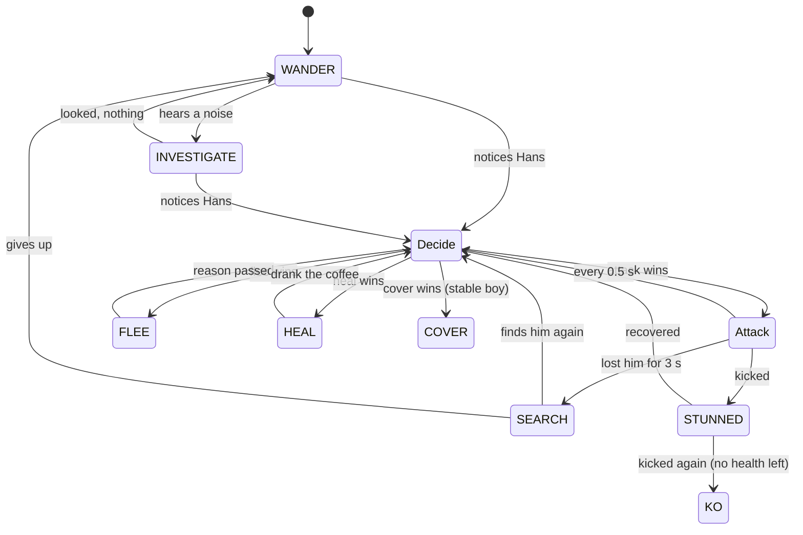

# Hans: Game Design Document

*Catch me if you can.*
AI for Games individual coursework · Python + pygame-ce · v0.4.1 · 26 Sep 2026
**Deadline: Friday 27 November 2026, 3pm** (2–3 min video 50% + 2,000-word report 50%)

> Earlier directions are kept in git: `v0.2-detective` (player as the scientist) and `v0.3-stealth`
> (sneak past lantern guards). Both were too much reading and thinking; v0.4 is pure action.

---

## 1. Pitch

Clever Hans is the most famous horse in Europe, and everyone wants to catch him. You play Hans
in a 1904 courtyard: **run, gallop, kick, eat carrots, survive the waves.** Scientists with
butterfly nets, stable boys with lassos and packs of guard dogs come through the stable doors.
Each type is its own AI, and each wave there are more of them and they're quicker.

## 2. How it plays

| Input | |
|---|---|
| Arrows / WASD | run (4.2 tiles/s) |
| hold Shift | gallop (6.8 tiles/s): drains stamina, and enemies hear it |
| Space | kick: everyone within 1.3 tiles is knocked back and stunned |
| P / Esc, X, F1, M, F11 | pause, AI X-Ray, help, mute, full screen |

- **A wave** is cleared by eating its carrots (7 in wave 1, then 2 more each wave). Up to 3 are on the field at once; eating one makes a crunch that enemies can hear.
- **3 hearts.** A net, a bite, or being caught loses one; then you blink invulnerable for 1.6 s.
- **Red warnings** tell you what's coming: a red arc (net swing), a red dashed line (a dog about to leap), a spinning rope (a lasso). Dodge, or step in and kick during the wind-up.
- **Pick-ups:** sugar cube (+1 heart), golden horseshoe (6 s: you can't be hurt, and everyone flees; touching them knocks them out), coffee (enemies only: +1 health).
- **Score:** carrot 10, knockout 25, wave cleared 100 × wave number. Best score is saved.

## 3. The enemies

### 3.1 Shared brain (`game/ai/enemy.py`)



"Attack" is a different sub-machine for each enemy type (below). States are classes on one
reusable `StateMachine` (`game/ai/state_machine.py`), the "state classes" pattern from the FSM
lecture, created once and never allocated at run time. The same class runs the game's screens.

**Senses** (`game/ai/perception.py`, `enemy.py`):
- **Sight:** a cone 7.5 tiles long and 120° wide, needing a clear line of sight. Hay and carts block it; troughs don't.
- **Noticing:** sight must last a moment (faster when close) before "!". Meanwhile he does a **double take**: stops and turns toward the glimpse, shown as "?".
- **Hearing:** a gallop carries 6 tiles, a kick 5, a crunching carrot 4.5. An unaware enemy goes to look (INVESTIGATE); an aware one updates where he thinks Hans is.
- **Smell (dogs):** within 5.5 tiles, through hay.
- **Memory:** the last place Hans was seen. Out of sight for 3 s, he SEARCHes there.
- **Word of mouth:** a spotting scientist or stable boy shouts to others within 7 tiles; a bark brings the whole pack within 12.

**Desirability** (`game/ai/desire.py`): when aware, each enemy scores its options:

| option | score |
|---|---|
| attack | aggression × (0.4 + 0.6 × health); 0 if Hans is golden |
| flee | 1.3 if Hans is golden, else cowardice × wounds × closeness |
| heal | wounds × (0.4 + 0.6 × closeness of the nearest coffee he has *seen*) × 2 |
| cover | (1.1 − 0.5 × health) if Hans is galloping at him (stable boys only) |

The best wins, with 0.12 stickiness so they don't dither. It's re-evaluated twice a second, so a
scientist kicked once will break off a chase for a nearby coffee, and everyone scatters the
moment Hans turns golden (the lecture's Pac-Man EVADE).

### 3.2 Scientist: butterfly net (`scientist.py`)

**CHASE:** A* to Hans (or his last known spot), re-planned every 0.25 s → **SWING:** stops, winds
up (the red arc), swings. It hits if Hans is still within 1.6 tiles and in front of him. The net
outreaches the kick (1.3), so you must either dodge the wind-up or step in and kick during it.

### 3.3 Stable boy: lasso (`stableboy.py`)

**POSITION:** scores ~30 tiles near Hans (ideal 3.5–6.5 tiles away, clear line of sight, short
walk) and goes to the best → **THROW:** spins the rope, then throws where Hans *will be* (leading
the target by his velocity, with a little human error). A hit tangles Hans for 1.8 s at half speed
→ reload → POSITION. **COVER:** if Hans gallops at him, he runs to the nearest tile Hans can't see.

### 3.4 Guard dog: pack (`dog.py`)

**SURROUND:** the pack shares out a ring 2.4 tiles around Hans, evenly spaced and starting from
the side they come from; each dog runs to its place → **POUNCE:** crouches (red dashed line),
leaps 3 tiles; a bite costs a heart → **RETREAT:** backs off, then circles again. They find Hans by
smell and track his scent while wandering.

## 3.5 The illusion of intelligence

Lecture 1: *"Game AI is about creating the illusion, or giving the user the impression, that they
are engaged in gameplay with 'intelligent' opponents."* Clever AI the player never notices is
wasted, so v0.4.1 makes the thinking visible.

| Feature | What the player sees | What's really happening |
|---|---|---|
| **Barks** (`barks.py`) | Speech bubbles: "There he is!", "Where did he go?", "I need a coffee...", "Cut him off!", "sniff sniff" | Every state change posts an event; each enemy type has its own lines, 3 s cooldowns, at most 3 on screen, never covering Hans |
| **The Commission learns** (`commission.py`) | Between waves: "The Commission learned: you kick a lot. Now they jump back from your hooves." A red label keeps what it has learned on screen | It counts kicks/min, share of time galloping, time lurking by cover, carrots snatched near enemies; the strongest habit over its threshold gets a counter-tactic, remembered all game (max 4) |
| WARY (vs kicking) | Scientists hop back from a missed kick: "Ha! Missed me!" | Aware enemies within 2.8 tiles are knocked back 1.3 tiles when a kick misses them |
| INTERCEPT (vs galloping) | "Cut him off!": they run to where you're going | Chase target = Hans + velocity × look-ahead (up to 1.2 s) |
| SWEEP (vs hiding) | "Check behind the hay!": searchers look behind cover | SEARCH visits up to 3 tiles beside hay/carts that are hidden from where Hans vanished |
| GUARD (vs greed) | "I'll watch the carrots." | One enemy per wave takes a GUARD state beside the nearest carrot, sweeping the approach |
| **Pincer** | "I'll go round!": two scientists close in from opposite sides | If a colleague is already chasing and closer, run to the point 1.8 tiles beyond Hans on the far side |
| **Tracking** | Hoofprints on the ground; dogs follow them nose-down | Prints every 0.45 tiles, fading over 14 s; TRACK steers to the freshest print within 3 tiles, fresher each time |
| **Morale** | "He's too strong!": the rest start running as you knock them out | Each KO lowers the wave's morale by 0.18; flee desire uses wounds + lost morale |
| **Double take** | "?" and a turn toward a glimpse | Noticing takes a moment; while it builds, calm enemies stop and face the glimpse |

In the X-Ray, a panel shows the Commission's live habit bars filling toward their thresholds.

## 4. Waves and procedural generation

- **Courtyards** (`game/arena.py`): each wave places 6–12 hay bales, carts and troughs at random. It keeps a clear ring inside the walls and clear space around the start and the four stable doors. Obstacles never touch each other (no dead ends), and a flood fill proves every tile is reachable; otherwise the layout is re-rolled.
- **Waves** (`game/waves.py`): waves 1–5 are hand-made to introduce one enemy at a time (wave 1 sends its two scientists 8 s apart). From wave 6, waves are generated from a budget (4 + 0.9 × wave; scientist 1, stable boy 1.5, dog 0.8). Enemy speed grows from 0.82× to 1.35×, and **attack wind-ups shorten with it**, so later waves give you less time to react.
- A one-line intro banner names each new enemy.

## 5. Balancing by bots (`tools/autoplay.py`)

Two bots play 30 games each:

| bot | waves reached (median) | best | died in wave 1 |
|---|---|---|---|
| naive: runs at carrots, kicks when anything is close | 2.5 | 4 | 7/30 |
| player: dodges wind-ups, sidesteps lassos and pounces, kicks during wind-ups, gallops when crowded, grabs pick-ups | 5 | 7 | 3/30 |

The bots drove real changes:
- **The net outreaches the kick.** At first the kick won every fight, and the naive bot survived 4 minutes untouched.
- **Dogs got smell and scent tracking.** At first they wandered and rarely found Hans.
- **Lassos got aim error.** They were hitting 52 of 56.
- **Double takes.** Enemies turned away mid-glimpse.
- **Wounded enemies want coffee more.** Coffee never won against attacking.
- **Carrots are topped up every frame.** A failed spawn could soft-lock a wave.
- **Gentler wave 1.**

## 6. Module topic coverage

| Topic | Where |
|---|---|
| Finite state machines | 3 enemy types on one shared FSM core (10–11 states each, incl. GUARD, TRACK); game screens use the same class |
| Desirability / motivations | attack / flee / heal / cover scores, re-evaluated twice a second |
| Pathfinding | A* for chase, investigate, search, flee, heal, cover; re-planned while chasing |
| Perception | sight cone + line of sight, noticing, double take, hearing, smell, memory, shouting |
| Imperfect information | enemies only know what they sense or are told; coffee only if seen; search the last known spot; dogs follow a trail |
| Adaptation | the Commission learns the player's habits and counters them wave by wave |
| Procedural generation | a fair courtyard every wave; generated waves after 5 |

## 7. AI X-Ray (X)

For each enemy: its **state**, its top **desire scores**, its **sight cone** (orange = unaware, red =
aware), its **A* path**, its **last-seen marker**, a dog's **ring slot**, and a stable boy's chosen
**throwing spot**.

## 8. Code map

```
main.py                     entry point (--wave, --xray, --seed, --no-sound)
game/config.py              every tunable number
game/arena.py               procedural courtyards
game/waves.py               hand-made and generated waves
game/level.py               the grid: walls, sight, rays, collision, cached A*
game/match.py               one game: waves, spawning, kicks, hits, items, lassos, score
game/entities/hans.py       the player's horse
game/entities/walker.py     A*-following / steering body shared by all enemies
game/ai/state_machine.py    reusable FSM
game/ai/enemy.py            shared senses, memory and states
game/ai/desire.py           desirability scores
game/ai/scientist.py        CHASE, SWING
game/ai/stableboy.py        POSITION, THROW, COVER
game/ai/dog.py              SURROUND, POUNCE, RETREAT (+ smell)
game/ai/perception.py       sight cones, hearing
game/ai/pathfinding.py      A*
game/scenes.py, app.py      title / play / game over, and the main loop
game/audio.py               synthesised sound (no files)
game/save.py                best score
game/ui/                    theme, sprites, view (arena, warnings, HUD, X-Ray), cards
tools/autoplay.py           balancing bots
game/ai/commission.py       learns the player's habits, picks counter-tactics
game/ai/barks.py            speech bubbles for decisions
tests/                      39 tests
```

## 9. Video plan (2–3 minutes)

1. **0:00** Title → wave 1: run, eat a carrot, a scientist spots you (? then !), dodge his wind-up, step in and kick.
2. **0:30** Speech bubbles as they notice, lose and search for you; a second scientist says "I'll go round!" and closes the pincer.
3. **0:45** Kick a lot in wave 1, then read wave 2's banner: the Commission learned it; watch them hop back "Ha! Missed me!".
4. **1:00** X-Ray on: states, desire scores, the Commission's habit bars; kick a scientist once and watch "heal" beat "attack".
5. **1:15** Wave 3: a stable boy positions, leads his throw; gallop at him and he runs for cover.
6. **1:35** Wave 4: a dog follows your hoofprints nose-down, the pack spreads around you and pounces from two sides.
7. **2:00** Golden horseshoe: everyone flips to FLEE; KO a few and the rest lose their nerve.
8. **2:20** A new wave's courtyard layout; the bot balancing table.

## 10. Report plan (2,000 words)

| Section | Words |
|---|---|
| Concept and why it suits real-time game AI | 150 |
| The shared FSM core and the state-class pattern | 300 |
| Perception: sight, noticing, double take, hearing, smell, tracks, memory, shouting | 250 |
| Desirability and decision making | 250 |
| The three enemy types and their attack states | 250 |
| The illusion of intelligence: barks, the learning Commission, pincers, tracking, morale | 250 |
| Pathfinding and steering | 150 |
| Procedural courtyards and waves | 150 |
| Evaluation: bot balancing and what it changed | 200 |
| Reflection | 100 |

## 11. Roadmap to 27 November

| When | What |
|---|---|
| ✅ now | Playable wave game, 3 enemy AIs, X-Ray, bots, 39 tests |
| ✅ now | Illusion of intelligence: barks, learning Commission, pincers, tracking, morale |
| weeks 1–2 | Play it yourself; tune what feels unfair or dull |
| optional | A boss (Oskar Pfungst) every 5 waves; a 4th enemy (a goat that steals carrots) |
| weeks 5–7 | Record the video (§9), write the report (§10) |
| before 27 Nov 3pm | Submit early |
